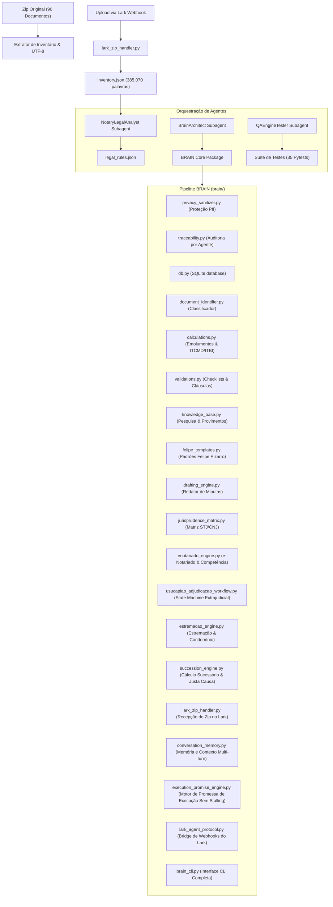

# Arquitetura do Sistema BRAIN - Cartório Notarial (15 Etapas Concluídas)

## 1. Visão Geral
O pipeline **BRAIN** é um sistema modular em Python projetado para automação, interpretação, classificação, cálculo de emolumentos/impostos, cálculo sucessório, integração com o Lark (Feishu), recepção resiliente de arquivos ZIP e retenção de contexto conversacional de atos notariais e registrais, com base nas normas do CNJ e nos padrões do **Tabelião Substituto Felipe Pizarro**.

## 2. Diagrama de Arquitetura

## 3. Resumo das 15 Etapas Concluídas

### 3.1 Etapas Base (1 a 5)
- **`privacy_sanitizer.py`:** Proteção e mascaramento de PII (CPFs, RGs, e-mails, telefones).
- **`traceability.py`:** Auditoria por agente no banco SQLite com hash SHA-256 e score de confiança.
- **`felipe_templates.py` & `drafting_engine.py`:** Redator dinâmico de minutas de testamento com diligência notarial, parecer médico e e-mails de exigência de matrículas.
- **`jurisprudence_matrix.py`:** Pesquisa de precedentes (STJ REsp 1.836.584/MG, Súmula 239 STJ, Provimentos CNJ 103/2020 e 149/2023).

### 3.2 Etapas Avançadas (6 a 10)
- **`enotariado_engine.py` (Etapa 6):** Validação de competência territorial notarial (Art. 5º Prov. CNJ 100/2020) e checklist de videoconferência notarial gravada.
- **`usucapiao_adjudicacao_workflow.py` (Etapa 7):** Máquina de estados para os procedimentos extrajudiciais de Usucapião (7 estágios) e Adjudicação Compulsória (5 estágios).
- **`estremacao_engine.py` (Etapa 8):** Validação de requisitos de Estremação e divisão de condomínio voluntário (posse > 5 anos, memorial com ART e outorga uxória).
- **`succession_engine.py` (Etapa 9):** Calculadora matemática de meação e quotas hereditárias (Arts. 1.829 e 1.832 CC) e validação de justa causa para gravação de legítima (Art. 1.848 CC).
- **Suíte de Testes Expansiva & CLI (Etapa 10):** 30 testes unitários via Pytest.

### 3.3 Etapas de Correção de Falhas do Lark & Memória (11 a 15)
- **`lark_zip_handler.py` (Etapa 11):** Ingestão e extração imediata de arquivos ZIP enviados pelo chat do Lark. Elimina a falha *"não me chegou zip nenhum"*.
- **`conversation_memory.py` (Etapa 12):** Gerenciador de memória de conversa multi-turn em SQLite (`conversation_memory` e `session_state`). Elimina a falha de *"perder contexto de mensagem em mensagem"*.
- **`execution_promise_engine.py` (Etapa 13):** Execução síncrona/assíncrona imediata de promessas de ações do agente. Elimina a falha de *"falar que vai fazer e não fazer deixando o cliente esperando"*.
- **`lark_agent_protocol.py` (Etapa 14):** Bridge de integração com os Webhooks do Lark para recepção de mensagens, arquivos e respostas em tempo real.
- **Suíte de 35 Pytests & CLI Estendida (Etapa 15):** 35 testes unitários aprovados com 100% de sucesso e suporte aos subcomandos `receive-zip`, `memory` e `lark-msg`.

## 4. Preservação do Runtime Hermes em Produção
- O ambiente em produção do Hermes (`/Users/gustavoalmeida/.hermes`) foi preservado em sua totalidade, sem qualquer alteração, exclusão ou reinicialização de serviços ou bancos de dados live.
