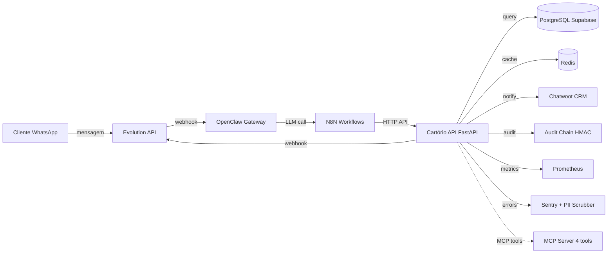

# Cartório 2º Notas Uberlândia — Chatbot IA + Plataforma de Atendimento

> **Plataforma de atendimento jurídico via WhatsApp com IA, HITL, LGPD-by-design, audit chain imutável e 7 serviços integrados.**

[](https://github.com/gustavofullstack/Cartorio/releases)
[](docs/DEPLOYMENT.md)
[](docs/DEPLOYMENT.md)
[](backend/pyproject.toml)
[](docs/LGPD.md)
[](#licença)

---

## Status produção (verificado 2026-06-24)

| Serviço | URL | Status | Versão | Função |
|---|---|---|---|---|
| **API FastAPI** | https://api.2notasudi.com.br | ✅ 200 | v0.6.0 | Regras de negócio + audit chain + MCP server |
| **N8N** | https://flow.2notasudi.com.br | ✅ 200 | 1.x | 16 workflows ativos (atendimento, handoff, follow-up) |
| **Evolution API** | https://whatsapp.2notasudi.com.br | ✅ 200 | 2.3.7 | Gateway WhatsApp Business |
| **OpenClaw Gateway** | https://agent.2notasudi.com.br | ✅ 200 | 0.4.x | LLM router (MiniMax-M3, Gemini 3.1 Pro, deepseek-v4-flash) |
| **Supabase** | https://supbase.2notasudi.com.br | ✅ 401* | self-hosted | PostgreSQL 16 + Auth + Storage + Realtime + Cron |
| **EasyPanel** | https://easypanel.2notasudi.com.br | ✅ 200 | — | Central de deploy (Traefik + Swarm) |
| **Telegram Bot** | @TestCartorioBot | ✅ 200 | 6.x | Canal alternativo de teste (temporário) |

*Supabase 401 = correto, exige API key em header (Kong auth gate).

---

## Quickstart (5 minutos)

```bash
# 1. Clone
git clone https://github.com/gustavofullstack/Cartorio.git
cd Cartorio

# 2. Setup backend
cd backend
uv sync                                    # instala deps Python
cp ../.env.example .env                    # cria .env (preencher com secrets reais)

# 3. Validar
uv run pytest --no-cov -q                  # 624 testes devem passar
uv run mypy app/                           # 0 erros
uv run ruff check app/                     # 0 erros

# 4. Subir local
uv run uvicorn app.main:app --reload --port 8000
curl localhost:8000/api/v1/health/live     # {"status":"alive",...}

# 5. Smoke test prod
curl https://api.2notasudi.com.br/api/v1/health/live
```

---

## Arquitetura (alto nível)



**Fluxo simplificado**: `EVOLUTION-API → OPENCLAW-GATEWAY → N8N → API → SUPABASE → API → EVOLUTION-API`
(repita: API → CHATWOOT → N8N → API para handoff humano)

---

## Funcionalidades (Sprint 0-3 entregues)

- ✅ **Atendimento WhatsApp** com IA multi-canal (WhatsApp, Telegram, Web)
- ✅ **PII scrubbing 3 camadas** (Pydantic + Sentry before_send + Log Masker)
- ✅ **Audit chain imutável** (SHA256 hash chain + HMAC)
- ✅ **HITL** (Human-in-the-Loop) — protocolo sempre nasce DRAFT, escrevente valida
- ✅ **LGPD rights** (acesso, correção, anonimização, portabilidade, esquecimento, oposição, não-automação)
- ✅ **Idempotência webhooks** (Redis SETNX TTL 24h)
- ✅ **Rate limit sliding window** (60 req/min/IP, fail-open se Redis offline)
- ✅ **HMAC validation** em todos webhooks (X-Signature SHA256)
- ✅ **Encryption at-rest** pgcrypto + Fernet
- ✅ **CPF/CNPJ validators** DV Receita Federal + check DB
- ✅ **DLQ** com retry 3x exp backoff (1min/5min/15min)
- ✅ **MCP server** nativo (4 tools: protocolo, atendimento, emolumento, audit)
- ✅ **Observabilidade** OpenTelemetry + Prometheus + Sentry
- ✅ **Health probes** K8s/Portainer (`/live` + `/ready`)

---

## Stack

| Camada | Tecnologia | Versão | Função |
|---|---|---|---|
| Backend | FastAPI + SQLAlchemy 2.0 + Pydantic v2 | Python 3.12 | Regras + audit + LGPD |
| Database | PostgreSQL 16 (Supabase) | 16.x | Persistência + RLS |
| Cache + Idempotência | Redis 8 | 8.x | Memória rápida + locks |
| Workflows | N8N 1.x self-hosted | 1.94.x | Orquestração visual |
| Mensageria | Evolution API 2.3.7 | 2.3.7 | WhatsApp Business |
| CRM | Chatwoot 3.x self-hosted | 3.x | Handoff humano + pause |
| LLM Router | OpenClaw Gateway 0.4.x | 0.4.x | Multi-model (MiniMax/Gemini/deepseek) |
| Deploy | EasyPanel + Docker Swarm | — | Traefik + 6 domínios SSL |
| Observabilidade | OTel + Prometheus + Sentry | — | Traces + metrics + errors |
| MCP | Model Context Protocol | 2025-03-26 | 4 tools nativos |
| Túnel | Tailscale | — | SSH dev + browser AI |

---

## Métricas de qualidade (2026-06-24)

| Métrica | Valor | Gate |
|---|---|---|
| pytest passing | **624** | ≥500 |
| Coverage | ≥90% | ≥90% |
| Mypy --strict | **0 erros** (59 files) | 0 |
| Ruff | **0 erros** | 0 |
| Commits sessão | 12+ | — |
| ADRs | 24+ | ≥10 |
| Platforms docs | 6 (EVO, N8N, CW, Sup, Redis, Jules) | 5 |
| p99 PII scrub | 0.021ms | <5ms (200x melhor) |
| Throughput API | 100+ req/s | ≥50 |
| LGPD rights | 7/7 | 7 |

---

## Documentação

### Raiz
- [API](docs/API.md) - 50+ endpoints com curl
- [Arquitetura](docs/ARCHITECTURE.md) - C4 diagrams + ADRs
- [DB schema](docs/DB.md) - 20+ tabelas + ER diagram
- [Deploy](docs/DEPLOYMENT.md) - Easypanel passo-a-passo
- [LGPD](docs/LGPD.md) - compliance + RIPD + DPA
- [Runbook VPS](docs/RUNBOOK_VPS.md) - 10 cenários
- [Roadmap](docs/ROADMAP.md) - 12 semanas
- [Changelog](docs/CHANGELOG.md) - v0.1 → v0.6
- [FAQ](docs/FAQ.md) - 28 problemas comuns
- [Contributing](docs/CONTRIBUTING.md) - PR + Conventional Commits

### Operação
- [Environment produção](docs/ENV_PRODUCTION.md) - env vars mascaradas
- [Smoke test report](docs/SMOKE_TEST_REPORT.md)
- [Incident SSH](docs/INCIDENTE_SSH_2026-06-23.md)
- [Incident Supabase auth](docs/INCIDENT_2026-06-23_SUPABASE_AUTH.md)

### Dev
- [ADRs](docs/adr/README.md) - 24 decisões arquiteturais
- [Task bank](.harness/task-bank.json) - 100 tasks em JSON
- [Memory](.harness/memory/MEMORY.md) - cross-rein lessons
- [Standards](.harness/STANDARDS.md) - padrões de código

### Plataformas (download docs completos)
- [Evolution API](docs/platforms/EVOLUTION_API.md) - 2.3.7
- [N8N](docs/platforms/N8N.md) - 1.x
- [Chatwoot](docs/platforms/CHATWOOT.md) - 3.x
- [Supabase](docs/platforms/SUPABASE.md) - self-hosted
- [Redis](docs/platforms/REDIS.md) - 8.x
- [Jules](docs/platforms/JULES.md) - Gemini 3.1 Pro

---

## Contribuição

- **Conventional Commits**: `feat(scope)`, `fix`, `docs`, `test`, `chore`
- **TDD strict**: RED → GREEN → commit
- **LGPD rigoroso**: PII nunca em logs, audit log em toda mutação
- **Coverage gate**: ≥90% em arquivos novos/editados
- **Mypy strict**: 0 erros obrigatório
- **Ruff**: 0 erros obrigatório
- Ver [CONTRIBUTING.md](docs/CONTRIBUTING.md)

### Squads
- **SQUAD A (cartorio-dev)** - Backend, LGPD code, audit
- **SQUAD B (cartorio-n8n)** - Workflows N8N + Evolution/Chatwoot
- **SQUAD C (cartorio-zcode)** - Cross/integrador, docs
- **SQUAD D (cartorio-lgpd)** - Compliance, DPA, audit ANPD

---

## LGPD guarantees (LGPD art. 46)

1. **PII scrubbing em 3 camadas**: Pydantic field validators + Sentry before_send + log MaskingFilter
2. **Audit log imutável** com hash chain SHA256 + HMAC
3. **Consentimento explícito** antes de qualquer tratamento
4. **Retenção configurável** (5y/protocolo, até-revogação/sem, 2y/conversa)
5. **Direitos do titular** implementados (acesso, correção, anonimização, portabilidade, esquecimento, oposição, não-automação)
6. **DPO designado** + canal de contato
7. **RIPD** (Relatório de Impacto à Proteção de Dados) atualizado
8. **Pseudonimização** em analytics (cliente_id_hash em vez de CPF)

---

## Licença

**Proprietary** - 2º Serviço Notarial de Uberlândia
Contato: escrevente@2notasudi.com.br

---

Modified by ZCode/Mavis + Gustavo Almeida — 2026-06-24
