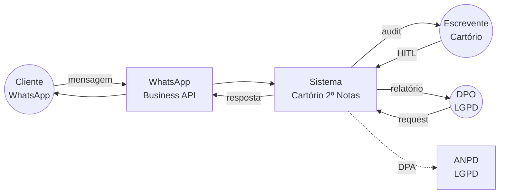
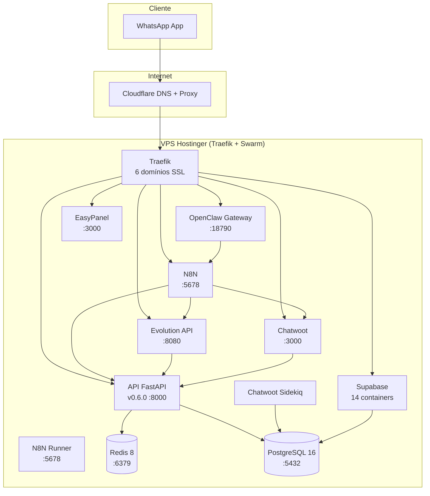
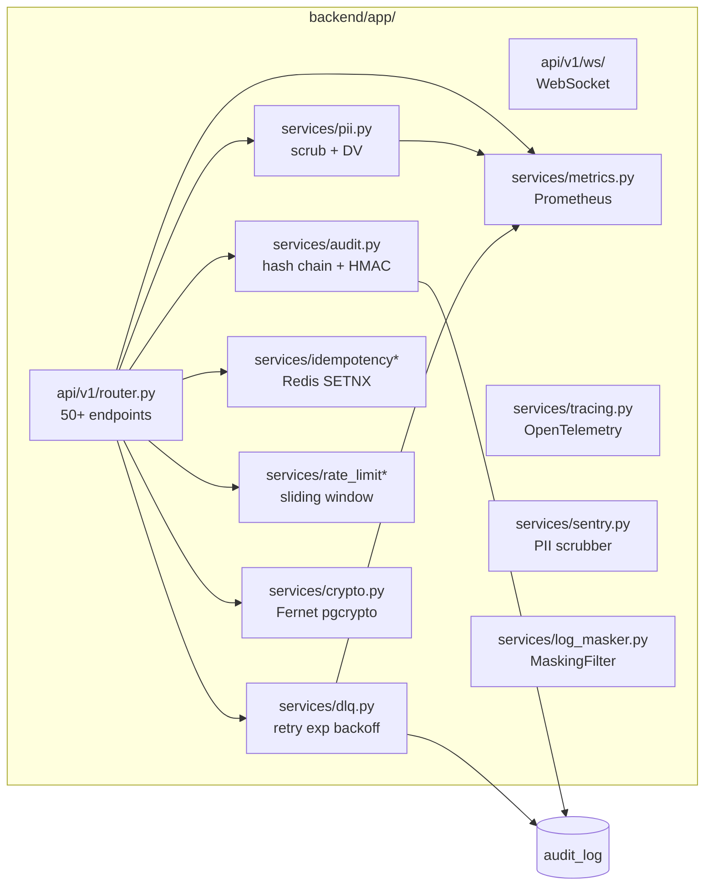
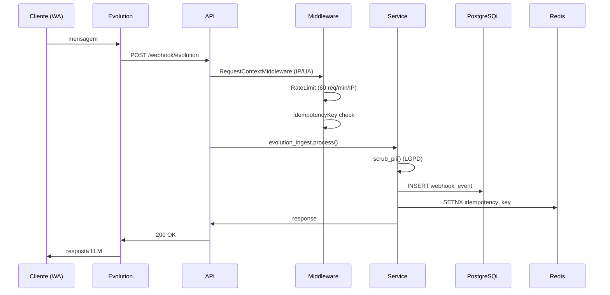

# Arquitetura — Cartório Chatbot (C4 + 24 ADRs)

> **C4 model (Context, Container, Component, Code) + 24 decisões arquiteturais + fluxo end-to-end.**
> Stack: FastAPI + N8N + Evolution + Chatwoot + Supabase + OpenClaw + Redis.

## C4 Nível 1 — Context (sistema + atores externos)



**Atores**:
- **Cliente** (titular dados): recebe atendimento, exerce direitos LGPD
- **Escrevente** (operador cartório): valida protocolos via HITL, gerencia Chatwoot
- **DPO**: recebe notificações, responde titulares
- **ANPD**: fiscaliza compliance

**Sistema** expõe:
- 50+ endpoints REST (`/api/v1/*`)
- 4 MCP tools (protocolo, atendimento, emolumento, audit)
- 16 N8N workflows (atendimento, handoff, follow-up)
- 6 webhooks (Evolution, Chatwoot, Telegram)

---

## C4 Nível 2 — Container (aplicações + datastores)



**Containers** (11 + infra):

| Container | URL pública | Tech | Responsabilidade |
|---|---|---|---|
| **Traefik** | (proxy) | Traefik 2.x | SSL auto (Let's Encrypt) + 6 domínios |
| **cartorio_api** | api.2notasudi.com.br | FastAPI v0.6.0 | Regras + audit + LGPD + MCP |
| **cartorio_n8n** | flow.2notasudi.com.br | N8N 1.94.x | Workflows visuais + credenciais |
| **cartorio_n8n-runner** | (internal) | N8N runner | Execução async workflows |
| **cartorio_openclaw** | agent.2notasudi.com.br | OpenClaw 0.4.x | LLM router multi-provider |
| **cartorio_evolution** | whatsapp.2notasudi.com.br | Evolution 2.3.7 | Gateway WhatsApp |
| **cartorio_chatwoot** | chat.2notasudi.com.br | Chatwoot 3.x | CRM + handoff humano |
| **cartorio_chatwoot-sidekiq** | (internal) | Sidekiq | Background jobs Chatwoot |
| **cartorio_redis** | (internal) | Redis 8 | Cache + idempotência + locks |
| **cartorio_supabase** | supbase.2notasudi.com.br | Supabase self-hosted | Auth + DB + Storage + Realtime |
| **easypanel** | easypanel.2notasudi.com.br | EasyPanel | Deploy + gestão |

---

## C4 Nível 3 — Component (módulos do backend)



**Componentes críticos**:

| Componente | Path | Responsabilidade | LOC |
|---|---|---|---|
| `audit` | `app/services/audit.py` | Hash chain SHA256 + HMAC, append-only | ~300 |
| `pii` | `app/services/pii.py` | Scrub CPF/CNS/CNH + check DV | ~250 |
| `metrics` | `app/services/metrics.py` | Prometheus: pii_blocked_total, scrub_latency, dlq_depth | ~150 |
| `tracing` | `app/services/tracing.py` | OpenTelemetry spans (request/LLM/DB) | ~140 |
| `sentry` | `app/services/sentry.py` | Error tracking + PII before_send | ~160 |
| `dlq` | `app/services/dlq.py` | Outbox + retry 3x exp backoff | ~180 |
| `log_masker` | `app/services/log_masker.py` | MaskingFilter LGPD art. 46 | ~55 |
| `idempotency` | `app/services/idempotency*.py` | Redis SETNX TTL 24h | ~120 |
| `rate_limit` | `app/services/rate_limit*.py` | Sliding window 60 req/min/IP | ~200 |
| `crypto` | `app/services/crypto.py` | Fernet encrypt/decrypt pgcrypto | ~80 |

---

## C4 Nível 4 — Code (fluxo de uma request)



**Ponto de auditoria** (LGPD art. 37):
- Cada mutação chama `AuditService.log()` com hash chain
- IP truncado `/24` (decisão arquitetural D5)
- request_id propaga via `X-Request-Id`

---

## Decisões arquiteturais (24 ADRs)

| # | Título | Status | Arquivo |
|---|---|---|---|
| 001 | Stack: FastAPI + Supabase + N8N + OpenClaw | Aceito | [001](adr/001-stack-fastapi-supabase-n8n.md) |
| 002 | Audit log hash chain + HMAC | Aceito | [002](adr/002-audit-chain-hmac.md) |
| 003 | PII scrubbing pre-LLM | Aceito | [003](adr/003-pii-scrubbing-pre-llm.md) |
| 004 | HITL em atos jurídicos | Aceito | [004](adr/004-hitl-juridico.md) |
| 005 | LiteLLM removido, Opencode-Go direto | Aceito | [005](adr/005-litellm-removed.md) |
| 006 | WebhookEvent table p/ idempotência | Aceito | [006](adr/006-webhook-event-idempotency.md) |
| 007 | LGPD retenção configurável | Aceito | [007](adr/007-lgpd-retencao.md) |
| 008 | Conventional Commits + TDD strict | Aceito | [008](adr/008-conv-commits-tdd.md) |
| 009 | Cloudflare proxy + Traefik SSL | Aceito | [009](adr/009-cloudflare-traefik.md) |
| 010 | DB_HOST IP direto (Swarm alias bug) | Aceito | [010](adr/010-db-host-ip-direto.md) |
| 011 | OpenClaw multi-LLM provider | Aceito | [011](adr/011-openclaw-multi-llm.md) |
| 013 | Supabase password mismatch | Aceito | [013](adr/013-supabase-password-mismatch.md) |
| 015 | Chatwoot restart loop (4 hipóteses) | Aceito | [015](adr/015-chatwoot-restart-loop.md) |
| 016 | OpenClaw context overflow | Aceito | [016](adr/016-openclaw-context-overflow.md) |
| 017 | D5 LGPD dual-column IP (truncado + completo) | Aceito | [017](adr/017-lgpd-dual-column-ip.md) |
| 018 | Encryption at-rest pgcrypto | Aceito | [018](adr/018-pgcrypto-encryption.md) |
| 019 | HMAC SHA256 webhooks | Aceito | [019](adr/019-hmac-webhook-validation.md) |
| 020 | Idempotency-Key Redis SETNX | Aceito | [020](adr/020-idempotency-redis-setnx.md) |
| 021 | Rate limit sliding window | Aceito | [021](adr/021-rate-limit-sliding-window.md) |
| 022 | DDoS rate limit por IP | Aceito | [022](adr/022-ddos-rate-limit.md) |
| 023 | Health 7 serviços radar | Aceito | [023](adr/023-health-7-services.md) |
| 024 | OpenTelemetry tracing distribuído | Aceito | [024](adr/024-otel-tracing.md) |
| 025 | DLQ retry 3x exp backoff | Aceito | [025](adr/025-dlq-retry-policy.md) |

(Verificar contagem real em `docs/adr/`)

---

## Decisões arquiteturais críticas (resumo)

### 1. Hash chain no audit log (NÃO WAL shipping, NÃO storage externo)
- Append-only com SHA256(prev_hash + payload + timestamp) + HMAC
- Verificação: `POST /api/v1/audit/verify` percorre cadeia
- Job diário cron alerta se `ok=false`

### 2. PII scrubbing em 3 camadas (LGPD art. 46)
- Input: mascara CPF/RG/email antes de logar (hash + scrubbed)
- Pre-LLM: garante zero PII puro pra API pública
- Output: confirma resposta não vaza
- Defesa em profundidade: LLM é caixa-preta

### 3. Human-in-the-loop obrigatório (HITL)
- Bot NUNCA decide sozinho: isenção, urgência, validação jurídica, certidão
- Bot PODE: horário, emolumento, status protocolo, dúvidas documentação
- `handoff_to_human` em conversa quando intent confidence < 0.7

### 4. Tabela de emolumento snapshot (NÃO live)
- Snapshot no momento do cálculo com `tabela_referencia` + `valido_ate`
- Protocolos antigos NÃO recalculam (imutabilidade histórica)
- Carga diária automática do DO do estado

### 5. Multi-tenancy futuro (Sprint 5+)
- `schema_name` em tabelas + `cartorio_id` em queries
- Supabase gerencia schemas separados
- Single backend, multi-tenant white-label

---

## Princípios arquiteturais (não negociáveis)

1. **LGPD-by-design**: PII nunca em logs, audit log em toda mutação, retenção configurável
2. **HITL em ato jurídico**: protocolo sempre nasce DRAFT, escrevente valida
3. **TDD strict**: RED → GREEN → commit, coverage ≥90%
4. **Conventional Commits**: feat/fix/docs/test/chore com scope
5. **No-refactor**: melhorar sempre, nunca reescrever do zero
6. **Idempotência em webhooks**: Redis SETNX TTL 24h
7. **Fail-open em dependências**: rate limit, idempotência (Redis offline = passa + log)
8. **Observabilidade 3-pilares**: traces (OTel) + metrics (Prom) + logs (Sentry)

---

## Fluxo end-to-end: "cliente pergunta status do protocolo"

```
1. Cliente WhatsApp: "qual o status do protocolo 12345?"
2. Evolution API recebe webhook
3. N8N workflow #2 aciona (intent: consultar_protocolo)
4. POST /api/v1/webhook/evolution → PII scrubber (none nesse caso)
5. Audit log: conversa.received, payload scrubbed
6. Backend: SELECT * FROM protocolos WHERE numero = '12345'
7. Audit log: protocolo.read
8. Backend retorna: "Protocolo 12345 - em_andamento - previsao 2026-06-25"
9. N8N monta resposta WhatsApp
10. Evolution API envia msg
11. Audit log: conversa.sent
12. Conversa atualizada com bot_response + llm_tokens
```

Tempo total esperado: < 2s. Com cache Redis: < 200ms.

---

Modified by ZCode/Mavis + Gustavo Almeida — 2026-06-24
