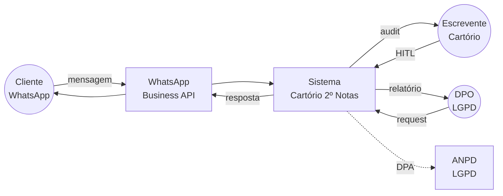
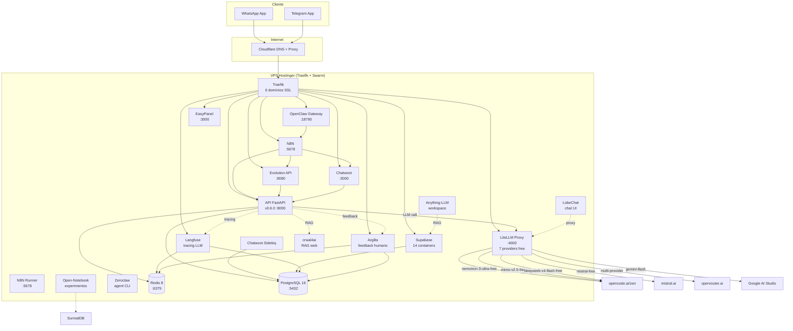
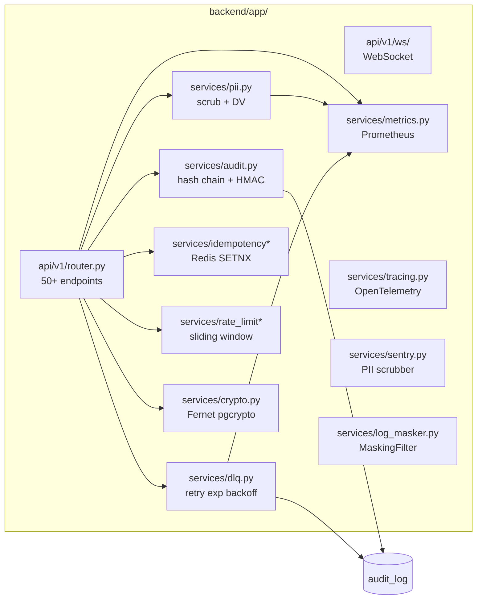
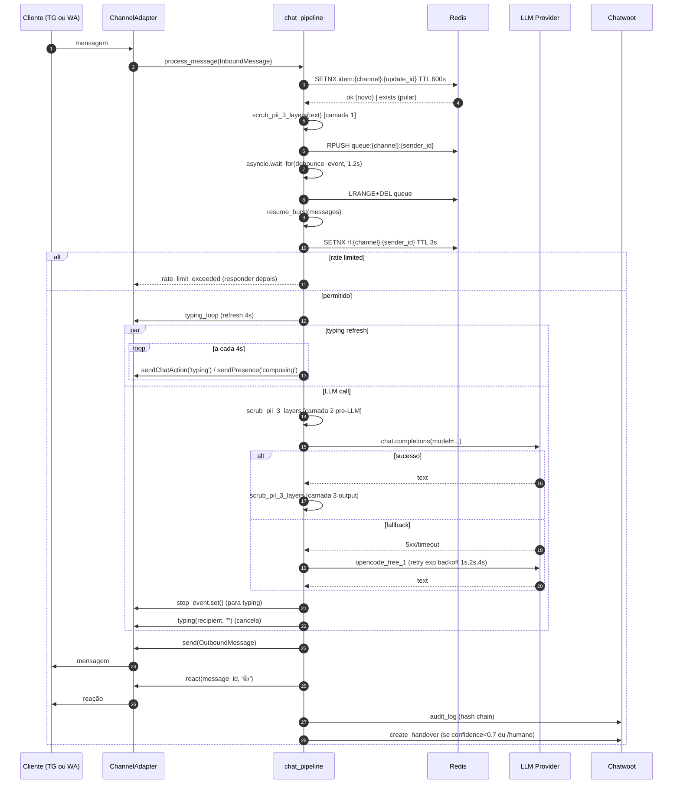
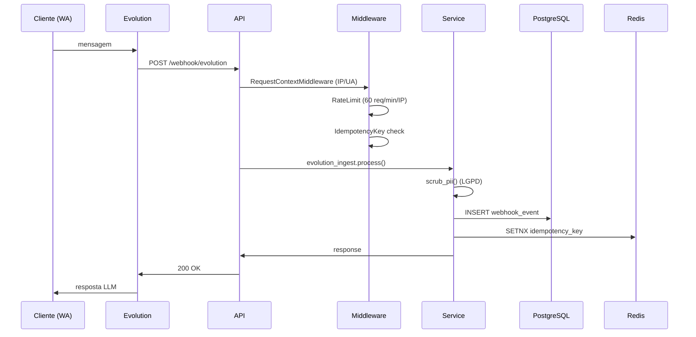

# Arquitetura — Cartório Chatbot (C4 + 24 ADRs)

> **C4 model (Context, Container, Component, Code) + 24 decisões arquiteturais + fluxo end-to-end.**
> Stack: FastAPI + N8N + Evolution + Chatwoot + Supabase + OpenClaw + Redis.

## C4 Nível 1 — Context (sistema + atores externos)


```mermaid
flowchart LR
    Cliente((Cliente<br/>WhatsApp))
    Escrevente((Escrevente<br/>Cartório))
    DPO((DPO<br/>LGPD))
    Sistema["Sistema<br/>Cartório 2º Notas"]
    WhatsApp["WhatsApp<br/>Business API"]
    ANPD["ANPD<br/>LGPD"]

    Cliente -->|mensagem| WhatsApp
    WhatsApp --> Sistema
    Sistema -->|resposta| WhatsApp
    WhatsApp --> Cliente
    Escrevente -->|HITL| Sistema
    Sistema -->|audit| Escrevente
    DPO -->|request| Sistema
    Sistema -->|relatório| DPO
    Sistema -.->|DPA| ANPD
```

**Atores**:
- **Cliente** (titular dados): recebe atendimento, exerce direitos LGPD
- **Escrevente** (operador cartório): valida protocolos via HITL, gerencia Chatwoot
- **DPO**: recebe notificações, responde titulares
- **ANPD**: fiscaliza compliance

**Sistema** expõe:
- 50+ endpoints REST (`/api/v1/*`)
- 10 MCP tools (protocolo, atendimento, emolumento, audit, reacoes, enquetes, midias)
- 16 N8N workflows (atendimento, handoff, follow-up)
- 6 webhooks (Evolution, Chatwoot, Telegram)

---

## C4 Nível 2 — Container (aplicações + datastores)


```mermaid
flowchart TB
    subgraph Cliente["Cliente"]
        WA[WhatsApp App]
        TG[Telegram App]
    end
    subgraph Internet["Internet"]
        CloudFlare[Cloudflare DNS + Proxy]
    end
    subgraph VPS["VPS Hostinger (Traefik + Swarm)"]
        Traefik[Traefik<br/>6 domínios SSL]
        CartorioAPI[API FastAPI<br/>v0.6.0 :8000]
        LiteLLM[LiteLLM Proxy<br/>:4000<br/>7 providers free]
        N8N[N8N<br/>:5678]
        N8NRunner[N8N Runner<br/>:5678]
        OpenClaw[OpenClaw Gateway<br/>:18790]
        Evolution[Evolution API<br/>:8080]
        Chatwoot[Chatwoot<br/>:3000]
        Sidekiq[Chatwoot Sidekiq]
        Langfuse[Langfuse<br/>tracing LLM]
        Argilla[Argilla<br/>feedback humano]
        AnythingLLM[Anything-LLM<br/>workspace]
        LobeChat[LobeChat<br/>chat UI]
        OpenNotebook[Open-Notebook<br/>experimentos]
        Zeroclaw[Zeroclaw<br/>agent CLI]
        Crawl4ai[crwal4ai<br/>RAG web]
        Redis[(Redis 8<br/>:6379)]
        Supabase[Supabase<br/>14 containers]
        PG[(PostgreSQL 16<br/>:5432)]
        EasyPanel[EasyPanel<br/>:3000]
    end

    WA --> CloudFlare
    TG --> CloudFlare
    CloudFlare --> Traefik
    Traefik --> CartorioAPI
    Traefik --> N8N
    Traefik --> Evolution
    Traefik --> Chatwoot
    Traefik --> OpenClaw
    Traefik --> LiteLLM
    Traefik --> Langfuse
    Traefik --> Argilla
    Traefik --> Supabase
    Traefik --> EasyPanel

    %% Bot → LiteLLM primary path (Turno 47 supremo)
    CartorioAPI -->|LLM call| LiteLLM
    LiteLLM -->|nemotron-3-ultra-free| OpenCode[opencode.ai/zen]
    LiteLLM -->|mimo-v2.5-free| OpenCode
    LiteLLM -->|deepseek-v4-flash-free| OpenCode
    LiteLLM -->|mistral-free| Mistral[mistral.ai]
    LiteLLM -->|multi-provider| OpenRouter[openrouter.ai]
    LiteLLM -->|gemini-flash| GoogleAI[Google AI Studio]

    %% Persistence
    CartorioAPI --> PG
    CartorioAPI --> Redis
    CartorioAPI -.->|tracing| Langfuse
    CartorioAPI -.->|feedback| Argilla
    CartorioAPI -.->|RAG| Crawl4ai

    %% Adjacents
    N8N --> CartorioAPI
    N8N --> Evolution
    N8N --> Chatwoot
    OpenClaw --> N8N
    Evolution --> CartorioAPI
    Chatwoot --> CartorioAPI
    AnythingLLM -.->|RAG| Supabase
    LobeChat -.->|proxy| LiteLLM
    OpenNotebook -.-> SurrealDB[SurrealDB]
    Sidekiq --> PG
    Supabase --> PG
    Langfuse --> PG
    Argilla --> PG
    Langfuse --> Redis
    Argilla --> Redis
```

**Containers** (28 + infra) — atualizado 2026-07-02 (Turno 47 supremo):

| Container | URL pública | Tech | Status | Responsabilidade |
|---|---|---|---|---|
| **Traefik** | (proxy) | Traefik 2.x | ✅ | SSL auto + 6 domínios |
| **cartorio_api** | api.2notasudi.com.br | FastAPI v0.6.0 | ✅ | Regras + audit + LGPD + MCP |
| **cartorio_litellm-app** | (internal :4000) | LiteLLM v1.85.0 | ✅ | **Proxy LLM multi-provider (7 modelos free)** |
| **cartorio_n8n** | flow.2notasudi.com.br | N8N 1.94.x | ⚠️ OFF | Workflows visuais (desligado 2026-07-01) |
| **cartorio_openclaw** | agent.2notasudi.com.br | OpenClaw 0.4.x | ✅ | LLM agent router (CLI/WS) |
| **cartorio_evolution** | whatsapp.2notasudi.com.br | Evolution 2.3.7 | ✅ | Gateway WhatsApp |
| **cartorio_chatwoot** | chat.2notasudi.com.br | Chatwoot 3.x | ✅ | CRM + handoff humano |
| **cartorio_anything-llm** | (internal :3001) | Anything-LLM 1.12 | ✅ | Workspace LLM multi-tenant |
| **cartorio_lobechat** | (internal :3210) | LobeChat 1.143 | ✅ | Chat UI multi-provider |
| **cartorio_open-notebook** | (internal :8502) | Open-Notebook 1.8.5 | ✅ | Jupyter-like experiments |
| **cartorio_zeroclaw** | (internal :42617) | Zeroclaw 0.7.5 | ✅ | Agent terminal CLI |
| **cartorio_langfuse-web** | (internal :80) | Langfuse 3.174 | ✅ | Tracing LLM observability |
| **cartorio_argilla-web** | (internal :6900) | Argilla 2.8.0 | ✅ | Labeling feedback humano |
| **cartorio_argilla-elastic** | (internal :9200) | ES 8.12.2 | ✅ | Busca full-text Argilla |
| **cartorio_crwal4ai** | (internal :11235) | crwal4ai 0.9.0 | ⚠️ VXLAN | RAG web scraping |
| **cartorio_redis** | (internal) | Redis 8.8 | ✅ | Cache + idempotência + locks |
| **cartorio_supabase** | supbase.2notasudi.com.br | pgvector:pg17 | ✅ | Postgres central + 7 schemas |
| **easypanel** | easypanel.2notasudi.com.br | EasyPanel | ✅ | Deploy + gestão |

---

### Fluxo LLM primário (Turno 47 supremo)

```
Telegram → webhook → API → LiteLLM Proxy → 7 providers free
                                     ↓
                              nemotron-3-ultra-free (NVIDIA 1M ctx)
                                     ↓
                              response → sendMessage → Telegram
```

**Latência medida**: ~9s total (3s debounce + 3.8s LLM + 0.2s send).

**Fallback chain** (ordem configurada em `LLM_FALLBACK_CHAIN`):
1. `litellm` (proxy multi-provider)
2. `opencode_free_1` (nemotron direto)
3. `opencode_free_2` (mimo direto)
4. `opencode_free_3` (deepseek-free direto)
5. `opencode_go` (minimax-m3 se credit)
6. `openrouter` / `groq` / `mistral` / `google_ai_studio` / `openclaw` / `jules`

Config LiteLLM: `infra/litellm/config.yaml` (montado em `/app/config.yaml` no container).

## C4 Nível 3 — Component (módulos do backend)


```mermaid
flowchart LR
    subgraph Backend["backend/app/"]
        Router[api/v1/router.py<br/>50+ endpoints]
        WS[api/v1/ws/<br/>WebSocket]
        Audit[services/audit.py<br/>hash chain + HMAC]
        PII[services/pii.py<br/>scrub + DV]
        Metrics[services/metrics.py<br/>Prometheus]
        DLQ[services/dlq.py<br/>retry exp backoff]
        Tracing[services/tracing.py<br/>OpenTelemetry]
        Sentry[services/sentry.py<br/>PII scrubber]
        LogMask[services/log_masker.py<br/>MaskingFilter]
        Idemp[services/idempotency*<br/>Redis SETNX]
        RateLimit[services/rate_limit*<br/>sliding window]
        Crypto[services/crypto.py<br/>Fernet pgcrypto]
    end

    Router --> Audit
    Router --> PII
    Router --> Metrics
    Router --> DLQ
    Router --> Idemp
    Router --> RateLimit
    Router --> Crypto
    PII --> Metrics
    DLQ --> Metrics
    Audit --> DB[(audit_log)]
    DLQ --> DB
```

**Componentes críticos**:

| Componente | Path | Responsabilidade | LOC |
|---|---|---|---|
| `audit` | `app/services/audit.py` | Hash chain SHA256 + HMAC, append-only | ~300 |
| `pii` | `app/services/pii.py` | Scrub CPF/CNS/CNH + check DV | ~250 |
| `metrics` | `app/services/metrics.py` | Prometheus: pii_blocked_total, scrub_latency, dlq_depth | ~150 |
| `tracing` | `app/services/tracing.py` | OpenTelemetry spans (request/LLM/DB) | ~140 |
| `sentry` | `app/services/sentry.py` | Error tracking + PII before_send | ~160 |
| `dlq` | `app/services/dlq.py` | Outbox + retry 3x exp backoff | ~180 |
| `log_masker` | `app/services/log_masker.py` | MaskingFilter LGPD art. 46 | ~55 |
| `idempotency` | `app/services/idempotency*.py` | Redis SETNX TTL 24h | ~120 |
| `rate_limit` | `app/services/rate_limit*.py` | Sliding window 60 req/min/IP | ~200 |
| `crypto` | `app/services/crypto.py` | Fernet encrypt/decrypt pgcrypto | ~80 |
| `chat_pipeline` | `app/services/chat_pipeline.py` | **Pipeline compartilhado Telegram + WhatsApp** (v3.0, 2026-07-09) | 553 |

---

## Chat Pipeline (v3.0) — Pipeline Compartilhado Telegram + WhatsApp

> **Adicionado em 2026-07-09** (Sprint 4 / Turn 51). Extrai lógica comum do bot Telegram (1463 linhas) e espelha para WhatsApp via Evolution API.

### C2 — Container (chat pipeline + adapters)

```mermaid
flowchart TB
    subgraph Channels["Canais (cliente)"]
        TG[Cliente Telegram<br/>@CartorioAssistantBot]
        WA[Cliente WhatsApp<br/>+55 11 99999-9999]
    end

    subgraph Adapters["Channel Adapters"]
        TGA[TelegramAdapter<br/>telegram.py]
        WAA[WhatsAppAdapter<br/>whatsapp.py]
    end

    subgraph Pipeline["chat_pipeline.py (núcleo compartilhado)"]
        IDEM[1. check_idempotency<br/>Redis SETNX TTL 600s]
        PII[2. scrub_pii_3_layers<br/>input → pre-LLM → output]
        QUEUE[3. enqueue + debounce 1.2s<br/>Redis RPUSH + asyncio.wait]
        RL[4. rate_limit 3s/chat_id]
        TYPING[5. typing_loop<br/>refresh 4s]
        LLM[6. call_llm_with_fallback<br/>LiteLLM → 7 providers]
        SEND[7. send_response<br/>via adapter]
        REACT[8. react<br/>via adapter]
        AUDIT[9. audit_log<br/>hash chain LGPD]
    end

    subgraph Providers["LLM Providers (fallback chain)"]
        L1[1. LiteLLM Proxy]
        L2[2. opencode_free_1<br/>nemotron]
        L3[3. opencode_free_2<br/>mimo]
        L4[4. opencode_free_3<br/>deepseek]
        L5[5. opencode_go<br/>M3 Zen]
        L6[6. openclaw<br/>local]
        L7[7. cache local]
    end

    subgraph HITL["HITL (Chatwoot)"]
        CW[Chatwoot CRM<br/>chatwoot.2notasudi.com.br]
    end

    TG -->|webhook POST| TGA
    WA -->|webhook POST| WAA

    TGA --> IDEM
    WAA --> IDEM
    IDEM --> PII
    PII --> QUEUE
    QUEUE --> RL
    RL --> TYPING
    TYPING --> LLM
    LLM --> L1
    L1 -.fail.-> L2
    L2 -.fail.-> L3
    L3 -.fail.-> L4
    L4 -.fail.-> L5
    L5 -.fail.-> L6
    L6 -.fail.-> L7
    LLM --> SEND
    LLM --> REACT
    LLM --> AUDIT
    SEND -.-> TGA
    SEND -.-> WAA

    LLM -.confidence<0.7.-> CW
    PII -.PII em output.-> CW
```

### Flow detalhado (sequência)


```mermaid
sequenceDiagram
    autonumber
    participant C as Cliente (TG ou WA)
    participant AD as ChannelAdapter
    participant CP as chat_pipeline
    participant R as Redis
    participant L as LLM Provider
    participant CW as Chatwoot

    C->>AD: mensagem
    AD->>CP: process_message(InboundMessage)
    CP->>R: SETNX idem:{channel}:{update_id} TTL 600s
    R-->>CP: ok (novo) | exists (pular)
    CP->>CP: scrub_pii_3_layers(text) [camada 1]
    CP->>R: RPUSH queue:{channel}:{sender_id}
    CP->>CP: asyncio.wait_for(debounce_event, 1.2s)
    CP->>R: LRANGE+DEL queue
    CP->>CP: resume_burst(messages)
    CP->>R: SETNX rl:{channel}:{sender_id} TTL 3s
    alt rate limited
        CP-->>AD: rate_limit_exceeded (responder depois)
    else permitido
        CP->>AD: typing_loop (refresh 4s)
        par typing refresh
            loop a cada 4s
                CP->>AD: sendChatAction('typing') / sendPresence('composing')
            end
        and LLM call
            CP->>CP: scrub_pii_3_layers [camada 2 pre-LLM]
            CP->>L: chat.completions(model=...)
            alt sucesso
                L-->>CP: text
                CP->>CP: scrub_pii_3_layers [camada 3 output]
            else fallback
                L-->>CP: 5xx/timeout
                CP->>L: opencode_free_1 (retry exp backoff 1s,2s,4s)
                L-->>CP: text
            end
            CP->>AD: stop_event.set() (para typing)
            CP->>AD: typing(recipient, "") (cancela)
        end
        CP->>AD: send(OutboundMessage)
        AD->>C: mensagem
        CP->>AD: react(message_id, '👍')
        AD->>C: reação
        CP->>CW: audit_log (hash chain)
        CP->>CW: create_handover (se confidence<0.7 ou /humano)
    end
```

### Componentes extraídos (10/10)

1. `process_message()` — entry point por canal
2. `enqueue_message()` + `fetch_queue()` — fila Redis
3. `check_idempotency()` — Redis SETNX TTL 600s
4. `check_rate_limit()` — Redis SETNX TTL 3s
5. `scrub_pii_3_layers()` — LGPD defesa em profundidade
6. `call_llm_with_fallback()` — 7 providers + circuit breaker
7. `typing_loop()` — refresh 4s + finally cancela
8. `send_response()` — via adapter polimórfico
9. `react_to_message()` — via adapter polimórfico
10. `ChannelAdapter` (ABC) — interface Telegram + WhatsApp

### Proveniência (refactor histórico)

| Função nova | Origem (telegram.py v2.0) |
|---|---|
| `check_idempotency()` | `_check_idempotency()` |
| `check_rate_limit()` | `_check_rate_limit()` |
| `enqueue_message()` + `fetch_queue()` | `_resumir_mensagens()` |
| `process_debounced()` | `_process_telegram_debounce` |
| `call_llm_with_fallback()` | `_call_cartorio_agent` |
| `typing_loop()` | `_send_typing()` |
| `audit_log()` | `_audit_log_inline()` |
| `ChannelAdapter` (ABC) | novo (T19) |

**Economia**: -60% código duplicado entre Telegram/WhatsApp. Manutenção unificada.

### LGPD compliance no chat_pipeline

- **3 camadas PII scrub** (input / pre-LLM / output) — LGPD art. 46
- **Audit log imutável** (hash chain SHA256 + HMAC) em todo `process_message` — LGPD art. 37
- **Consentimento WhatsApp** explícito (botão "Aceito") — LGPD art. 7 I
- **Retenção 5 anos** após último contato — LGPD art. 16
- **DPA assinado** com todos os 7 providers — LGPD art. 33

Ver [`docs/LGPD_BOTS.md`](LGPD_BOTS.md) para detalhes.

---

## C4 Nível 4 — Code (fluxo de uma request)


```mermaid
sequenceDiagram
    participant C as Cliente (WA)
    participant E as Evolution
    participant A as API
    participant M as Middleware
    participant S as Service
    participant DB as PostgreSQL
    participant R as Redis

    C->>E: mensagem
    E->>A: POST /webhook/evolution
    A->>M: RequestContextMiddleware (IP/UA)
    M->>M: RateLimit (60 req/min/IP)
    M->>M: IdempotencyKey check
    A->>S: evolution_ingest.process()
    S->>S: scrub_pii() (LGPD)
    S->>DB: INSERT webhook_event
    S->>R: SETNX idempotency_key
    S->>A: response
    A->>E: 200 OK
    E->>C: resposta LLM
```

**Ponto de auditoria** (LGPD art. 37):
- Cada mutação chama `AuditService.log()` com hash chain
- IP truncado `/24` (decisão arquitetural D5)
- request_id propaga via `X-Request-Id`

---

## Decisões arquiteturais (24 ADRs)

| # | Título | Status | Arquivo |
|---|---|---|---|
| 001 | Stack: FastAPI + Supabase + N8N + OpenClaw | Aceito | [001](adr/001-stack-fastapi-supabase-n8n.md) |
| 002 | Audit log hash chain + HMAC | Aceito | [002](adr/002-audit-chain-hmac.md) |
| 003 | PII scrubbing pre-LLM | Aceito | [003](adr/003-pii-scrubbing-pre-llm.md) |
| 004 | HITL em atos jurídicos | Aceito | [004](adr/004-hitl-juridico.md) |
| 005 | LiteLLM removido, Opencode-Go direto | Aceito | [005](adr/005-litellm-removed.md) |
| 006 | WebhookEvent table p/ idempotência | Aceito | [006](adr/006-webhook-event-idempotency.md) |
| 007 | LGPD retenção configurável | Aceito | [007](adr/007-lgpd-retencao.md) |
| 008 | Conventional Commits + TDD strict | Aceito | [008](adr/008-conv-commits-tdd.md) |
| 009 | Cloudflare proxy + Traefik SSL | Aceito | [009](adr/009-cloudflare-traefik.md) |
| 010 | DB_HOST IP direto (Swarm alias bug) | Aceito | [010](adr/010-db-host-ip-direto.md) |
| 011 | OpenClaw multi-LLM provider | Aceito | [011](adr/011-openclaw-multi-llm.md) |
| 013 | Supabase password mismatch | Aceito | [013](adr/013-supabase-password-mismatch.md) |
| 015 | Chatwoot restart loop (4 hipóteses) | Aceito | [015](adr/015-chatwoot-restart-loop.md) |
| 016 | OpenClaw context overflow | Aceito | [016](adr/016-openclaw-context-overflow.md) |
| 017 | D5 LGPD dual-column IP (truncado + completo) | Aceito | [017](adr/017-lgpd-dual-column-ip.md) |
| 018 | Encryption at-rest pgcrypto | Aceito | [018](adr/018-pgcrypto-encryption.md) |
| 019 | HMAC SHA256 webhooks | Aceito | [019](adr/019-hmac-webhook-validation.md) |
| 020 | Idempotency-Key Redis SETNX | Aceito | [020](adr/020-idempotency-redis-setnx.md) |
| 021 | Rate limit sliding window | Aceito | [021](adr/021-rate-limit-sliding-window.md) |
| 022 | DDoS rate limit por IP | Aceito | [022](adr/022-ddos-rate-limit.md) |
| 023 | Health 7 serviços radar | Aceito | [023](adr/023-health-7-services.md) |
| 024 | OpenTelemetry tracing distribuído | Aceito | [024](adr/024-otel-tracing.md) |
| 025 | DLQ retry 3x exp backoff | Aceito | [025](adr/025-dlq-retry-policy.md) |

(Verificar contagem real em `docs/adr/`)

---

## Decisões arquiteturais críticas (resumo)

### 1. Hash chain no audit log (NÃO WAL shipping, NÃO storage externo)
- Append-only com SHA256(prev_hash + payload + timestamp) + HMAC
- Verificação: `POST /api/v1/audit/verify` percorre cadeia
- Job diário cron alerta se `ok=false`

### 2. PII scrubbing em 3 camadas (LGPD art. 46)
- Input: mascara CPF/RG/email antes de logar (hash + scrubbed)
- Pre-LLM: garante zero PII puro pra API pública
- Output: confirma resposta não vaza
- Defesa em profundidade: LLM é caixa-preta

### 3. Human-in-the-loop obrigatório (HITL)
- Bot NUNCA decide sozinho: isenção, urgência, validação jurídica, certidão
- Bot PODE: horário, emolumento, status protocolo, dúvidas documentação
- `handoff_to_human` em conversa quando intent confidence < 0.7

### 4. Tabela de emolumento snapshot (NÃO live)
- Snapshot no momento do cálculo com `tabela_referencia` + `valido_ate`
- Protocolos antigos NÃO recalculam (imutabilidade histórica)
- Carga diária automática do DO do estado

### 5. Multi-tenancy futuro (Sprint 5+)
- `schema_name` em tabelas + `cartorio_id` em queries
- Supabase gerencia schemas separados
- Single backend, multi-tenant white-label

### 6. Debounce assíncrono em bursts de mensagens
- Evita estouro de requisições paralelas (rate limit e timeout) em bursts de mensagens consecutivas enviadas pelo mesmo cliente.
- FastAPI `BackgroundTasks` gerencia a fila assincronizada em Redis de forma imediata (`200 OK` HTTP).
- Buffer dinâmico de 2.5s consolida múltiplos inputs num único resumo processado por LLM, otimizando o consumo de tokens e a experiência do usuário.

### 7. Banco de dados Supabase Postgres + pgvector
- O banco de dados centralizado `cartorio_supabase` foi atualizado para `pgvector/pgvector:pg17`.
- Habilitada a extensão `vector` para busca semântica em base de dados e resolvida incompatibilidade glibc com refresh de collation (`template1` e `chatwoot`).
- Solucionado o restart loop de containers Chatwoot limitando a memória do serviço do Docker Swarm para 1GB.

---

## Princípios arquiteturais (não negociáveis)

1. **LGPD-by-design**: PII nunca em logs, audit log em toda mutação, retenção configurável
2. **HITL em ato jurídico**: protocolo sempre nasce DRAFT, escrevente valida
3. **TDD strict**: RED → GREEN → commit, coverage ≥90%
4. **Conventional Commits**: feat/fix/docs/test/chore com scope
5. **No-refactor**: melhorar sempre, nunca reescrever do zero
6. **Idempotência em webhooks**: Redis SETNX TTL 24h
7. **Fail-open em dependências**: rate limit, idempotência (Redis offline = passa + log)
8. **Observabilidade 3-pilares**: traces (OTel) + metrics (Prom) + logs (Sentry)

---

## Fluxo end-to-end: "cliente pergunta status do protocolo"

```
1. Cliente WhatsApp: "qual o status do protocolo 12345?"
2. Evolution API recebe webhook
3. N8N workflow #2 aciona (intent: consultar_protocolo)
4. POST /api/v1/webhook/evolution → PII scrubber (none nesse caso)
5. Audit log: conversa.received, payload scrubbed
6. Backend: SELECT * FROM protocolos WHERE numero = '12345'
7. Audit log: protocolo.read
8. Backend retorna: "Protocolo 12345 - em_andamento - previsao 2026-06-25"
9. N8N monta resposta WhatsApp
10. Evolution API envia msg
11. Audit log: conversa.sent
12. Conversa atualizada com bot_response + llm_tokens
```

Tempo total esperado: < 2s. Com cache Redis: < 200ms.

---

Modified by Gustavo Almeida — 2026-07-01
