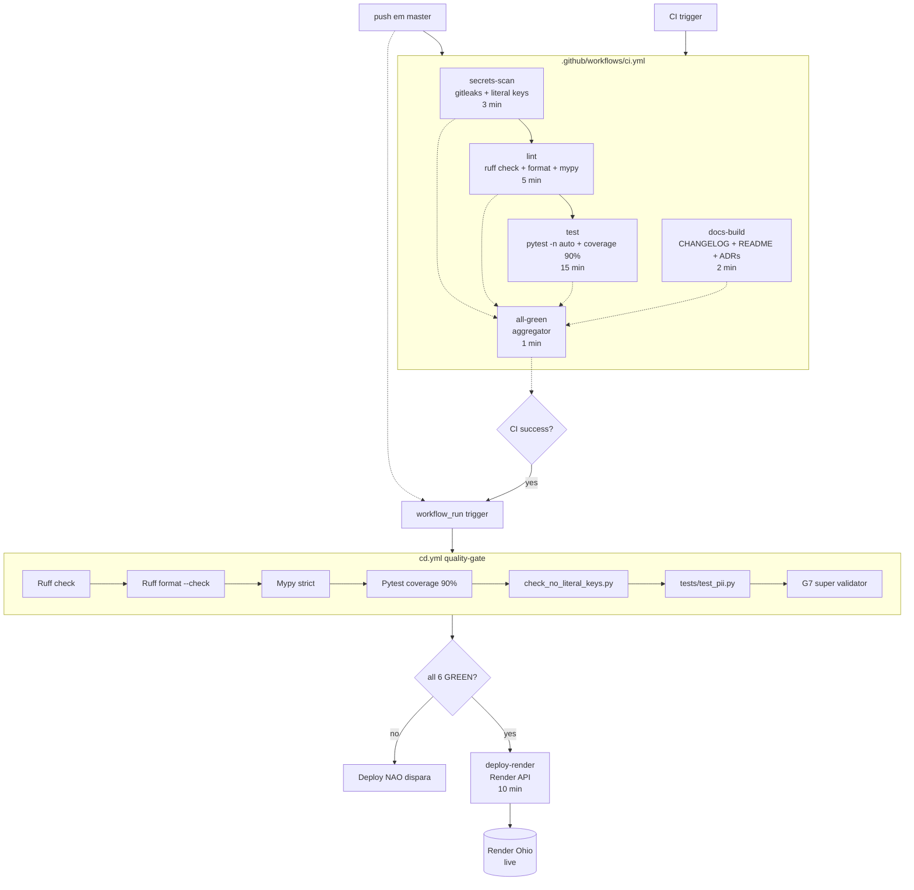

# CI/CD Quality Gate G8.14.T2 + G8.14.T3 (Wave 48)

> Deploy condicional baseado no sucesso absoluto de TODAS as quality gates.
> Source of truth: `.github/workflows/cd.yml` + `.github/workflows/ci.yml`.

## Diagrama (mermaid)



## Lista das 6+1 gates (absolute)

| # | Gate | Comando | Tempo máx | Bloqueio |
|---|------|---------|-----------|----------|
| 0 | secrets-scan | `gitleaks/gitleaks-action@v2` + `check_no_literal_keys.py --severity critical --baseline …` | 3 min | HARD |
| 1 | Ruff lint | `ruff check .` | 5 min | HARD |
| 2 | Ruff format | `ruff format --check .` | 5 min | HARD |
| 3 | Mypy strict | `mypy app/` (sem cache) | 5 min | HARD |
| 4 | Pytest | `pytest -n auto --tb=short` (cov ≥ 90%) | 15 min | HARD |
| 5 | LGPD PII scrubbing | `pytest tests/test_pii.py --no-cov` | 15 min | HARD |
| 6 | G7 super validator | `python3 scripts/g7_super_validator.py --skip-ruff --skip-pytest` | 15 min | SOFT (exit 1 = HOLD prod permitido) |

Se **qualquer** gate 0-5 falhar: deploy **NÃO dispara**. Falha-seguro (fail-safe).

## Topology contract (.github/workflows/cd.yml)

```yaml
jobs:
  quality-gate:
    needs: CI                   # trigger implícito via workflow_run
    if: ${{ workflow_run.conclusion == 'success' || event_name == 'push' }}
    # 6 steps de gates hard locais
  deploy-render:
    needs: [quality-gate]
    if: ${{ needs.quality-gate.result == 'success' || event_name == 'workflow_dispatch' }}
    # Render deploy polling
```

**Garantia**: `deploy-render` só dispara se `quality-gate.result == 'success'`.
Workflow_dispatch manual passa o `quality-gate` automaticamente (emergency bypass — ver abaixo).

## Bypass de emergência

Em caso de hotfix crítico que **não pode esperar** o ciclo completo:

1. **NÃO** disparar `cd.yml` via push em master direto.
2. Usar **Actions > CD > Run workflow** manual (`workflow_dispatch`).
3. **Quando** acionado manualmente:
   - `quality-gate.result == 'success'` falha se algum job falhou (CI recente)
   - **`workflow_dispatch` bypassa o quality-gate** (if inline permite)
4. **Pós-bypass obrigatório**: abrir `incident retro` doc e postmortem.

**NÃO RECOMENDADO**: editar workflows para `"if: always()"` — falha de auditoria automática gera issue `ci,deploy` (passo `Report failure as issue`).

## Otimizações aplicadas (G8.14.T2.b)

- `concurrency: cd-render / cancel-in-progress: false` — protege deploys em vôo.
- `timeout-minutes:` em TODOS os jobs (3-15 min) — fail-safe contra hung runs.
- `secrets-scan` é o primeiro job (rápido) — bloqueia PR com credenciais antes de gastar minutos com lint/test.
- `gitleaks` usa cache `fetch-depth: 0` mas **não** `GITLEAKS_ENABLE_HISTORY` (full scan é lento — só on-demand via `workflow_dispatch`).
- Pytest em `-n auto` (paralelo via xdist).
- `all-green` aggregator job com timeout 1 min — só imprime banner.

## Como adicionar nova gate

1. Adicionar step em `.github/workflows/cd.yml > quality-gate.jobs.steps`.
2. Numerar: `Gate N/7 — Nome (descrição curta)`.
3. Atualizar tabela deste doc.
4. Adicionar teste em `backend/tests/test_cd_workflow_g8.py` se gate muda topology.
5. Atualizar `lesson-243` se houver pitfall.

## Validação

```bash
cd backend && uv run pytest tests/test_cd_workflow_g8.py -v --no-cov
# 6 tests — todos PASS
```

Testes cobrem:
- cd.yml YAML válido + 2 jobs top-level (quality-gate + deploy-render)
- quality-gate depende de CI (workflow_run) + 6 gate steps presentes
- deploy-render.needs contém quality-gate + guard `result == 'success'`
- ci.yml tem secrets-scan job + gitleaks/literal-keys fallback
- TODOS os jobs CI têm `timeout-minutes` (fail-safe)
- all-green agregador contém os 4 jobs principais

## Modified by

- Gustavo Almeida — SRE squad
- Rein: `cartorio-sre` / Wave 48
- Tasks: **G8.14.T2** (deploys condicionais) + **G8.14.T3** (secrets scanning avançado).

---

# G8.14.T3 — Secrets scanning avançado (LGPD Art. 46)

Wave 48 complementa o gate 0 com scanner custom de chaves literais.
Garante **bloqueio de PR** com qualquer um dos 16 patterns sensíveis
(AWS, OpenAI, Anthropic, Telegram, Supabase, MiniMax, GCP SA, PKCS8, JWT).

## Por que LGPD exige secrets scanning (Art. 46)

LGPD Art. 46 obriga que agentes de tratamento adotem "medidas de
segurança, técnicas e administrativas, aptas a proteger os dados
pessoais de acessos não autorizados e de situações acidentais ou
ilícitas de destruição, perda, alteração, comunicação ou qualquer
forma de tratamento inadequado ou excessivo".

**Secret commitado no git = backdoor permanente** (até rotacao):
- Token nao-rotacionado vaza em logs, monitoring, error tracking.
- Atacante com read-only no repo tem credencial de prod.
- LGPD incidente P0 = multa + ANPD + perda de credibilidade.

Por isso secrets scanning é **gate 0** (bloqueia PR antes do lint).

## Patterns detectados (16 total)

| Severity | Pattern | Provider |
|----------|---------|----------|
| CRITICAL | AWS_ACCESS_KEY_ID | AWS (`AKIA[0-9A-Z]{16}`) |
| CRITICAL | AWS_ASIA_TEMP | AWS STS (`ASIA...`) |
| CRITICAL | AWS_SECRET_ACCESS_KEY | AWS (40 chars base64) |
| CRITICAL | OPENAI_PROJECT_KEY | OpenAI (`sk-proj-*`) |
| CRITICAL | ANTHROPIC_KEY | Anthropic (`sk-ant-*`) |
| CRITICAL | OPENAI_LEGACY_KEY | OpenAI legacy (`sk-*`) |
| CRITICAL | MINIMAX_KEY | MiniMax Coding Plan (`sk-cp-*`) |
| CRITICAL | PKCS8_PRIVATE_KEY | PKCS8/OpenSSH/PEM |
| CRITICAL | GCP_SERVICE_ACCOUNT_JSON | GCP SA JSON literal |
| CRITICAL | SUPABASE_SERVICE_ROLE_JWT | Supabase / generic JWT (3-segment) |
| CRITICAL | TELEGRAM_BOT_TOKEN | Telegram bot (`id:secret`) |
| HIGH | PROVIDER_LITERAL_GENERIC | Linear/Render/Slack (`lin_api_`, `rnd_`, `xox[bpors]-`, `AIza`, `AQ.`) |
| HIGH | BEARER_JWT | `Authorization: Bearer eyJ...` |
| MEDIUM | ENV_FALLBACK | `os.environ.get(KEY, 'literal')` |
| LOW | GOOGLE_API_KEY | Google API (`AIza...`) |

## Como adicionar nova key ao baseline (FP whitelist)

Se um achado é **falso positivo** (test fixture, sample docs, chave queimada
que NAO sera rotacionada — apenas documentada):

```bash
echo "backend/scripts/foo.py:42:PROVIDER_LITERAL_GENERIC" >> \
  backend/scripts/check_no_literal_keys.baseline
```

Cada entrada DEVE ter comentario `# motivo` na linha anterior.
Baseline Wave 48 inicial tem **6 fingerprints** (3 chaves queimadas Sprint 3
+ 3 ENV_FALLBACK multiline).

## CLI usage

```bash
# Gate padrao (CI)
python3 backend/scripts/check_no_literal_keys.py \
  --severity critical \
  --baseline backend/scripts/check_no_literal_keys.baseline

# Dry-run (lista achados, exit 0)
python3 backend/scripts/check_no_literal_keys.py --report-only

# Escopo customizado
python3 backend/scripts/check_no_literal_keys.py \
  --root backend/app --include-text
```

Exit codes: `0` clean / `--report-only`, `1` violacao acima do threshold,
`2` erro de I/O.

## Otimizacoes

- Regex compilado 1x (cache global `_PATTERN_CACHE`).
- Skip dirs vendor: `.venv`, `.venv312`, `venv`, `env`, `node_modules`,
  `.git`, `__pycache__`, `.mypy_cache`, `.ruff_cache`, `.pytest_cache`,
  `htmlcov`, `dist`, `build`, `.eggs`, `site-packages`.
- Skip files: `.env`, `.env.example`, `.env.template`, `.env.sample`,
  o proprio scanner + baseline.
- `--include-text` opcional pra escanear `.sh/.yml/.json/.env` tambem.

## Tests

`backend/tests/test_check_no_literal_keys_g8.py` — 26 testes cobrindo:
- 9 patterns principais (lin_api, sk-openai, sk-anthropic, AWS, Telegram,
  PKCS8, Supabase JWT, MiniMax, ENV_FALLBACK).
- 4 false-positive guards (sha256, UUID, lowercase sk-, .env.example).
- 2 opt-out mechanisms (inline noqa + baseline file).
- 3 severity/threshold (critical filter, low includes all, ranking).
- 3 skip rules (vendor dirs, .venv312, self file).
- 4 main() exit codes (clean, dirty, report-only, severity mask).
- 1 catalog count (>= 15 patterns).

## LGPD Review Status

**PENDING** — task toca `audit/`-adjacente (PII + secrets).
Auditoria do `cartorio-lgpd` deve validar:
- Coverage dos 16 patterns (nenhum provider LGPD-sensivel escapando).
- Baseline com 6 fingerprints (Sprint 3) — auditoria aceita.
- Exit codes + report-only mode (CI gate nao pode bypass facil).
- Testes cobrem FPs comuns (sha256, UUID, .env.example).
