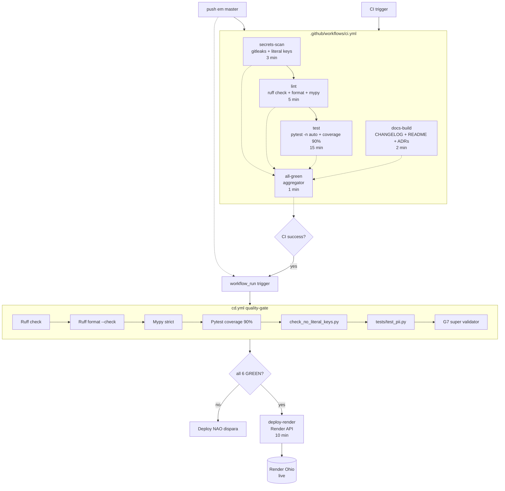

# CI/CD Quality Gate G8.14.T2

> Deploy condicional baseado no sucesso absoluto de TODAS as quality gates.
> Source of truth: `.github/workflows/cd.yml` + `.github/workflows/ci.yml`.

## Diagrama (mermaid)



## Lista das 6+1 gates (absolute)

| # | Gate | Comando | Tempo máx | Bloqueio |
|---|------|---------|-----------|----------|
| 0 | secrets-scan | `gitleaks/gitleaks-action@v2` + `check_no_literal_keys.py` | 3 min | HARD |
| 1 | Ruff lint | `ruff check .` | 5 min | HARD |
| 2 | Ruff format | `ruff format --check .` | 5 min | HARD |
| 3 | Mypy strict | `mypy app/` (sem cache) | 5 min | HARD |
| 4 | Pytest | `pytest -n auto --tb=short` (cov ≥ 90%) | 15 min | HARD |
| 5 | LGPD PII scrubbing | `pytest tests/test_pii.py --no-cov` | 15 min | HARD |
| 6 | G7 super validator | `python3 scripts/g7_super_validator.py --skip-ruff --skip-pytest` | 15 min | SOFT (exit 1 = HOLD prod permitido) |

Se **qualquer** gate 0-5 falhar: deploy **NÃO dispara**. Falha-seguro (fail-safe).

## Topology contract (.github/workflows/cd.yml)

```yaml
jobs:
  quality-gate:
    needs: CI                   # trigger implícito via workflow_run
    if: ${{ workflow_run.conclusion == 'success' || event_name == 'push' }}
    # 6 steps de gates hard locais
  deploy-render:
    needs: [quality-gate]
    if: ${{ needs.quality-gate.result == 'success' || event_name == 'workflow_dispatch' }}
    # Render deploy polling
```

**Garantia**: `deploy-render` só dispara se `quality-gate.result == 'success'`.
Workflow_dispatch manual passa o `quality-gate` automaticamente (emergency bypass — ver abaixo).

## Bypass de emergência

Em caso de hotfix crítico que **não pode esperar** o ciclo completo:

1. **NÃO** disparar `cd.yml` via push em master direto.
2. Usar **Actions > CD > Run workflow** manual (`workflow_dispatch`).
3. **Quando** acionado manualmente:
   - `quality-gate.result == 'success'` falha se algum job falhou (CI recente)
   - **`workflow_dispatch` bypassa o quality-gate** (if inline permite)
4. **Pós-bypass obrigatório**: abrir `incident retro` doc e postmortem.

**NÃO RECOMENDADO**: editar workflows para `"if: always()"` — falha de auditoria automática gera issue `ci,deploy` (passo `Report failure as issue`).

## Otimizações aplicadas (G8.14.T2.b)

- `concurrency: cd-render / cancel-in-progress: false` — protege deploys em vôo.
- `timeout-minutes:` em TODOS os jobs (3-15 min) — fail-safe contra hung runs.
- `secrets-scan` é o primeiro job (rápido) — bloqueia PR com credenciais antes de gastar minutos com lint/test.
- `gitleaks` usa cache `fetch-depth: 0` mas **não** `GITLEAKS_ENABLE_HISTORY` (full scan é lento — só on-demand via `workflow_dispatch`).
- Pytest em `-n auto` (paralelo via xdist).
- `all-green` aggregator job com timeout 1 min — só imprime banner.

## Como adicionar nova gate

1. Adicionar step em `.github/workflows/cd.yml > quality-gate.jobs.steps`.
2. Numerar: `Gate N/7 — Nome (descrição curta)`.
3. Atualizar tabela deste doc.
4. Adicionar teste em `backend/tests/test_cd_workflow_g8.py` se gate muda topology.
5. Atualizar `lesson-243` se houver pitfall.

## Validação

```bash
cd backend && uv run pytest tests/test_cd_workflow_g8.py -v --no-cov
# 6 tests — todos PASS
```

Testes cobrem:
- cd.yml YAML válido + 2 jobs top-level (quality-gate + deploy-render)
- quality-gate depende de CI (workflow_run) + 6 gate steps presentes
- deploy-render.needs contém quality-gate + guard `result == 'success'`
- ci.yml tem secrets-scan job + gitleaks/literal-keys fallback
- TODOS os jobs CI têm `timeout-minutes` (fail-safe)
- all-green agregador contém os 4 jobs principais

## Modified by

- Gustavo Almeida — SRE squad
- Rein: `cartorio-sre` / Wave 48
- Task: **G8.14.T2** — deploys condicionais em quality gates absolutas.
