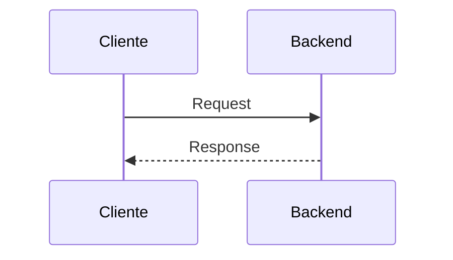

# Contributing Guide — Cartório Chatbot

> Guia para contribuir com o projeto (devs, docs, testes).
> Última atualização: 2026-06-26.

## TL;DR

**Workflow**:
1. Leia o `ONBOARDING_TIME.md` (se novo)
2. Veja `SQUADS` (qual squad sua task pertence)
3. TDD: RED (test) → GREEN (impl) → REFACTOR
4. Gates: `mypy` + `ruff` + `pytest` (0/0/todos)
5. Commit canônico + push master
6. Atualize SESSION_SUMMARY

**Regras**:
- ✅ Master only
- ✅ Nunca rotacionar chaves
- ✅ Pydantic V2 ConfigDict
- ✅ Async/await em I/O
- ✅ PII scrub antes de logar
- ✅ Testes para features novas

---

## Índice

1. [Código de Conduta](#1-código-de-conduta)
2. [Workflow de Contribuição](#2-workflow-de-contribuição)
3. [Padrões de Código](#3-padrões-de-código)
4. [Padrões de Commit](#4-padrões-de-commit)
5. [Testes (TDD)](#5-testes-tdd)
6. [Documentação](#6-documentação)
7. [Pull Requests (se aplicável)](#7-pull-requests-se-aplicável)
8. [Revisão de Código](#8-revisão-de-código)
9. [Releases](#9-releases)
10. [Comunidade](#10-comunidade)

---

## 1. Código de Conduta

### 1.1 Princípios

```
✅ Respeito mútuo (sempre)
✅ Construtivismo (crítica é sobre código, não pessoa)
✅ Colaboração (ajude quem é novo)
✅ Qualidade (zero erros, zero warnings)
✅ LGPD (privacidade desde o design)
✅ Documentação (código sem doc = código quebrado)
```

### 1.2 Comportamento Esperado

- Comentários construtivos em code review
- Ajudar novatos no onboarding
- Documentar decisões importantes (ADRs)
- Compartilhar conhecimento (docs, posts internos)

### 1.3 Comportamento Inaceitável

- Comentários ofensivos
- Commits sem mensagem
- Código sem testes
- Ignorar warnings do linter
- Vazar PII em logs ou commits

---

## 2. Workflow de Contribuição

### 2.1 Fluxo TDD

```
1. RED: Escrever teste que falha
   pytest backend/tests/test_new_feature.py  # FAIL
   
2. GREEN: Implementar código mínimo
   # ... implementar ...
   pytest backend/tests/test_new_feature.py  # PASS
   
3. REFACTOR: Melhorar
   # ... refatorar ...
   pytest backend/tests/test_new_feature.py  # PASS
   
4. Gates completos
   mypy backend/ --ignore-missing-imports  # 0 errors
   ruff check backend/ --fix               # 0 errors
   pytest backend/tests/ -v                # all pass
   
5. Commit
   git add -A
   git commit -m "feat(api): add new feature with tests"
   git push origin master
   
6. CI valida (GitHub Actions)
   - mypy
   - ruff
   - pytest
   - coverage
   
7. Deploy automático (Easypanel)
   
8. Atualizar SESSION_SUMMARY
```

### 2.2 Tamanho de Task

| Tipo | Tempo Ideal | Complexidade |
|------|------------|--------------|
| **Bug fix** | < 4h | Baixa-Média |
| **Feature pequena** | 4-8h | Média |
| **Feature média** | 1-2 dias | Média-Alta |
| **Refactor** | 1-3 dias | Alta |
| **Migration DB** | 2-4h | Média |

**Regra**: Se > 2 dias, dividir em subtasks.

### 2.3 Squads

Cada task pertence a um squad:

| Squad | Foco | Exemplo |
|-------|------|---------|
| **S0** | Supabase Foundation | Schema, RLS, Triggers |
| **A** | API + DB Hardening | Endpoints, performance |
| **B** | N8N Polish | Workflows, retry, timeout |
| **C** | Docs raiz | Documentação |
| **D** | LGPD Compliance | Direitos titular, DPO |
| **E** | OpenClaw Agent | Skills, config |
| **H** | Chatwoot CRM | Inbox, macros, HITL |
| **J** | Obs + CI/CD | Prometheus, Grafana |
| **BRAIN** | Sistema Cerebral | Memória, contexto |
| **DOCS** | Download Docs | Baixar docs externas |

Ver squads em `.harness/TASKS.md`.

---

## 3. Padrões de Código

### 3.1 Python (PEP 8 + extras)

```python
# ✅ Type hints SEMPRE
def process_cliente(cliente: Cliente) -> ClienteResponse:
    ...

# ✅ Async/await em I/O
async def fetch_data() -> dict:
    async with httpx.AsyncClient() as client:
        response = await client.get(...)
        return response.json()

# ✅ Pydantic V2 com ConfigDict
from pydantic import BaseModel, ConfigDict

class MySchema(BaseModel):
    model_config = ConfigDict(from_attributes=True, strict=True)
    nome: str
    valor: Decimal

# ✅ Logger estruturado
import structlog

logger = structlog.get_logger(__name__)

logger.info(
    "cliente.criado",
    cliente_id=cliente.id,
    correlation_id=cid,
)

# ✅ PII Scrub
from app.middleware.pii_scrub import scrub_pii

logger.info(scrub_pii(f"CPF: {cliente.cpf}"))  # "CPF: [REDACTED-CPF]"

# ✅ Tratamento de erro explícito
try:
    result = await external_service.call()
except httpx.HTTPStatusError as e:
    logger.error("external_error", status=e.response.status_code)
    raise HTTPException(502, "External service unavailable")

# ❌ EVITAR
# - Sem type hints
# - except genérico (except Exception)
# - print() ao invés de logger
# - f-string em SQL
# - secrets em código
```

### 3.2 Imports

```python
# Ordem alfabético (ruff isort)
# 1. Stdlib
import asyncio
import json
from datetime import datetime

# 2. Third-party
import httpx
from fastapi import APIRouter, Depends, HTTPException
from pydantic import BaseModel

# 3. Local
from app.config import settings
from app.services.cliente import ClienteService
```

### 3.3 Nomes

```python
# snake_case para funções/variáveis
def get_cliente_by_id(cliente_id: UUID) -> Cliente: ...

# PascalCase para classes
class ClienteService: ...

# UPPER_CASE para constantes
MAX_RETRY_ATTEMPTS = 3
DEFAULT_TIMEOUT = 10.0

# Prefixos
# - get_: retorna valor
# - list_: retorna lista
# - create_: cria novo
# - update_: atualiza existente
# - delete_: remove
# - is_/has_: boolean
# - _underscore: privado
```

### 3.4 Documentação (Docstrings)

```python
def complex_function(
    cliente_id: UUID,
    options: dict | None = None,
) -> Cliente:
    """Busca cliente por ID com opções avançadas.
    
    Implementa cache LRU + fallback para DB.
    LGPD: dados sensíveis são filtrados.
    
    Args:
        cliente_id: UUID do cliente.
        options: Opções adicionais (force_refresh, include_deleted).
    
    Returns:
        Cliente encontrado ou None.
    
    Raises:
        ValueError: Se cliente_id for inválido.
        DatabaseError: Se DB inacessível após retries.
    
    Examples:
        >>> cliente = complex_function(UUID('123...'))
        >>> cliente.nome
        'João'
    """
```

### 3.5 Error Handling

```python
# ✅ Específico
try:
    result = await api.call()
except httpx.TimeoutException:
    raise HTTPException(504, "API timeout")
except httpx.HTTPStatusError as e:
    if e.response.status_code == 404:
        return None
    raise

# ❌ Genérico
try:
    result = await api.call()
except:  # Muito genérico
    pass
```

### 3.6 Testes (Boas Práticas)

```python
# ✅ Arrange-Act-Assert (AAA)
async def test_criar_cliente_sucesso():
    # Arrange
    payload = {"nome": "João", "cpf": "12345678900"}
    
    # Act
    response = client.post("/api/v1/clientes", json=payload)
    
    # Assert
    assert response.status_code == 201
    assert response.json()["nome"] == "João"

# ✅ Testar edge cases
async def test_criar_cliente_cpf_invalido():
    # Arrange
    payload = {"nome": "João", "cpf": "111"}  # CPF inválido
    
    # Act
    response = client.post("/api/v1/clientes", json=payload)
    
    # Assert
    assert response.status_code == 422
    assert "cpf" in response.json()["detail"][0]["loc"]

# ✅ Fixtures reutilizáveis
@pytest.fixture
def cliente_valido():
    return {"nome": "João", "cpf": "12345678900", "telefone": "34999999999"}

async def test_a(cliente_valido):
    response = client.post("/api/v1/clientes", json=cliente_valido)
    ...

# ✅ Mock serviços externos
async def test_with_mock(monkeypatch):
    async def mock_evolution(*args, **kwargs):
        return {"status": "sent"}
    
    monkeypatch.setattr("app.services.evolution.send_text", mock_evolution)
    
    # Act
    await send_notification("3499999999", "Olá")
    
    # Assert
    mock_evolution.assert_called_once()
```

### 3.7 Migrations (Alembic)

```python
# ✅ Reversível
def upgrade():
    op.add_column('clientes', sa.Column('novo_campo', sa.String(50)))
    op.create_index('ix_clientes_novo_campo', 'clientes', ['novo_campo'])

def downgrade():
    op.drop_index('ix_clientes_novo_campo', 'clientes')
    op.drop_column('clientes', 'novo_campo')

# ✅ Backfill se necessário
def upgrade():
    op.add_column('clientes', sa.Column('ativo', sa.Boolean(), server_default='true'))
    op.execute("UPDATE clientes SET ativo = true WHERE ativo IS NULL")
    op.alter_column('clientes', 'ativo', nullable=False)

# ❌ EVITAR
# - DROP TABLE em prod (soft delete)
# - Lock longo (usar CONCURRENTLY)
# - Mudanças sem migration versionada
```

---

## 4. Padrões de Commit

### 4.1 Formato (Conventional Commits)

```
<type>(<scope>): <description>

[body]

[footer]
```

### 4.2 Types

| Type | Descrição | Exemplo |
|------|-----------|---------|
| **feat** | Nova feature | `feat(api): add LGPD export endpoint` |
| **fix** | Bug fix | `fix(openclaw): correct context to 1M` |
| **docs** | Documentação | `docs(readme): update installation steps` |
| **style** | Formatação | `style(backend): apply ruff formatting` |
| **refactor** | Refactoring | `refactor(services): simplify cliente service` |
| **perf** | Performance | `perf(api): add Redis cache to emolumento` |
| **test** | Testes | `test(lgpd): add rights request tests` |
| **chore** | Manutenção | `chore(deps): update fastapi to 0.115` |
| **ci** | CI/CD | `ci(github): add mypy to pipeline` |
| **build** | Build | `build(docker): optimize image size` |
| **ops** | Operations | `ops(monitoring): add Grafana dashboard` |
| **revert** | Reverter | `revert: feat(api): add breaking change` |

### 4.3 Scopes

| Scope | Área |
|-------|------|
| **api** | API FastAPI |
| **n8n** | Workflows N8N |
| **db** | Database / Migrations |
| **openclaw** | Agent AI |
| **chatwoot** | CRM |
| **evolution** | WhatsApp |
| **telegram** | Telegram Bot |
| **lgpd** | LGPD |
| **auth** | Authentication |
| **monitoring** | Prometheus/Grafana |
| **infra** | Infraestrutura |
| **docs** | Documentação |
| **tests** | Testes |
| **ci** | CI/CD |
| **docker** | Containers |
| **security** | Segurança |

### 4.4 Exemplos de Boas Mensagens

```bash
# Boa
feat(api): add LGPD data export endpoint
fix(openclaw): correct context size from 131k to 1M
docs(readme): update deployment steps with Easypanel
test(lgpd): add D09 exclusion endpoint tests
chore(deps): update fastapi to 0.115
perf(api): add Redis cache to emolumento lookup
refactor(services): extract common audit logic
ci(github): add openapi-spec-validator check
ops(monitoring): add Grafana dashboard for N8N

# Ruim
update
fix bug
WIP
asdf
```

### 4.5 Breaking Changes

```bash
# Footer com BREAKING CHANGE
feat(api)!: rename /clientes to /v2/clientes

BREAKING CHANGE: /clientes is now /v2/clientes. Update your integrations.
Migration guide: https://docs.migration/v1-to-v2
```

---

## 5. Testes (TDD)

### 5.1 Pirâmide de Testes

```
         /\
        /  \      E2E (poucos, lentos)
       /────\     
      /      \    Integração (médios)
     /────────\   
    /          \  Unitários (muitos, rápidos)
   /────────────\
```

**Proporção ideal**:
- 70% unitários
- 20% integração
- 10% E2E

### 5.2 Estrutura

```bash
backend/tests/
├── unit/                    # Testes isolados
│   ├── test_cliente_service.py
│   ├── test_emolumento_calc.py
│   └── ...
├── integration/             # Testes com DB
│   ├── test_api_clientes.py
│   ├── test_lgpd_endpoints.py
│   └── ...
├── e2e/                     # Testes end-to-end
│   ├── test_whatsapp_flow.py
│   ├── test_openclaw_integration.py
│   └── ...
├── conftest.py              # Fixtures globais
└── fixtures/                # Dados de teste
```

### 5.3 Nomenclatura

```python
# Função: test_<comportamento>_<condição>_<resultado_esperado>
def test_criar_cliente_cpf_valido_retorna_201(): ...
def test_criar_cliente_cpf_invalido_retorna_422(): ...
def test_listar_clientes_paginacao_skip_0_limit_50(): ...
def test_atualizar_cliente_inexistente_retorna_404(): ...
def test_excluir_cliente_existente_retorna_204(): ...
```

### 5.4 Fixtures (conftest.py)

```python
# backend/tests/conftest.py
import pytest
from app.main import app
from app.db import get_db, Base
from sqlalchemy import create_engine
from sqlalchemy.orm import sessionmaker

# DB em memória para testes
SQLALCHEMY_DATABASE_URL = "sqlite:///./test.db"
engine = create_engine(SQLALCHEMY_DATABASE_URL)
TestingSessionLocal = sessionmaker(bind=engine)

@pytest.fixture
def db():
    Base.metadata.create_all(bind=engine)
    session = TestingSessionLocal()
    yield session
    session.close()
    Base.metadata.drop_all(bind=engine)

@pytest.fixture
def client(db):
    def override_get_db():
        try:
            yield db
        finally:
            db.close()
    
    app.dependency_overrides[get_db] = override_get_db
    yield TestClient(app)
    app.dependency_overrides.clear()

@pytest.fixture
def api_key():
    return "test-api-key"

@pytest.fixture
def cliente_valido():
    return {
        "nome": "João Silva",
        "cpf": "12345678900",
        "telefone": "34999999999",
        "email": "joao@example.com"
    }
```

### 5.5 Cobertura

**Meta**: 90%+ para código novo, 80%+ global.

```bash
# Ver cobertura
pytest backend/tests/ --cov=backend/app --cov-report=term-missing

# HTML report
pytest backend/tests/ --cov=backend/app --cov-report=html
open htmlcov/index.html
```

### 5.6 Mocking

```python
# httpx mock
import respx

@respx.mock
async def test_external_api():
    respx.get("https://api.external.com/data").mock(
        return_value=httpx.Response(200, json={"key": "value"})
    )
    
    result = await external_api.fetch_data()
    assert result == {"key": "value"}

# DB mock
from unittest.mock import AsyncMock

async def test_with_db_mock():
    db = AsyncMock()
    db.query.return_value.filter_by.return_value.first.return_value = Cliente(
        id=UUID("..."), nome="João"
    )
    
    result = await service.get_by_id(UUID("..."), db=db)
    assert result.nome == "João"
```

---

## 6. Documentação

### 6.1 Quando Documentar

```
✅ Toda feature nova
✅ Toda API nova
✅ Toda decisão arquitetural (ADR)
✅ Todo bug complexo (postmortem)
✅ Toda mudança de processo
✅ Todo onboarding (ONBOARDING)
```

### 6.2 Onde Documentar

| Tipo | Local |
|------|-------|
| **API endpoint** | Docstring + OpenAPI auto |
| **Função complexa** | Docstring Google-style |
| **Feature** | `docs/FEATURE_NAME.md` |
| **ADR** | `docs/ARCH_DECISIONS.md` ou `docs/adr/NNN-titulo.md` |
| **Postmortem** | `docs/postmortems/YYYY-MM-DD-titulo.md` |
| **Sessão** | `SESSION_SUMMARY_YYYY-MM-DD.md` |
| **Runbook** | `docs/RUNBOOK_*.md` |
| **Troubleshooting** | `docs/TROUBLESHOOTING.md` |

### 6.3 Formato

```markdown
# Título Claro

> Resumo em 1-2 frases.

## TL;DR

[O essencial em 3-5 bullets]

## Índice

1. [Seção 1](#1-seção-1)
2. ...

## Seção 1

[Conteúdo]

## Seção 2

[Conteúdo]

## Recursos

- [Link 1]
- [Link 2]

---

**Mantido por**: @autor
**Última atualização**: YYYY-MM-DD
**Versão**: X.Y.Z
```

### 6.4 Diagrama (Mermaid)



---

## 7. Pull Requests (se aplicável)

**Nota**: Atualmente trabalhamos direto na `master` (regra de ouro). Se necessário usar PR no futuro:

### 7.1 Template

```markdown
## O que esta PR faz?

[Descrição em 2-3 frases]

## Por que?

[Link para issue/task]

## Como testar?

[Passos para QA]

## Checklist

- [ ] Testes adicionados/atualizados
- [ ] mypy passa (0 errors)
- [ ] ruff passa (0 errors)
- [ ] pytest passa (todos)
- [ ] Documentação atualizada
- [ ] Sem secrets em código
- [ ] Sem PII em logs
- [ ] SESSION_SUMMARY atualizado
```

### 7.2 Reviewers

**Obrigatório**: 1 dev sênior (ou Gustavo) aprovar antes de merge.

---

## 8. Revisão de Código

### 8.1 Checklist do Revisor

```
□ Código segue padrões (type hints, async, Pydantic V2)
□ Testes cobrem casos normais + edge cases
□ Cobertura > 90% para código novo
□ Sem secrets/PII em código
□ Docstrings em funções complexas
□ Sem TODOs sem issue linkada
□ Sem código comentado (morto)
□ Mensagens de commit canônicas
□ Documentação atualizada
□ Gates passam (mypy/ruff/pytest)
```

### 8.2 Feedback Construtivo

```markdown
# ✅ Bom
"Sugiro extrair essa lógica para uma função nomeada. Vai ficar mais testável."

# ❌ Ruim
"Esse código está feio."
```

### 8.3 Conflito com cartorio-dev

```bash
# Se cartorio-dev commitou na master
git fetch origin
git rebase origin/master  # ou merge
git push origin master

# Se houver conflito
git status  # ver arquivos
# ... resolver manualmente ...
git add -A
git rebase --continue
git push origin master --force-with-lease
```

---

## 9. Releases

### 9.1 Versionamento (SemVer)

```
MAJOR.MINOR.PATCH
  |     |     |
  |     |     └─ Bug fix (backward compatible)
  |     └─────── Feature nova (backward compatible)
  └───────────── Breaking change
```

**Exemplo**: v0.6.0
- 0 = ainda em desenvolvimento
- 6 = minor (6 features adicionadas)
- 0 = patch

### 9.2 Changelog

Manter `docs/CHANGELOG.md`:

```markdown
# Changelog

## [0.6.0] - 2026-06-26

### Adicionado
- LGPD data export endpoint
- OpenClaw 1M context
- Caching de emolumento 24h

### Modificado
- Contexto OpenClaw de 131k para 1M
- Timeout N8N para 5s/10s

### Corrigido
- Race condition cartorio-dev
- PII scrub em logs de erro

### Removido
- (nada)
```

### 9.3 Tag de Versão

```bash
# Tag
git tag -a v0.6.0 -m "Release 0.6.0"
git push origin v0.6.0

# Ver tags
git tag -l
```

---

## 10. Comunidade

### 10.1 Comunicação

| Canal | Uso |
|-------|-----|
| **Telegram DM Gustavo** | Crítico, urgente |
| **Telegram Squad (-5006771024)** | Status, atualizações |
| **Email** | LGPD, formal |
| **GitHub Issues** | Bugs, features |
| **GitHub Discussions** | Perguntas, ideias |

### 10.2 Reuniões

- **Daily standup** (15min, assíncrono via Telegram)
- **Sprint review** (semanal, 1h)
- **Postmortem** (após P0/P1, 1h)
- **Retrospectiva** (mensal, 1h)

### 10.3 Reconhecimento

Contribuições reconhecidas via:
- Co-autoria em commits
- Menção em SESSION_SUMMARY
- ADR assinado pelo autor
- Post interno de "ship-it"

---

## 11. Recursos para Novos Contribuidores

- `docs/ONBOARDING_TIME.md` - Onboarding completo
- `docs/VERSIONAMENTO_PROJETO.md` - Estado do projeto
- `docs/CHANGELOG.md` - Histórico
- `docs/ARCH_DECISIONS.md` - Decisões arquiteturais
- `docs/PLATFORMS/*.md` - Docs por plataforma
- `docs/TROUBLESHOOTING.md` - Resolução de problemas
- `docs/INCIDENT_RESPONSE_PLAYBOOK.md` - Resposta a incidentes
- `docs/SECURITY_HARDENING.md` - Segurança
- `docs/PERFORMANCE_TUNING.md` - Performance
- `docs/INTEGRATION_GUIDE.md` - Integrações
- `docs/DATABASE_OPERATIONS.md` - DB
- `docs/MONITORING_GUIDE.md` - Monitoring
- `docs/FAQ_OPERACIONAL.md` - FAQ
- `docs/GLOSSARIO_CARTORIO.md` - Glossário

---

**Mantido por**: Pietra (orquestrador)
**Próxima revisão**: 2026-07-02
**Versão**: 1.0.0
