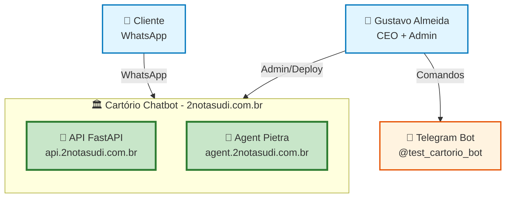
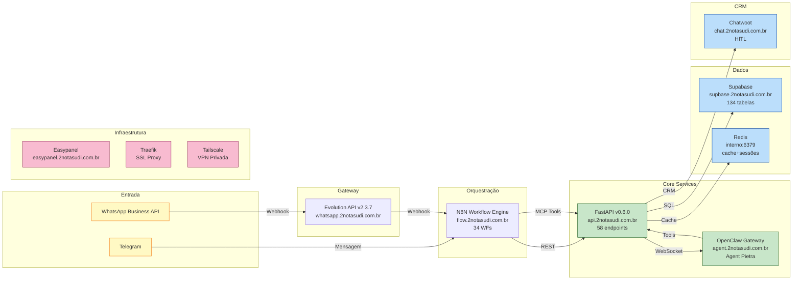
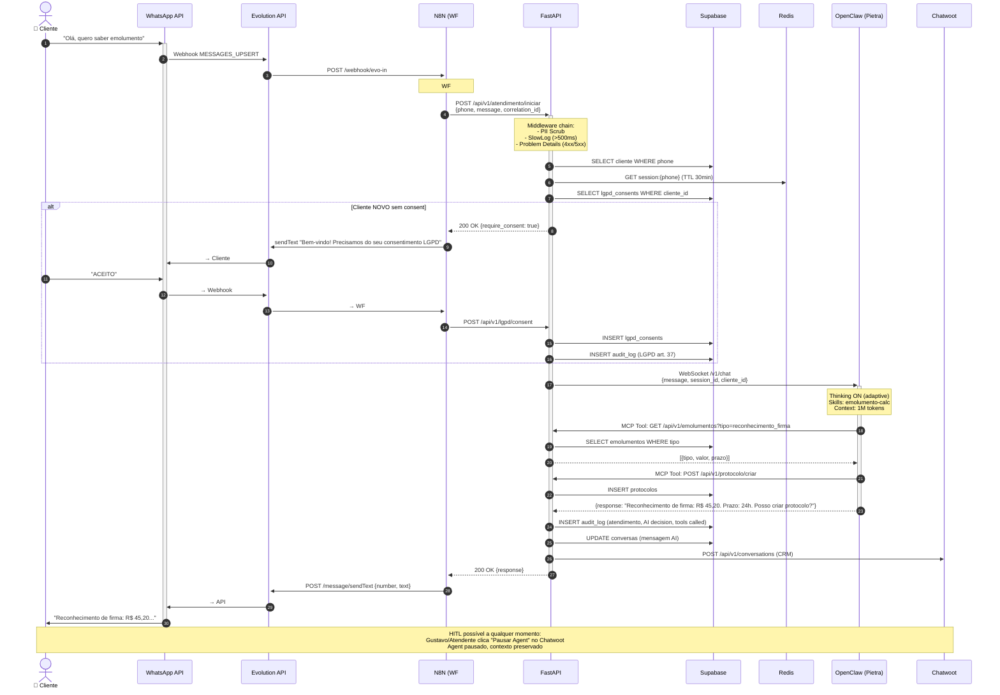
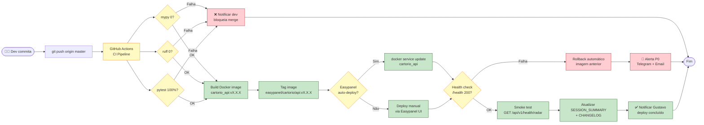
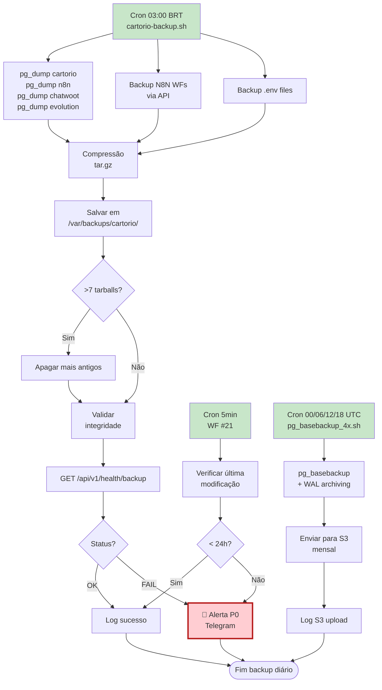
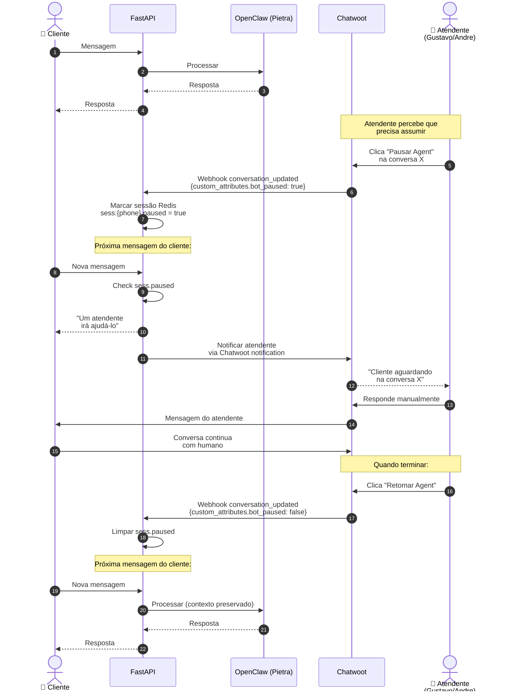
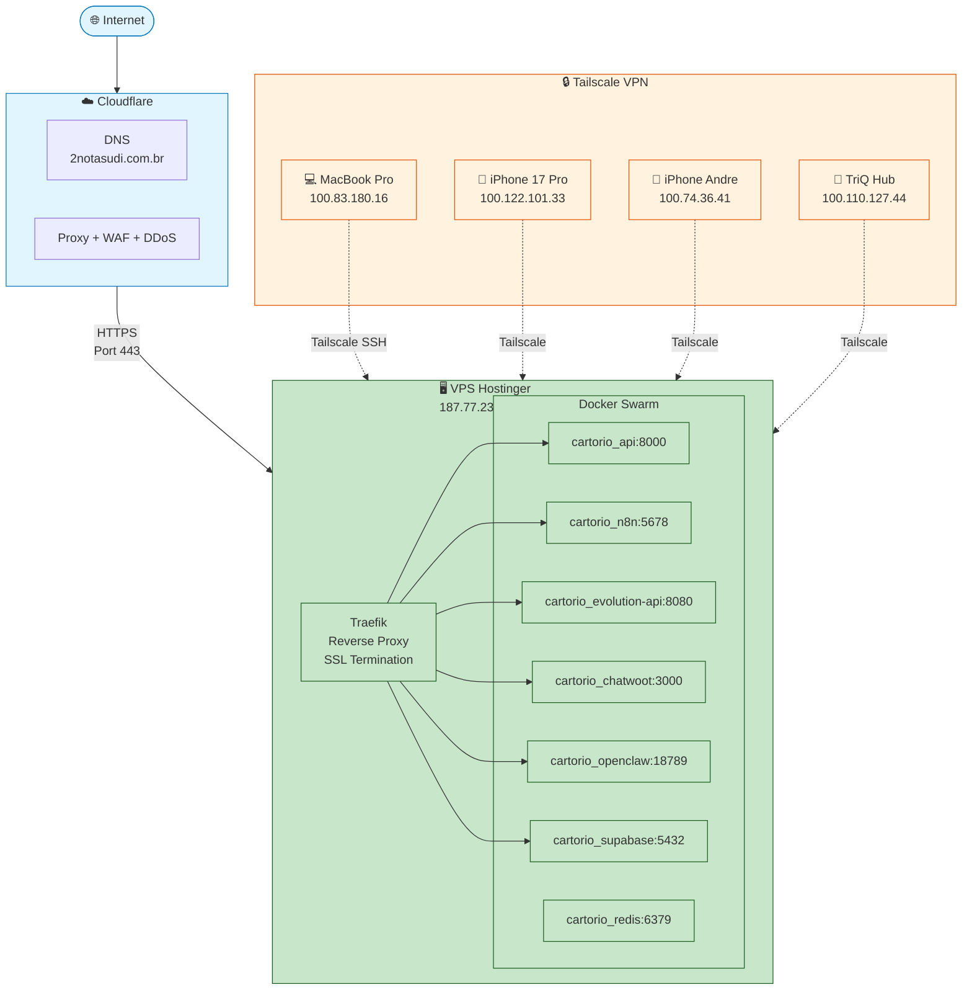
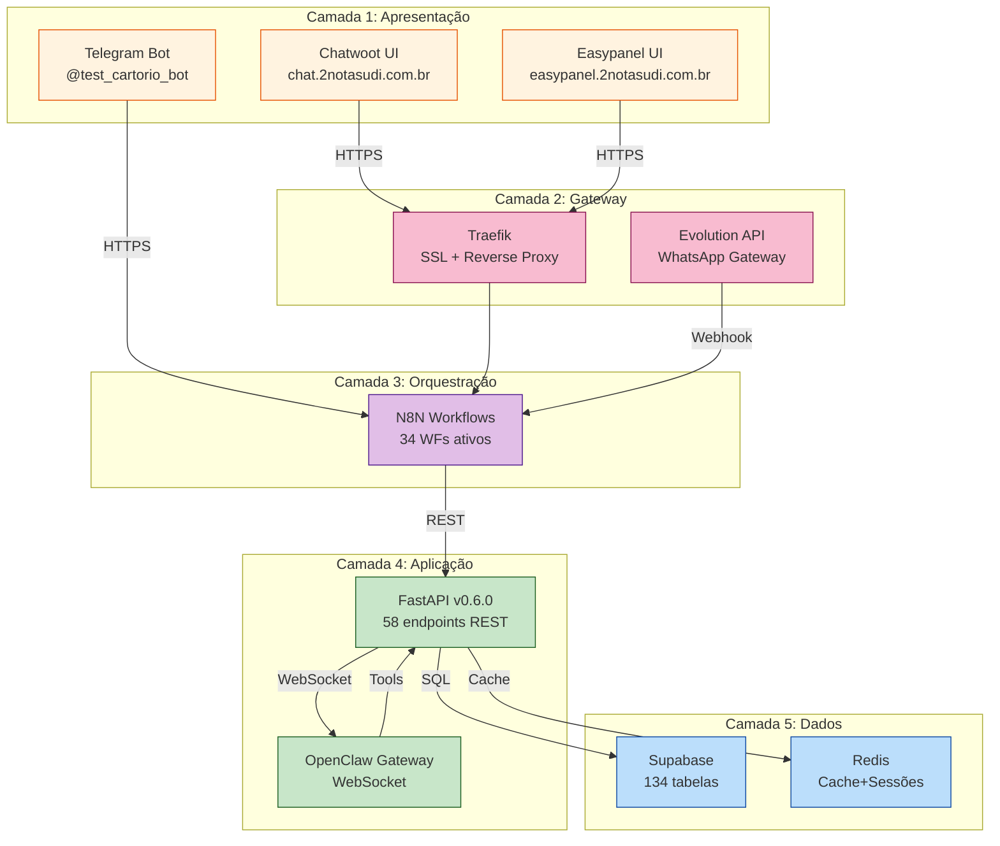

# Diagrama de Sistema — Cartório Chatbot

> Diagramas Mermaid de alta fidelidade mostrando todos os fluxos do sistema.
> Última atualização: 2026-06-26.

## Índice

1. [Visão Macro (C4 Level 1)](#1-visão-macro-c4-level-1)
2. [Container View (C4 Level 2)](#2-container-view-c4-level-2)
3. [Fluxo de Atendimento WhatsApp (E2E)](#3-fluxo-de-atendimento-whatsapp-e2e)
4. [Fluxo LGPD e Consentimento](#4-fluxo-lgpd-e-consentimento)
5. [Fluxo de Deploy](#5-fluxo-de-deploy)
6. [Fluxo de Backup e Recuperação](#6-fluxo-de-backup-e-recuperação)
7. [Fluxo HITL (Human In The Loop)](#7-fluxo-hitl-human-in-the-loop)
8. [Arquitetura de Rede](#8-arquitetura-de-rede)
9. [Topologia Docker Swarm](#9-topologia-docker-swarm)
10. [Fluxo de Dados por Camada](#10-fluxo-de-dados-por-camada)

---

## 1. Visão Macro (C4 Level 1)



**Atores**:
- **Cliente**: Usuário final que manda mensagens WhatsApp
- **Gustavo**: CEO, admin do sistema, deploys, configs críticas
- **Telegram Bot**: Canal alternativo (pré-teste)

---

## 2. Container View (C4 Level 2)



---

## 3. Fluxo de Atendimento WhatsApp (E2E)



**Tempo esperado total**: 2-5 segundos (p95) entre mensagem do cliente e resposta.

---

## 4. Fluxo LGPD e Consentimento

```mermaid
flowchart TD
    Start([Cliente novo<br/>entra em contato]) --> Check{Session existe?}
    
    Check -->|Não| QueryConsent[GET /lgpd_consents<br/>WHERE phone]
    Check -->|Sim| LoadSession[Carregar sessão Redis]
    
    QueryConsent --> HasConsent{Tem consent?}
    
    HasConsent -->|Sim| LoadSession
    HasConsent -->|Não| SendConsent[Enviar termo LGPD<br/>via WhatsApp]
    
    SendConsent --> WaitReply{Aguarda resposta<br/>30min TTL}
    WaitReply -->|Timeout| Reject[Sair: "Consentimento<br/>necessário"]
    WaitReply -->|ACEITO/CONCORDO| RecordConsent[POST /lgpd/consent<br/>aceito_em: NOW]
    
    RecordConsent --> Audit1[INSERT audit_log<br/>LGPD art. 37]
    Audit1 --> NotifyDPO[notify_outbox_new<br/>→ N8N WF #04b]
    NotifyDPO --> LoadSession
    
    LoadSession --> ProcessMsg[Processar mensagem<br/>normalmente]
    ProcessMsg --> Audit2[INSERT audit_log<br/>toda ação]
    
    Audit2 --> RightCheck{Cliente exerceu<br/>direito LGPD?}
    RightCheck -->|Sim D09| ScheduleExclusion[POST /lgpd/data-subject-request<br/>type=EXCLUSION, prazo=30d]
    RightCheck -->|Sim D08| ExportData[GET /lgpd/portabilidade<br/>→ JSON+ZIP+S3 link 7d]
    RightCheck -->|Sim D07| UpdateData[PATCH /lgpd/meus-dados]
    RightCheck -->|Não| Continue[Continuar atendimento]
    
    ScheduleExclusion --> CronWait[Anonimização após 30d<br/>via N8N WF #24 cron diário]
    CronWait --> Anon[UPDATE clientes/protoccolos<br/>SET nome='ANON-{hash}', cpf=NULL]
    Anon --> AuditAnon[INSERT lgpd_audit_anpd<br/>type=ANONIMIZATION]
    AuditAnon --> Done([Fim])
    
    ExportData --> Done
    UpdateData --> Done
    Continue --> Done
    
    classDef lgpd fill:#ffebee,stroke:#c62828
    classDef consent fill:#e8f5e9,stroke:#2e7d32
    classDef neutral fill:#e3f2fd,stroke:#1565c0
    
    class SendConsent,RecordConsent,Audit1,Audit2,AuditAnon lgpd
    class HasConsent,RightCheck consent
    class Check,LoadSession,ProcessMsg neutral
```

**Retenção**:
- Conversas: 365 dias
- Audit log: 1825 dias (5 anos - LGPD art. 37)
- Consentimentos: permanente (até revogação)

---

## 5. Fluxo de Deploy



**Tempo total**: 3-7 minutos (mypy + ruff + pytest + build + deploy + smoke).

**Zero-downtime**: Swarm rolling update garante que sempre há N containers UP.

---

## 6. Fluxo de Backup e Recuperação



**Recuperação** (RTO < 1h, RPO < 24h):
1. SSH VPS
2. Localizar tarball mais recente
3. `tar -xzf backup-YYYY-MM-DD.tar.gz -C /restore/`
4. `psql -U postgres < restore/cartorio.sql`
5. Restart serviços
6. Validar com smoke test

---

## 7. Fluxo HITL (Human In The Loop)



**Benefícios**:
- Atendente pode intervir SEM perder contexto
- Cliente não percebe transição
- Bot pode ser retomado exatamente de onde parou

---

## 8. Arquitetura de Rede



**Segurança**:
- Cloudflare: DDoS + WAF + bot management
- Tailscale: VPN WireGuard (criptografia ponta a ponta)
- Traefik: SSL Let's Encrypt (renovação auto)
- Docker Swarm: isolamento entre containers

---

## 9. Topologia Docker Swarm

```mermaid
graph TB
    subgraph SwarmManager [Swarm Manager]
        Manager[docker swarm manager<br/>187.77.236.77]
    end
    
    subgraph Services [12 Services]
        direction LR
        S1[cartorio_api<br/>:8000]
        S2[cartorio_n8n<br/>:5678]
        S3[cartorio_n8n-runner<br/>worker]
        S4[cartorio_evolution-api<br/>:8080]
        S5[cartorio_chatwoot<br/>:3000]
        S6[cartorio_chatwoot-sidekiq<br/>worker]
        S7[cartorio_openclaw-gateway<br/>:18789]
        S8[cartorio_redis<br/>:6379]
        S9[cartorio_redis_dbgate<br/>:3001]
        S10[cartorio_redis_rediscommander<br/>:8081]
        S11[easypanel<br/>:3000]
        S12[easypanel-traefik<br/>:80,:443]
    end
    
    subgraph Supabase [14 sub-containers]
        SB1[supabase-db]
        SB2[supabase-kong]
        SB3[supabase-postgrest]
        SB4[supabase-gotrue]
        SB5[supabase-storage]
        SB6[supabase-realtime]
        SB7[supabase-functions]
        SB8[supabase-studio]
        SB9[supabase-meta]
        SB10[supabase-edge-runtime]
        SB11[supabase-imgproxy]
        SB12[supabase-analytics]
        SB13[supabase-vector]
        SB14[supabase-logflare]
    end
    
    Manager --> S1
    Manager --> S2
    Manager --> S3
    Manager --> S4
    Manager --> S5
    Manager --> S6
    Manager --> S7
    Manager --> S8
    Manager --> S9
    Manager --> S10
    Manager --> S11
    Manager --> S12
    Manager --> SB1
    Manager --> SB2
    Manager --> SB3
    Manager --> SB4
    Manager --> SB5
    Manager --> SB6
    Manager --> SB7
    Manager --> SB8
    Manager --> SB9
    Manager --> SB10
    Manager --> SB11
    Manager --> SB12
    Manager --> SB13
    Manager --> SB14
    
    classDef manager fill:#c8e6c9,stroke:#1b5e20,stroke-width:3px
    classDef service fill:#bbdefb,stroke:#0d47a1
    classDef supabase fill:#fff9c4,stroke:#f57f17
    
    class Manager manager
    class S1,S2,S3,S4,S5,S6,S7,S8,S9,S10,S11,S12 service
    class SB1,SB2,SB3,SB4,SB5,SB6,SB7,SB8,SB9,SB10,SB11,SB12,SB13,SB14 supabase
```



**Total**: 12 services + 14 sub-containers = **26 containers** gerenciados.

---

## 10. Fluxo de Dados por Camada



**Princípios**:
- Cada camada é independente
- Falha em uma camada não derruba as outras
- Cada serviço tem health check próprio
- Auto-scaling horizontal (Swarm replicas)

---

## Como usar estes diagramas

1. **Visualização**: Mermaid renderiza nativamente em GitHub, GitLab, VS Code, Obsidian
2. **Edição**: Editar diretamente no Mermaid Live Editor (https://mermaid.live/)
3. **Export PNG/SVG**: Usar `mmdc` (Mermaid CLI) ou extensões Chrome
4. **Documentação**: Diagramas são referenciados em `/docs/ARCHITECTURE.md` e `/docs/platforms/ARCHITECTURE_DIAGRAM.md`

---

**Mantido por**: Pietra (orquestrador)
**Próxima revisão**: 2026-07-03
**Versão**: 1.0.0
