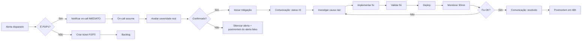

# Incident Response Playbook — Cartório Chatbot

> Playbook operacional para resposta a incidentes em produção.
> Última atualização: 2026-06-26.

## TL;DR

**Princípio P0**: P0 = **resolver primeiro, documentar depois**.

**Princípio P1**: Comunicação clara e contínua (status a cada 15min).

**Princípio P2**: Postmortem SEMPRE após P0/P1 (sem culpados, só aprendizado).

**Escalation**: Dev on-call → Gustavo (CEO) → DPO (LGPD).

---

## Índice

1. [Classificação de Incidentes](#1-classificação-de-incidentes)
2. [Fluxo de Resposta](#2-fluxo-de-resposta)
3. [Runbooks por Tipo](#3-runbooks-por-tipo)
4. [Comunicação](#4-comunicação)
5. [Postmortem](#5-postmortem)
6. [Prevenção](#6-prevenção)
7. [Contatos e Escalation](#7-contatos-e-escalation)

---

## 1. Classificação de Incidentes

### 1.1 P0 - CRÍTICO (Vermelho 🔴)

**SLA**: Resposta < 5min, Resolução < 1h

**Critérios**:
- Serviço DOWN (API, N8N, Supabase, Evolution, OpenClaw, Chatwoot)
- Data breach confirmado
- LGPD: violação de dados pessoais
- WhatsApp enviando mensagens erradas em massa
- Sistema respondendo 5xx > 50% requests

**Ação Imediata**:
1. Notificar Gustavo via Telegram (IMEDIATO)
2. Ativar bridge de incidente
3. Iniciar resolução
4. Status updates a cada 15min
5. Postmortem obrigatório

### 1.2 P1 - ALTO (Laranja 🟠)

**SLA**: Resposta < 30min, Resolução < 4h

**Critérios**:
- Serviço degradado (latência p95 > 2s, error rate > 5%)
- Funcionalidade core quebrada (emolumento, protocolo, agendamento)
- Webhook não processando eventos
- Backup falhou
- OpenClaw respondendo lentamente

**Ação**:
1. Resolver em < 4h
2. Status updates a cada 1h
3. Postmortem se > 1h

### 1.3 P2 - MÉDIO (Amarelo 🟡)

**SLA**: Resposta < 2h, Resolução < 24h

**Critérios**:
- Funcionalidade secundária quebrada
- Erro intermitente (não bloqueante)
- Logs poluindo espaço em disco
- Performance degradada mas funcional
- Alerta falso positivo (mas precisa investigação)

**Ação**:
1. Criar ticket
2. Resolver no próximo dia útil
3. Adicionar teste de regressão

### 1.4 P3 - BAIXO (Azul 🔵)

**SLA**: Resposta < 24h, Resolução < 1 semana

**Critérios**:
- Melhoria de UX
- Documentação faltando
- Tech debt conhecido
- Code smell

**Ação**:
1. Backlog
2. Resolver quando possível

---

## 2. Fluxo de Resposta

### 2.1 Detecção



### 2.2 Mitigação Imediata (P0)

**Estratégia "Stop the Bleeding"**:

```bash
# 1. Identificar serviço afetado
curl https://api.2notasudi.com.br/api/v1/health/radar | jq

# 2. Se 1 serviço DOWN, restart rápido
ssh vps-cartorio "docker service update --force cartorio_${service}"

# 3. Se múltiplos serviços, escalar VPS
ssh vps-cartorio "docker node ls"
ssh vps-cartorio "docker service ls | grep -v REPLICAS"

# 4. Se API retornando 5xx, verificar logs
ssh vps-cartorio "docker service logs cartorio_api --tail 200 -f"

# 5. Se DB sobrecarregado, ver conexões
ssh vps-cartorio "docker exec \$(docker ps -qf 'name=cartorio_supabase-db') psql -U postgres -c 'SELECT count(*), state FROM pg_stat_activity GROUP BY state;'"
```

### 2.3 Comunicação Inicial (Template)

```
🚨 P0 - [SERVIÇO] DOWN

Detectado em: 2026-06-26 17:30 BRT
Serviço afetado: api.2notasudi.com.br
Sintoma: 502 Bad Gateway
Impacto estimado: 100% dos usuários WhatsApp
Início da mitigação: 17:32 BRT (2 min após detecção)
Próximo update: 17:45 BRT

Comandos executados:
- docker service update --force cartorio_api
- Verificação de logs (sem erros de DB)

@Gustavo precisando de GO para próximas ações
```

---

## 3. Runbooks por Tipo

### 3.1 P0 - API FastAPI DOWN

**Sintomas**: `/health` retorna 502, 503, ou timeout

**Investigação**:
```bash
# 1. Container status
ssh vps-cartorio "docker ps -a | grep cartorio_api"

# 2. Última linha do log
ssh vps-cartorio "docker service logs cartorio_api --tail 20"

# 3. Healthcheck do container
ssh vps-cartorio "docker inspect \$(docker ps -qf 'name=cartorio_api') --format '{{json .State.Health}}' | jq"

# 4. Recursos
ssh vps-cartorio "docker stats \$(docker ps -qf 'name=cartorio_api') --no-stream"
```

**Causas Comuns + Fix**:

| Causa | Sintoma | Fix |
|-------|---------|-----|
| **OOM Killed** | Status=exited (137) | Aumentar memory limit + restart |
| **DB connection pool exausto** | Timeout em queries | Restart API (libera connections) |
| **Código com bug em loop** | CPU 100% | Rollback deploy + investigar |
| **Import circular** | ModuleNotFoundError | Rollback + fix |
| **Alembic migration falhou** | startup crash | Reverter migration manualmente |
| **Porta ocupada** | bind: address already in use | Matar processo + restart |

**Fix rápido (se nada funcionar)**:
```bash
# Rollback para imagem anterior
ssh vps-cartorio "docker service rollback cartorio_api"

# OU Easypanel UI: cartorio_api → Deployments → Rollback
```

**Validação**:
```bash
sleep 30 && for i in 1 2 3; do
  curl -fsS https://api.2notasudi.com.br/health && break
  sleep 10
done
```

### 3.2 P0 - N8N Workflows Não Executam

**Sintomas**: Webhook retorna 200 mas WF não processa, ou fila cresce

**Investigação**:
```bash
# 1. Status N8N
curl -fsS https://flow.2notasudi.com.br/healthz

# 2. Filas
ssh vps-cartorio "docker service logs cartorio_n8n --tail 50"

# 3. Runner
ssh vps-cartorio "docker service logs cartorio_n8n-runner --tail 50"

# 4. Webhook específico
curl -fsS -X POST "https://flow.2notasudi.com.br/webhook/test-path" \
  -H "Content-Type: application/json" \
  -d '{"test": true}' -i
```

**Causas Comuns + Fix**:

| Causa | Fix |
|-------|-----|
| N8N runner travado | `docker service update --force cartorio_n8n-runner` |
| WF inativo (active=false) | Ativar via UI ou API |
| Credencial expirada | Atualizar credential |
| Erro em Code node | Ver logs + fix código |
| DB cheio (Postgres N8N) | Limpar executions antigas |

### 3.3 P0 - Supabase / DB DOWN

**Sintomas**: Queries timeout, RLS bloqueando, conexão refused

**Investigação**:
```bash
# 1. Kong (API gateway Supabase)
curl -fsS https://supbase.2notasudi.com.br/auth/v1/health

# 2. DB
ssh vps-cartorio "docker exec \$(docker ps -qf 'name=cartorio_supabase-db') pg_isready -U postgres"

# 3. Conexões ativas
ssh vps-cartorio "docker exec \$(docker ps -qf 'name=cartorio_supabase-db') psql -U postgres -c 'SELECT count(*), state FROM pg_stat_activity GROUP BY state;'"

# 4. Locks
ssh vps-cartorio "docker exec \$(docker ps -qf 'name=cartorio_supabase-db') psql -U postgres -c 'SELECT * FROM pg_locks WHERE NOT granted;'"
```

**Causas Comuns + Fix**:

| Causa | Fix |
|-------|-----|
| DB OOM Killed | Aumentar memory + restart |
| Disco cheio | Limpar WAL + VACUUM FULL |
| Lock de longa duração | `pg_terminate_backend` no lock holder |
| Conexões exaustas (max_connections) | Identificar quem está conectando demais |
| PostgREST crash | `docker service update --force cartorio_supabase-rest` |

### 3.4 P0 - OpenClaw Não Responde

**Sintomas**: WebSocket timeout, Agent retorna erro 500

**Investigação**:
```bash
# 1. Health
curl -fsS https://agent.2notasudi.com.br/health

# 2. Logs
ssh vps-cartorio "docker service logs cartorio_openclaw-gateway --tail 100"

# 3. Config
ssh vps-cartorio "cat /var/lib/docker/volumes/cartorio_openclaw-gateway_config/_data/agents/main/agent/agent.json | jq"
```

**Causas Comuns + Fix**:

| Causa | Fix |
|-------|-----|
| Chave OpenCode-Go inválida | Atualizar chave (SUI Gustavo) |
| Contexto overflow | Ver E07_OPENCLAW_CONTEXT_FIX.md (1M já aplicado) |
| WebSocket connection leak | Restart gateway |
| OpenClaw bug | Rollback versão |

### 3.5 P0 - WhatsApp Evolution Instance Fechada

**Sintomas**: Mensagens não chegam, instance state=close

**Investigação**:
```bash
curl -fsS "https://whatsapp.2notasudi.com.br/instance/connectionState/cartorio-2notas" \
  -H "apikey: $EVO_KEY" | jq
```

**Causas + Fix**:

| Causa | Fix |
|-------|-----|
| WhatsApp desconectou (celular offline) | **SUI: Gustavo escanear QR** |
| Sessão expirou (>14 dias sem uso) | SUI: reconectar |
| TriQ Hub (teste) desconectou | Reconectar TriQ Hub |

### 3.6 P0 - Data Breach / LGPD

**Sintomas**: Logs de PII em local indevido, ou dump de dados vazado

**Ação Imediata** (LGPD art. 48):
```bash
# 1. CONTER o vazamento
# - Se logs: rotacionar log + investigar regex PII scrub
# - Se endpoint: BLOQUEAR endpoint + investigar
# - Se DB: REVOGAR acesso + investigar

# 2. AVALIAR impacto
# - Quantos titulares afetados?
# - Que tipo de dados?
# - Está acessível publicamente?

# 3. NOTIFICAR (em 2h úteis - LGPD art. 48 §1º)
# - DPO (dpo@2notasudi.com.br)
# - Gustavo (CEO)
# - Titulares afetados (se risco relevante)

# 4. NOTIFICAR ANPD (em 72h se risco relevante - art. 48)
# Site: https://www.gov.br/anpd/
# Formulário de notificação de incidente
```

**Template de Notificação ANPD**:
```
IDENTIFICAÇÃO DO INCIDENTE:
- Data/hora: 2026-06-26 17:30 BRT
- Tipo: Vazamento de [PII específica]
- Origem: [endpoint/serviço]
- Descoberta: [como foi detectado]

DADOS AFETADOS:
- Quantidade de titulares: [N]
- Tipos de dados: [CPF, telefone, email, etc]

MEDIDAS TOMADAS:
- [contenção imediata]
- [investigação]
- [remoção]

MEDIDAS DE PREVENÇÃO:
- [nova regex PII scrub]
- [novo teste de regressão]
- [nova auditoria]
```

### 3.7 P1 - Backup Falhou

**Sintomas**: `/api/v1/health/backup` retorna FAIL

**Investigação**:
```bash
# 1. Verificar último backup
ssh vps-cartorio "ls -lah /var/backups/cartorio/ | tail -5"

# 2. Rodar manualmente
ssh vps-cartorio "/usr/local/bin/cartorio-backup.sh"

# 3. Verificar cron
ssh vps-cartorio "cat /etc/cron.d/cartorio-backup"

# 4. Verificar logs
ssh vps-cartorio "tail -50 /var/log/cartorio-backup.log"

# 5. Espaço em disco
ssh vps-cartorio "df -h"
```

**Causas Comuns + Fix**:

| Causa | Fix |
|-------|-----|
| Disco cheio | Limpar tarballs antigos (>7d) |
| Permissão negada | `chmod +x /usr/local/bin/cartorio-backup.sh` |
| Script quebrado | Editar + testar |
| DB inacessível durante backup | Verificar Supabase UP |
| Cron parou | Reiniciar cron |

### 3.8 P1 - Agent (Pietra) Resposta Errada

**Sintomas**: Cliente recebe resposta incorreta, ou loop de mensagens

**Investigação**:
```bash
# 1. Verificar contexto da conversa
psql $SUPABASE_URL -c "SELECT * FROM conversas WHERE phone = '$PHONE' ORDER BY created_at DESC LIMIT 10"

# 2. Verificar audit log
psql $SUPABASE_URL -c "SELECT * FROM audit_log WHERE correlation_id = '$CID'"

# 3. Testar manualmente
python scripts/test_openclaw_ws.py --message "teste"

# 4. Verificar skills ativas
ssh vps-cartorio "cat /var/lib/docker/volumes/cartorio_openclaw-gateway_config/_data/agents/main/agent/agent.json | jq '.skills'"
```

**Ações**:
1. **Pausar agent** (HITL) imediatamente
2. Responder manualmente via Chatwoot
3. Investigar causa raiz (skill errada? contexto poluído? chave inválida?)
4. Adicionar teste de regressão
5. Retomar agent quando fix validado

---

## 4. Comunicação

### 4.1 Canais

| Canal | Quando | Quem |
|-------|--------|------|
| **Telegram DM (Gustavo)** | P0 imediato | Dev on-call |
| **Telegram grupo (-5006771024)** | P0 status updates (15min) | Dev on-call |
| **Email (DPO)** | LGPD breach | Dev on-call |
| **ANPD site** | LGPD breach (72h) | Gustavo + DPO |
| **Email clientes** | LGPD breach (titulares afetados) | Gustavo + DPO |
| **Status page** (futuro) | Todos | Sistema auto |

### 4.2 Template Status Update

```
[HH:MM BRT] STATUS: [MITIGANDO / RESOLVIDO / MONITORANDO]
- Ação: [o que está sendo feito agora]
- Próximo: [próximo passo + ETA]
- ETA resolução: [horário]
- Impacto atual: [N usuários afetados / funcionalidade X fora]
- Link runbook: [link interno]
```

### 4.3 Frequência de Updates

| Severidade | Frequência |
|------------|------------|
| P0 | 15min |
| P1 | 1h |
| P2 | Fim do dia |
| P3 | Backlog |

### 4.4 Bridge de Incidente (opcional)

Se incidente durar > 1h, criar bridge:
- **Link**: meet.2notasudi.com.br/incident-2026-06-26
- **Participantes**: on-call + Gustavo + dev sênior disponível
- **Notas**: `docs/postmortems/2026-06-26-incident.md` (atualizar em tempo real)

---

## 5. Postmortem

### 5.1 Quando

- **SEMPRE** após P0
- Após P1 se durou > 1h ou impactou clientes
- P2/P3: opcional

### 5.2 Quando (timing)

**48h após resolução** (dar tempo de processar, sem urgência)

### 5.3 Template

Arquivo: `docs/postmortems/YYYY-MM-DD-NOME.md`

```markdown
# Postmortem: [TÍTULO DO INCIDENTE]

**Data**: YYYY-MM-DD
**Severidade**: P0/P1/P2
**Duração**: HH:MM (de X a Y)
**Autor**: @autor
**Reviewers**: @reviewer1, @reviewer2

## TL;DR

[2-3 frases resumindo o que aconteceu]

## Impacto

- **Usuários afetados**: [N] (~X% da base)
- **Funcionalidades afetadas**: [lista]
- **Receita perdida**: [estimativa se aplicável]
- **Duração do impacto**: [HH:MM]
- **SLA violado**: [sim/não, qual SLO]

## Timeline (BRT)

- **HH:MM** - [evento]
- **HH:MM** - [evento]
- **HH:MM** - [resolução]
- **HH:MM** - [validação]

## Causa Raiz

[Análise 5-Whys ou Fishbone]

**Por quê 1**: [causa imediata]
**Por quê 2**: [causa sistêmica]
**Por quê 3**: [causa organizacional]
**Por quê 4**: [causa raiz]

## O que deu certo ✅

- [ação que ajudou]
- [pessoa que agiu rápido]

## O que deu errado ❌

- [falha de detecção]
- [falha de mitigação]
- [comunicação]

## Ações Corretivas

| # | Ação | Owner | ETA | Status |
|---|------|-------|-----|--------|
| 1 | [adicionar teste de regressão] | @dev | YYYY-MM-DD | TODO |
| 2 | [adicionar alerta Prometheus] | @sre | YYYY-MM-DD | TODO |
| 3 | [documentar runbook] | @dev | YYYY-MM-DD | TODO |

## Lições Aprendidas

- [L1 - o que aprendemos]
- [L2 - processo a melhorar]

## Anexos

- [Link para logs]
- [Link para Grafana]
- [Link para comunicação]
```

### 5.4 Postmortem Blameless

**Princípio**: Sem culpados. Foco em sistemas e processos.

**Permitido**:
- "O sistema X não detectou porque..."
- "Faltou alerta para..."
- "O processo de deploy não validou..."

**Não permitido**:
- "João deveria ter..."
- "Foi culpa do..."
- "Se Maria tivesse feito X..."

---

## 6. Prevenção

### 6.1 Princípios

```
✅ Defense in Depth - múltiplas camadas
✅ Fail Fast - detectar cedo
✅ Auto-healing - self-recovery quando possível
✅ Circuit Breaker - parar cascata de falhas
✅ Rate Limiting - proteger de abuse
✅ Audit Log - rastrear tudo
✅ Testes de regressão - evitar recorrência
✅ Postmortem - aprender sempre
```

### 6.2 Checklist Preventivo (Semanal)

```bash
# Toda segunda-feira (15min)

# 1. Verificar saúde
curl https://api.2notasudi.com.br/api/v1/health/radar | jq '.services | to_entries | map(select(.value.status != "online"))'

# 2. Verificar backup
curl https://api.2notasudi.com.br/api/v1/health/backup -H "X-API-Key: $API_KEY"

# 3. Verificar audit log
psql $SUPABASE_URL -c "SELECT MAX(created_at) FROM audit_log"
# Deve ser < 5min atrás

# 4. Verificar espaço em disco
ssh vps-cartorio "df -h | grep -E '(/$|/var)"

# 5. Verificar certificados SSL (próximos a expirar)
for d in api n8n evolution chatwoot supbase agent easypanel; do
  echo -n "$d: "
  echo | openssl s_client -servername $d.2notasudi.com.br -connect $d.2notasudi.com.br:443 2>/dev/null | openssl x509 -noout -enddate 2>/dev/null
done

# 6. Revisar incidentes da semana
ls -lt docs/postmortems/ | head -5
```

### 6.3 Melhorias Contínuas (Backlog)

**P2/P3 (sugestões)**:
- [ ] Adicionar dead man's switch para todos os crons
- [ ] Implementar chaos engineering (killing random services)
- [ ] Adicionar canary deploys
- [ ] Implementar feature flags
- [ ] Criar status page público
- [ ] Adicionar synthetic monitoring
- [ ] Automatizar runbooks com Ansible/Terraform
- [ ] Adicionar APM (Application Performance Monitoring)
- [ ] Implementar distributed tracing
- [ ] Criar game days (simular incidentes)

---

## 7. Contatos e Escalation

### 7.1 On-Call (Rotação)

**Como funciona**:
- Rotação semanal (seg-dom)
- 1 dev primary + 1 backup
- Recebe TODOS os alertas P0/P1 via Telegram

**Responsabilidades**:
- Responder a alertas em < SLA
- Resolver ou escalar
- Atualizar status
- Abrir postmortem se P0

**Como sair de sobreaviso**:
- Trocar com outro dev (passar contexto)
- Avisar Gustavo

### 7.2 Escalation Chain

```
Dev on-call (P0/P1)
    ↓ (se > 1h sem resolver OU LGPD)
Gustavo Almeida (CEO)
    ↓ (se LGPD breach)
DPO (dpo@2notasudi.com.br)
    ↓ (se > 72h OU risco grave)
ANPD + Titulares
```

### 7.3 Contatos

| Quem | Como | Quando |
|------|------|--------|
| **Dev on-call** | Telegram (definido em rotação) | P0/P1 |
| **Gustavo (CEO)** | Telegram DM 6682284055 | P0 imediato, escalação |
| **Squad Pietra** | Telegram grupo -5006771024 | Status updates |
| **DPO** | dpo@2notasudi.com.br | LGPD |
| **Admin** | admin@2notasudi.com.br | Questões administrativas |
| **Hostinger** | portal.hostinger.com | VPS DOWN |
| **Cloudflare** | dashboard.cloudflare.com | DNS |
| **Tailscale** | tailscale.com/kb | VPN |

---

## 8. Recursos

- **Troubleshooting detalhado**: `/docs/TROUBLESHOOTING.md`
- **Monitoramento**: `/docs/MONITORING_GUIDE.md`
- **FAQ**: `/docs/FAQ_OPERACIONAL.md`
- **Onboarding**: `/docs/ONBOARDING_TIME.md`
- **Postmortems anteriores**: `/docs/POSTMORTEMS.md` + `/docs/postmortems/`
- **LGPD**: `/docs/LGPD.md` + `/docs/ripd.md`

---

**Mantido por**: Pietra (orquestrador)
**Próxima revisão**: 2026-07-02
**Versão**: 1.0.0
