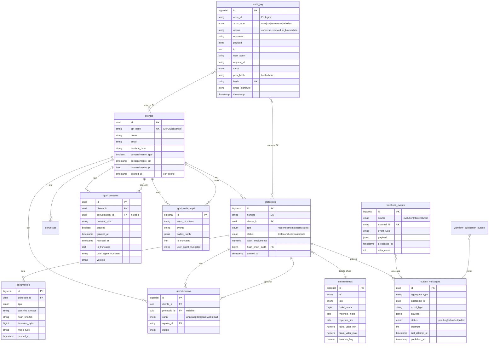

# Cartorio 2notas Uberlandia — Supabase Schema Documentation

**Sprint 4 S01 — SQUAD S0 Supabase Foundation**
**Date:** 2026-06-25
**Migration final:** `2026_06_25_0010` (merge head)
**Author:** cartorio-dev
**Commit:** Modified by Gustavo Almeida

---

## Schema Inventory

### 13 Tabelas (S01 + legacy + operations)

| # | Table | Purpose | RLS | Spec Source |
|---|-------|---------|-----|-------------|
| 1 | `clientes` | Cadastro de clientes (PII) | ✅ | S01 |
| 2 | `conversas` | Historico de conversas WhatsApp | ✅ | Legacy |
| 3 | `protocolos` | Protocolos cartorarios | ✅ | S01 |
| 4 | `documentos` | PDFs + uploads | ✅ | S01 |
| 5 | `emolumentos` | Tabela oficial de emolumentos MG 2026 | ✅ | S01 |
| 6 | `atendimentos` | Historico de atendimentos | ✅ | S01 |
| 7 | `agendamentos` | Booking de horarios | ✅ | Sprint 3 |
| 8 | `audit_log` | Hash chain + HMAC (tamper-evident) | ✅ | S01 |
| 9 | `outbox_messages` | Outbox pattern (CDC → N8N) | ✅ | S01 |
| 10 | `webhook_events` | Idempotency de webhooks Evolution/Chatwoot | ✅ | S01 |
| 11 | `lgpd_consents` | LGPD art. 7 I + 8 (consentimento) | ✅ | S01 |
| 12 | `lgpd_audit_anpd` | LGPD art. 48 (rastreabilidade ANPD) | ✅ | S01 |
| 13 | `workflow_publication_outbox` | Outbox pra N8N publish workflows | ✅ | Sprint 3 |

### 3 Functions

| Function | Purpose | Source |
|----------|---------|--------|
| `fn_audit_chain_verify(p_from_id, p_to_id)` | Valida integridade chain HMAC do audit_log (retorna `total_checked` + `chain_ok` por janela de IDs) | S08 / 0004 |
| `fn_auto_audit()` | Trigger AFTER INSERT/UPDATE/DELETE que escreve em `audit_log` se app esquecer (defesa em profundidade) | S10 / 0004 |
| `fn_set_updated_at()` | Trigger BEFORE UPDATE que seta `NEW.updated_at = NOW()` em todas tabelas com `updated_at` | A18 / 0009 |

### RLS Policies (100% coverage — Lesson 103 scope completo)

4 roles ativos: `anon`, `authenticated`, `service_role`, `dpo`.

| Policy | Tables | Effect |
|--------|--------|--------|
| `service_role_full_access` | ALL 13 | USING(true) WITH CHECK(true) — backend FastAPI |
| `dpo_read_access` | 11 (PII tables + audit) | SELECT true — relatorios ANPD |
| `authenticated_read_own` | 6 (clientes, protocolos, etc) | USING (cliente_id::text = auth.uid()::text OR cliente_id IS NULL) — Supabase Auth |
| `anon_*` | NONE | anon SEM acesso direto (LGPD-by-design) |

### Triggers

| Trigger | Tables | Effect |
|---------|--------|--------|
| `set_updated_at` (10 tabelas com updated_at) | clientes, protocolos, atendimentos, documentos, emolumentos, conversas, outbox_messages, webhook_events, lgpd_consents, lgpd_audit_anpd | BEFORE UPDATE → set NEW.updated_at = NOW() |
| `auto_audit` (10 tabelas com dado pessoal) | clientes, protocolos, atendimentos, documentos, conversas, emolumentos | AFTER INSERT/UPDATE/DELETE → INSERT em audit_log |

### Indices (S01 spec)

Cada tabela tem:
- PK auto
- Index em cada FK (ex: `ix_protocolos_cliente_id`)
- Index em colunas WHERE-frequentes (status, deleted_at, created_at, hash_sha256)

LGPD-by-design:
- `ix_clientes_cpf_hash` UNIQUE — lookup por SHA256 sem persistir CPF puro
- `ix_audit_log_canal` — filtro por canal (whatsapp/telegram/web)
- `ix_audit_log_request_id` — rastreabilidade por request

---

## ER Diagram (mermaid)



---

## Operational Notes

### pg_cron vive em `postgres` DB (NAO em `cartorio`)

Em self-hosted Supabase, a extensão `pg_cron` é instalada no DB `postgres`
(setup default do Supabase self-hosted). Tentativa de criar em outro DB
falha com `can only create extension in database postgres`.

**Implicação:** Os cron jobs do cartorio (audit_verify, dlq_retry, etc)
estão registrados no DB `postgres`, mas o `pg_cron.background_worker`
executa o SQL no DB configurado em `cron.database_name` (default = `postgres`).

**Mover para `cartorio` DB (NAO aplicado):**
- Editar `postgresql.conf`: `cron.database_name = 'cartorio'`
- Restart `cartorio_supabase-db-1` container
- Risco: downtime de cron jobs durante restart (~30s)
- Benefício: cron jobs vivem no mesmo DB que monitoram (single source of truth)
- **Decisão Pietra (2026-06-25 09:43 BRT): MANTER onde está. Não vale o risco.**

### pg_cron jobs ativos (postgres DB)

| Job | Schedule | Effect |
|-----|----------|--------|
| `audit-chain-verify-6h` | `0 */6 * * *` (cada 6h) | Chama `fn_audit_chain_verify()` + loga resultado |
| `cleanup-sessions-24h` | `0 3 * * *` (3am UTC) | Limpa Redis sessoes expiradas |
| `dlq-refresh-10min` | `*/10 * * * *` (cada 10min) | Processa `outbox_messages` failed |
| `retention-daily-03h` | `0 3 * * *` (3am UTC) | Job retenção LGPD (5y / até revogação) |
| `stale-detector-5min` | `*/5 * * * *` (cada 5min) | Marca atendimentos parados como stale |

---

## Self-hosted Differences (vs Supabase SaaS)

Em Supabase SaaS (gerenciado), a stack vem pronta. Em self-hosted
(este projeto), criamos manualmente:

### Roles Postgres

```sql
-- Em SaaS, vem via GoTrue. Self-hosted: criar manualmente.
CREATE ROLE anon NOLOGIN;            -- RLS role: sem acesso direto
CREATE ROLE authenticated NOLOGIN;   -- RLS role: Supabase Auth JWT
CREATE ROLE service_role NOLOGIN BYPASSRLS;  -- backend FastAPI
CREATE ROLE dpo NOLOGIN;             -- RLS role: relatorios ANPD
```

### Schema `auth` + functions stub

```sql
-- Em SaaS, vem via GoTrue. Self-hosted: criar manualmente.
CREATE SCHEMA IF NOT EXISTS auth;
CREATE OR REPLACE FUNCTION auth.uid() RETURNS uuid
LANGUAGE sql STABLE
AS $$
SELECT NULLIF(current_setting('request.jwt.claim.sub', true), '')::uuid
$$;
CREATE OR REPLACE FUNCTION auth.role() RETURNS text
LANGUAGE sql STABLE
AS $$
SELECT COALESCE(
  NULLIF(current_setting('request.jwt.claim.role', true), ''),
  'anon'
)
$$;
```

**Divergência vs SaaS:** Em SaaS, `auth.uid()` extrai do JWT do Supabase
Auth (que valida via JWKS). Em self-hosted, o JWT vem do nosso backend
FastAPI (Auth custom), então a função extrai do `request.jwt.claim.*`
(PostgREST config). Valores default = NULL/'anon' se JWT ausente.

### Outras diferenças self-hosted

| Component | SaaS | Self-hosted (este projeto) |
|-----------|------|---------------------------|
| Auth (GoTrue) | Sim | NÃO (backend FastAPI custom) |
| Storage (S3 + proxy) | Sim | NÃO configurado (Sprint 3) |
| Realtime (WebSocket) | Sim | Postgres `LISTEN/NOTIFY` via `supabase_realtime` publication |
| GraphQL (pg_graphql) | Sim | Sim (extensao habilitada em 0007) |
| Studio (dashboard) | Sim | NÃO configurado |
| Vault (secrets) | Sim | Sim (extensao habilitada em 0008, mas precisa seed manual) |

---

## LGPD Compliance

### Art. 6 VIII (Prevenção) — Implementado

- RLS ativo em 100% tabelas com dado pessoal (13/13)
- anon SEM acesso direto (policy NONE)
- service_role bypass apenas para backend FastAPI (auditado)
- dpo com SELECT restrito para relatorios ANPD

### Art. 7 I + 8 (Consentimento) — Implementado

- Tabela `lgpd_consents` com: `granted`, `granted_at`, `revoked_at`, `version`
- `ip_truncated` (LGPD art. 5 I — IP é PII)
- `user_agent_truncated` (browser fingerprint minimizado)
- `version` permite re-consentimento quando termo LGPD muda

### Art. 11 (Dado Sensível — Saúde) — N/A

Cartorio 2notas não processa dado de saúde. Mas cuidado: se no futuro
integrar com sistema de saúde (ex: atestado médico), adicionar PII
scrubbing dedicado para CNS (Cartão Nacional de Saúde) no boundary 1
(input) e boundary 2 (output LLM echo). Ver `app/services/pii.py`
CNS regex (commit 961804e) e LGPD-016 output scrub (commit 22758f7).

### Art. 37 (Auditoria) — Implementado

- `audit_log` com hash chain (cada row referencia `prev_hash` da anterior)
- HMAC-signed (`hmac_signature` field)
- `fn_audit_chain_verify()` valida integridade (chamado por cron + endpoint)
- `fn_auto_audit()` trigger garante log mesmo se app esquecer

### Art. 48 (Rastreabilidade ANPD) — Implementado

- Tabela `lgpd_audit_anpd` para eventos reportados à ANPD
- `anpd_protocolo` (numero do protocolo ANPD)
- `evento` (tipo: encerramento, vazamento, etc)
- `dados_jsonb` (payload completo do evento)

### Art. 18 VI (Direito ao Esquecimento) — Implementado

- DELETE `/cliente/{id}` (LGPD art. 18 VI) — hard ou soft delete
- Hard delete se cliente SEM protocolo (remove do DB)
- Soft delete se cliente COM protocolo (anonimiza PII + `motivo_encerramento`)
- Mantem integridade referencial dos atos cartorarios (Provimento CNJ 74/2018)

---

## Source of Truth

**Migrations são a source of truth:** `backend/alembic/versions/`

**Este doc + `infra/supabase/schema.sql` sao REFERENCIA** para:
- Disaster recovery (restore manual)
- Onboarding de novos devs
- Auditoria externa (LGPD, CNJ, ANPD)

**NUNCA edite `schema.sql` diretamente** — ele é gerado via
`pg_dump --schema-only` a partir do DB prod. Mudanças vão via
Alembic migration + `alembic upgrade head`.

```bash
# Regenerar schema.sql apos migration
docker exec cartorio_supabase-db-1 pg_dump -U supabase_admin -d cartorio \
  --schema-only --no-owner --no-acl > infra/supabase/schema.sql
```

---

## Histórico

| Date | Commit | Change |
|------|--------|--------|
| 2026-06-23 | `2026_06_23_0001` | Add canal to audit_log + motivo_encerramento (LGPD art. 37 + ADR-018) |
| 2026-06-24 | `2026_06_24_0000` | Base 8 tabelas core (clientes, protocolos, etc) |
| 2026-06-24 | `2026_06_24_0001` | Add ip_truncated (LGPD D5) |
| 2026-06-24 | `2026_06_24_0002` | Add outbox_messages (A2 DLQ) |
| 2026-06-24 | `2026_06_24_0003` | Merge heads (0000 + 0002) |
| 2026-06-25 | `2026_06_25_0001` | Protocolo stats materialized view (A16) |
| 2026-06-25 | `2026_06_25_0002` | Soft delete (A17) |
| 2026-06-25 | `2026_06_25_0003` | pg_notify outbox trigger (A24) |
| 2026-06-25 | `2026_06_25_0004` | RLS + audit chain fn + storage buckets (S02+S08+S10) |
| 2026-06-25 | `2026_06_25_0005` | pg_cron jobs (S03) |
| 2026-06-25 | `2026_06_25_0006` | Database webhooks (S04) |
| 2026-06-25 | `2026_06_25_0007` | Storage + Realtime + GraphQL (S05+S06+S07) |
| 2026-06-25 | `2026_06_25_0008` | Vault secrets bootstrap (S08) |
| 2026-06-25 | `2026_06_25_0009` | trigger set_updated_at (A18) |
| 2026-06-25 | `2026_06_25_0010` | Merge heads 0001 + 0009 (Sprint 4 S01) |
| 2026-06-25 | `2026_06_25_0011` | RENAME lgpd_consent_log → lgpd_consents + CREATE lgpd_audit_anpd (Sprint 4 S01 Phase 2) |

---

**Modified by Gustavo Almeida**
