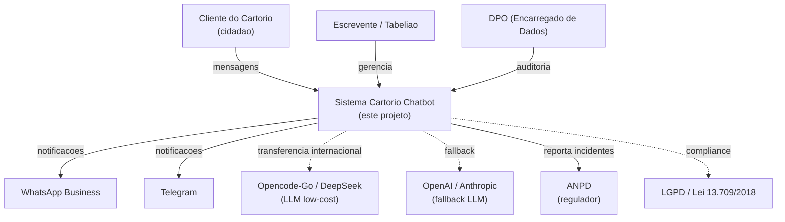
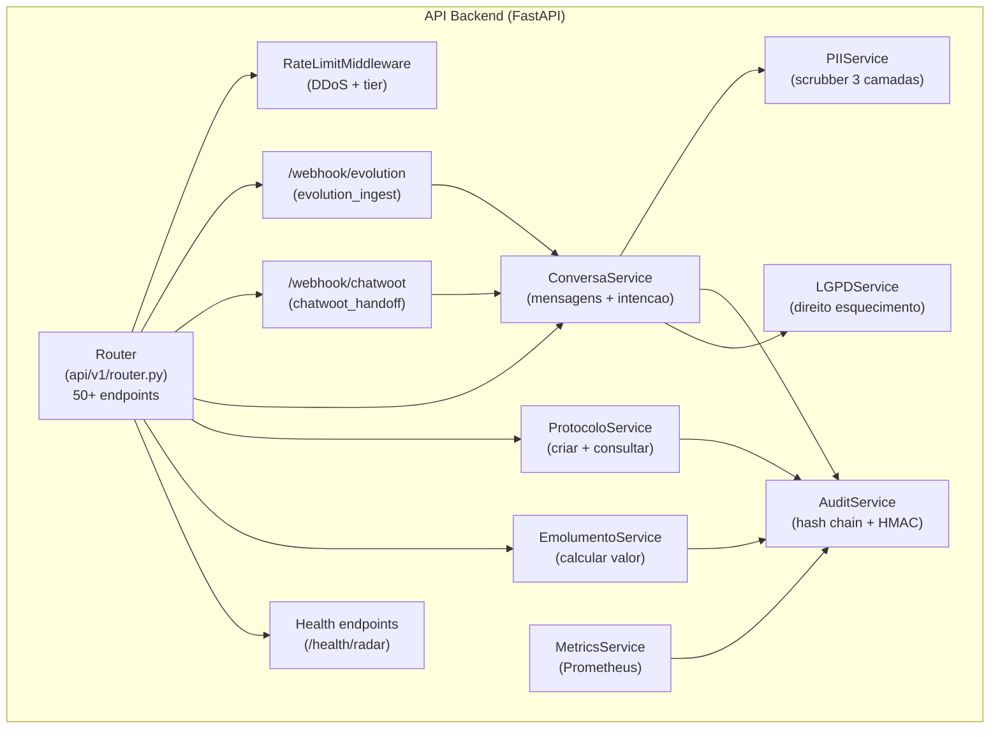
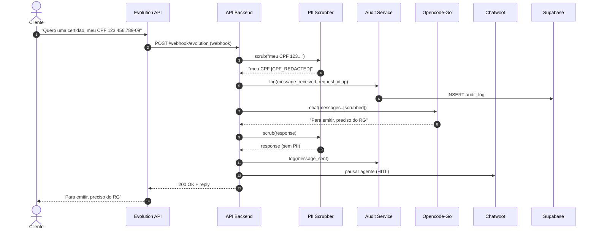

# C4 Architecture - Cartorio Chatbot

> **Diagramas C4 (Context, Container, Component, Code) do sistema.**
> Versao 1.0 (2026-06-24)
> Formato: Mermaid (renderiza no GitHub, GitLab, VSCode).
> Ref: https://c4model.com

---

## N1 - System Context

Visao de **40.000 pes**. Mostra o sistema como 1 caixa e seus usuarios + sistemas externos.



---

## N2 - Container

Visao de **10.000 pes**. Mostra os **7 containers** do sistema.

```mermaid
graph TB
    Cliente["Cliente"]
    Evolution["Evolution API<br/>(WhatsApp gateway)"]
    TelegramBot["Telegram Bot API"]
    API["API Backend<br/>(FastAPI + Python)<br/>:8000"]
    N8N["N8N<br/>(workflow engine)<br/>:5678"]
    OpenClaw["OpenClaw Gateway<br/>(LLM routing)<br/>:18790"]
    Chatwoot["Chatwoot<br/>(CRM + Agent Bot)<br/>:3000"]
    Supabase["Supabase<br/>(Postgres + Storage + Auth)"]
    Redis["Redis<br/>(cache + rate limit + bus)<br/>:6379"]
    SupabaseKong["Supabase Kong<br/>(API gateway)<br/>:8000"]
    OpencodeGo["Opencode-Go<br/>(LLM DeepSeek-v4)<br/>[externo]"]

    Cliente -->|WhatsApp| Evolution
    Cliente -->|Telegram| TelegramBot
    Evolution -->|webhook| API
    TelegramBot -->|webhook| API
    API -->|query/insert| SupabaseKong
    API -->|cache/bus| Redis
    API -->|dispara workflow| N8N
    N8N -->|envia msg| Evolution
    N8N -->|envia msg| TelegramBot
    N8N -->|atualiza conversa| Chatwoot
    N8N -->|chama LLM| OpenClaw
    OpenClaw -->|LLM call| OpencodeGo
    API -->|chat (HITL)| OpenClaw
    Chatwoot -->|atendente humano| Cliente
    SupabaseKong --> Supabase
```

---

## N3 - Component (API Backend)

Visao de **1.000 pes**. Mostra os **componentes principais** do container API.



---

## Fluxo de dados end-to-end (N2 + sequencia)

Sequencia de 1 mensagem WhatsApp do cliente ate resposta:



---

## Como ler este documento

- **N1 (Context)**: para stakeholders nao-tecnicos, gerentes, ANPD
- **N2 (Container)**: para devs novos, onboarding, decisao de stack
- **N3 (Component)**: para devs que vao mexer no codigo
- **Fluxo**: para entender LGPD, troubleshooting, code review

## Referencias

- [C4 model](https://c4model.com) - Simon Brown
- [LGPD art. 38](https://www.planalto.gov.br/ccivil_03/_ato2015-2018/2018/lei/l13709.htm) - RIPD
- `docs/ARCHITECTURE.md` - visao textual complementar
- `docs/DATA_FLOW.md` - fluxo de PII detalhado
- `docs/ONBOARDING.md` - primeiros passos

Modified by ZCode/Mavis - 2026-06-24
