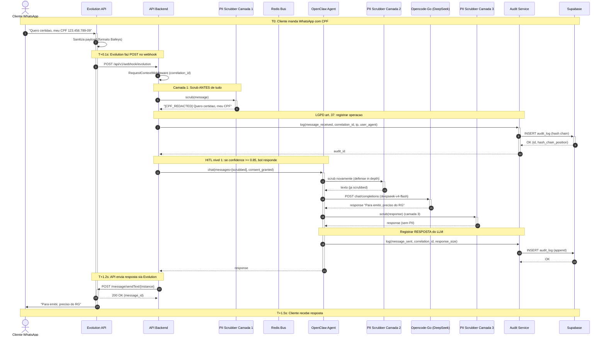
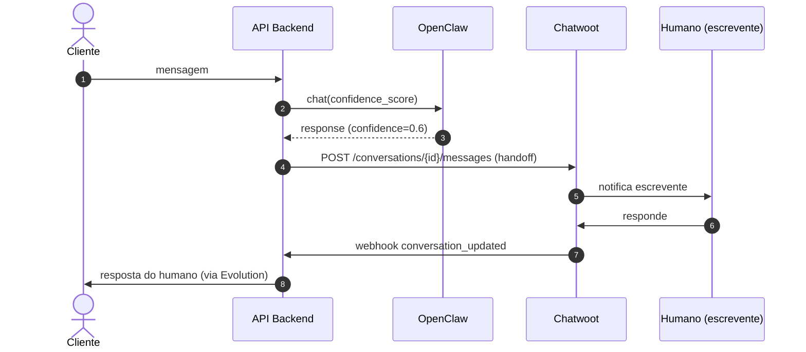
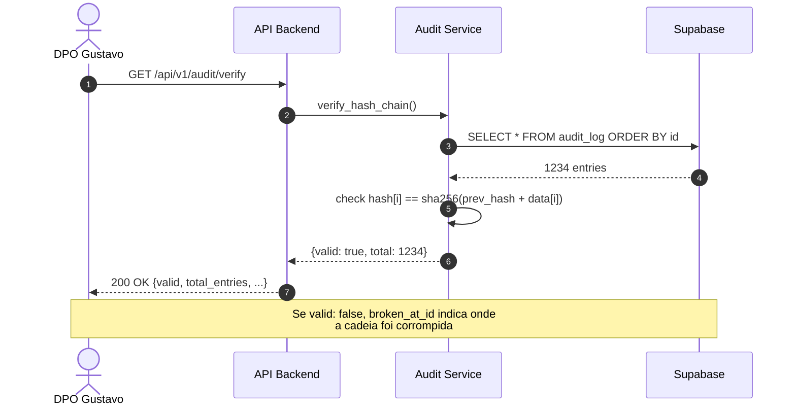
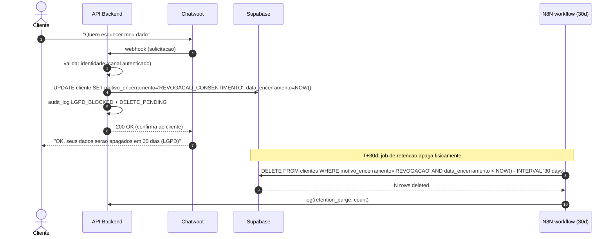

# Sequence Diagram - PII Flow end-to-end

> **Diagrama de sequencia mostrando cada hop de dados PII pelo sistema.**
> Renderiza em GitHub/GitLab/VSCode (Mermaid).
> Ref: `docs/DATA_FLOW.md` (visao geral) + `docs/architecture/C4-DIAGRAMS.md` (visao de container)

## Fluxo: Cliente manda WhatsApp com CPF ate receber resposta

## Detalhes por etapa

| # | Etapa | Latencia | LGPD | Onde no codigo |
|---|---|---|---|---|
| 1 | Cliente -> Evolution | ~0.5s (network) | - | WhatsApp Meta |
| 2 | Evolution sanitiza | ~10ms | - | Evolution internals |
| 3 | Evolution -> API webhook | ~50ms | - | webhook |
| 4 | Middleware context | ~1ms | - | `app/middleware/request_context.py` |
| 5 | PII scrub camada 1 | **0.021ms p99** | art. 6 VIII | `app/services/pii.py::scrub` |
| 6 | Audit log INSERT | ~5ms | art. 37 | `app/services/audit.py::log` |
| 7 | LLM chamada (OpenClaw) | ~5ms (roteamento) | - | `app/integrations/opencode_go.py` |
| 8 | PII scrub camada 2 | **0.021ms p99** | defense in depth | mesma funcao |
| 9 | Opencode-Go LLM | **~800ms p50** | - | https://api.2notasudi.com.br |
| 10 | PII scrub camada 3 | **0.021ms p99** | art. 6 VIII | mesma funcao |
| 11 | Audit log INSERT (2) | ~5ms | art. 37 | `app/services/audit.py` |
| 12 | Evolution send | ~100ms | - | Evolution API |
| 13 | Evolution -> Cliente | ~0.5s | - | WhatsApp Meta |
| **TOTAL** | | **~2.0s** | | |

## Fluxo alternativo: HITL escalado (confidence < 0.85)

## Fluxo de auditoria LGPD (consulta)

## Fluxo de direito ao esquecimento (LGPD art. 18 VI)

## Onde cada arquivo entra

| Componente | Arquivo | Cobre |
|---|---|---|
| WhatsApp webhook | `backend/app/api/v1/router.py::post_webhook_evolution` | Etapas 1-4 |
| PII scrub | `backend/app/services/pii.py::scrub` | Etapas 5, 8, 10 |
| Audit log | `backend/app/services/audit.py::log` | Etapas 6, 11 |
| LLM call | `backend/app/integrations/opencode_go.py::chat` | Etapas 7-11 |
| Evolution send | `backend/app/integrations/evolution_*` | Etapa 12 |
| HITL handoff | `backend/app/services/chatwoot_handoff.py` | Fluxo alternativo |
| Direito esquecimento | `backend/app/services/lgpd/direito_esquecimento.py` | Fluxo LGPD |
| Audit verify | `backend/app/services/audit.py::verify_hash_chain` | Fluxo auditoria |

## Referencias

- LGPD art. 6 VIII (prevencao): https://www.planalto.gov.br/ccivil_03/_ato2015-2018/2018/lei/l13709.htm
- LGPD art. 37 (registro): mesma lei
- LGPD art. 18 VI (esquecimento): mesma lei
- Bench PII: `tests/test_pii_bench.py` (p99 = 0.021ms)
- Visao geral: `docs/DATA_FLOW.md`
- C4 diagrams: `docs/architecture/C4-DIAGRAMS.md`

Modified by ZCode/Mavis - 2026-06-24
