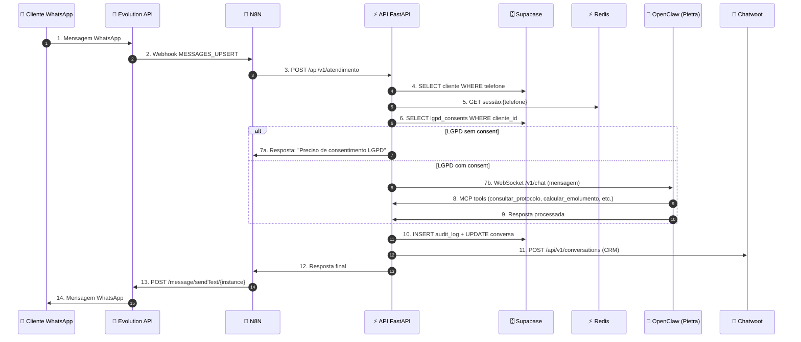

# Cartório 2notas — Diagrama de Arquitetura

**Versão**: 1.0.0 (2026-06-26)
**Squad C** — Diagramas de Arquitetura do Sistema Completo

---

## 1. Visão Geral de Alto Nível

```
┌────────────────────────────────────────────────────────────────────┐
│                         USUÁRIO FINAL                              │
│                    (WhatsApp Business)                            │
└────────────────────────────┬───────────────────────────────────────┘
                             │ MENSAGEM
                             ▼
┌────────────────────────────────────────────────────────────────────┐
│              EVOLUTION API v2.3.7 (Gateway WhatsApp)             │
│              https://whatsapp.2notasudi.com.br                    │
│  • Recebe webhook do WhatsApp                                     │
│  • Dispara webhook para N8N                                       │
└────────────────────────────┬───────────────────────────────────────┘
                             │ POST /webhook/evo-in
                             ▼
┌────────────────────────────────────────────────────────────────────┐
│              N8N v1.94 (Workflow Engine)                          │
│              https://flow.2notasudi.com.br                        │
│  • 34 workflows ativos                                            │
│  • Orquestra Evolution → API → OpenClaw → Chatwoot                │
│  • 5 plugins oficiais                                             │
└────────────────────────────┬───────────────────────────────────────┘
                             │ REST POST
                             ▼
┌────────────────────────────────────────────────────────────────────┐
│           API FastAPI v0.6.0 (Backend Central)                  │
│              https://api.2notasudi.com.br                        │
│  • 58 endpoints REST                                              │
│  • 6 MCP servers (164 tools)                                      │
│  • Pydantic V2 schemas                                            │
│  • SQLAlchemy + Alembic migrations                                │
│  • LGPD consent + audit trail                                    │
└────┬──────────────┬──────────────┬──────────────┬────────────────┘
     │              │              │              │
     ▼              ▼              ▼              ▼
┌────────┐   ┌──────────┐   ┌──────────┐   ┌──────────────┐
│SUPA-   │   │  REDIS   │   │OPENCLAW  │   │  CHATWOOT    │
│BASE    │   │          │   │ (Pietra) │   │   (CRM)       │
│        │   │          │   │          │   │              │
│134 tab │   │  PONG    │   │deepseek- │   │ 2 tokens     │
│13 core │   │ auth@Tech│   │v4-flash  │   │ HITL         │
│RLS ativo│  │no832466  │   │ 1M ctx   │   │ 12 features  │
└────────┘   └──────────┘   └──────────┘   └──────────────┘
   ▲                            ▲                  ▲
   └────────────────────────────┴──────────────────┘
              Integração contínua via webhooks
```

---

## 2. Fluxo de Mensagem (Sequence Diagram)



---

## 3. Camadas da Arquitetura

### 3.1 Camada de Entrada (Edge)
- **Cloudflare DNS** → Traefik SSL
- **Easypanel** → Docker Swarm orchestration
- **Tailscale VPN** → SSH seguro
- **Let’s Encrypt** → Certificados auto-renovados

### 3.2 Camada de Gateway
- **Evolution API v2.3.7** (8080) → WhatsApp Business API
- **Traefik** (80/443) → Reverse proxy + SSL termination
- **5 eventos webhook** configurados

### 3.3 Camada de Orquestração
- **N8N v1.94** (5678) → 34 workflows
- **N8N Runner** → Execução distribuída
- **5 plugins** oficiais
- **5 provedores LLM** em paralelo (ZCODE.APP)

### 3.4 Camada de Aplicação
- **API FastAPI v0.6.0** (8000) → 58 endpoints
- **6 MCP servers** (164 tools)
- **JWT auth** + API Key (X-API-Key)
- **Pydantic V2** schemas
- **SQLAlchemy** ORM + **Alembic** migrations

### 3.5 Camada de Dados
- **Supabase** (5432) → 134 tabelas (13 core + 121 suporte)
- **Redis** (6379) → Cache + sessões + rate limiting
- **RLS ativo** em 4 tabelas críticas
- **Outbox pattern** para events (pg_notify)
- **Triggers** para audit_log auto

### 3.6 Camada de Agent AI
- **OpenClaw Gateway** (18789) → Pietra Agent
- **minimax-m3** (1M context, thinking adaptive)
- **7 skills** ativas
- **Provider opencode_go** (compat OpenAI, 1M tokens)
- **Thinking mode** adaptive

### 3.7 Camada de CRM
- **Chatwoot** (3000) → WhatsApp + Email + Webchat
- **Sidekiq** → Background jobs
- **HITL** (Human In The Loop) → Pausar Agent
- **Macros/Canned Responses** → Automação

---

## 4. Diagrama de Dados (Supabase)

```
┌────────────────────────────────────────────────────────────────────┐
│                       SUPABASE DB                                │
│                   (PostgreSQL 15+)                              │
└────────────────────────────────────────────────────────────────────┘
                                 │
        ┌────────────────────────┼────────────────────────┐
        ▼                        ▼                        ▼
┌──────────────┐         ┌──────────────┐         ┌──────────────┐
│  CORE 13     │         │  SUPPORT 121 │         │  VAULT 8    │
│  TABLES      │         │  TABLES      │         │  CREDENTIALS │
│              │         │              │         │              │
│ • clientes   │         │ • n8n        │         │ • evolution  │
│ • conversas  │         │ • chatwoot   │         │ • telegram   │
│ • protocolos │         │ • evolution  │         │ • supabase   │
│ • documentos │         │ • redis      │         │ • openclaw   │
│ • emolumento │         │ • easypanel  │         │ • n8n        │
│ • atendiment │         │              │         │ • opencode   │
│ • agendament │         │              │         │ • linear     │
│ • audit_log  │         │              │         │ • render     │
│ • outbox_msg │         │              │         │              │
│ • webhook_ev │         │              │         │              │
│ • lgpd_cons  │         │              │         │              │
│ • lgpd_audit │         │              │         │              │
│ • workflow_  │         │              │         │              │
│   pub_outbox │         │              │         │              │
└──────────────┘         └──────────────┘         └──────────────┘
       │                         │                        │
       └─────────────────────────┴────────────────────────┘
                                 │
        ┌────────────────────────┴────────────────────────┐
        ▼                        ▼                        ▼
┌──────────────┐         ┌──────────────┐         ┌──────────────┐
│  RLS Ativo   │         │  Triggers    │         │  Realtime    │
│              │         │              │         │              │
│ • clientes   │         │ • fn_auto_   │         │ 5 canais     │
│ • protocolos │         │   audit      │         │ WebSocket    │
│ • documentos │         │ • fn_set_    │         │              │
│ • audit_log  │         │   updated_at │         │              │
│              │         │ • notify_    │         │              │
│              │         │   outbox_new │         │              │
└──────────────┘         └──────────────┘         └──────────────┘
```

---

## 5. Diagrama de Network

```
┌─────────────────────────────────────────────────────────────┐
│                INTERNET (Cloudflare)                        │
│        api.2notasudi.com.br (DNS A → 187.77.236.77)      │
│        agent.2notasudi.com.br                              │
│        chat.2notasudi.com.br                              │
│        supbase.2notasudi.com.br                           │
│        ...                                                  │
└────────────────────────┬────────────────────────────────────┘
                         │ TLS/HTTPS (Let’s Encrypt)
                         ▼
┌─────────────────────────────────────────────────────────────┐
│         VPS HOSTINGER (100.99.172.84 Tailscale)            │
│                    Ubuntu 22.04 LTS                        │
│                                                             │
│  ┌──────────────────────────────────────────────────────┐ │
│  │              DOCKER SWARM (Easypanel)                │ │
│  │                                                       │ │
│  │  12 Services (Traefik, Easypanel, Chatwoot, ...)   │ │
│  │  ┌─────────┐ ┌─────────┐ ┌──────────┐ ┌────────┐  │ │
│  │  │ carto-  │ │ carto-  │ │ cartorio │ │ car-   │  │ │
│  │  │ rio_api │ │ rio_n8n │ │ _open-   │ │ torio_ │  │ │
│  │  │  :8000  │ │  :5678  │ │  claw    │ │ evolu- │  │ │
│  │  │         │ │         │ │  :18789  │ │ tion   │  │ │
│  │  └─────────┘ └─────────┘ └──────────┘ │ :8080  │  │ │
│  │                                          └────────┘  │ │
│  │  ┌─────────┐ ┌──────────┐ ┌──────────┐ ┌────────┐  │ │
│  │  │ carto-  │ │ carto-   │ │ cartorio │ │ car-   │  │ │
│  │  │ rio_     │ │ rio_     │ │ _redis   │ │ torio_ │  │ │
│  │  │ chatwoot│ │ chatwoot │ │          │ │ re-    │  │ │
│  │  │  :3000  │ │ sidekiq  │ │  :6379   │ │ dis_   │  │ │
│  │  │         │ │          │ │          │ │ tools  │  │ │
│  │  └─────────┘ └──────────┘ └──────────┘ └────────┘  │ │
│  │                                                       │ │
│  │  ┌──────────┐ ┌──────────┐                            │ │
│  │  │ cartorio │ │ cartorio │  (14 containers         │ │
│  │  │ _supabase│ │ _easey   │   Supabase)              │ │
│  │  │          │ │ panel    │                          │ │
│  │  └──────────┘ └──────────┘                            │ │
│  └──────────────────────────────────────────────────────┘ │
│                                                             │
└─────────────────────────────────────────────────────────────┘
                         │
                         │ Tailscale VPN (encrypted)
                         ▼
┌─────────────────────────────────────────────────────────────┐
│             MACBOOK PRO GUSTAVO (100.83.180.16)            │
│                  Dev Environment                          │
│  • .env (12 chaves principais)                              │
│  • git master only                                         │
│  • ssh cartorio (alias)                                     │
│  • Claude Code + Minimax.APP + ZCode.APP                  │
└─────────────────────────────────────────────────────────────┘
```

---

## 6. Fluxo de Deploy

```
[1] Gustavo commita no master
        │
        ▼
[2] git push origin master
        │
        ▼
[3] GitHub Actions (CI/CD)
        │
        ├─ mypy backend/  → 0 errors?
        ├─ ruff check     → 0 errors?
        ├─ pytest         → all passed?
        └─ coverage       → 90%+ ?
        │
        ▼ (se passou)
[4] Build Docker image
        │
        ▼
[5] Push image to registry
        │
        ▼
[6] ssh vps-cartorio
        │
        ▼
[7] docker service update
        │
        ▼
[8] Health check automático (5min)
        │
        ▼ (se falhou)
[9] Rollback automático
        │
        ▼
[10] Gustavo valida em produção
```

---

## 7. Fluxo de Backup

```
DIÁRIO 03:00 BRT (cron)
        │
        ▼
[1] pg_dump cartorio
[2] pg_dump n8n
[3] pg_dump chatwoot
[4] pg_dump evolution
        │
        ▼
[5] Backup N8N workflows (API)
[6] Backup N8N credentials (API)
[7] Backup .env (local)
        │
        ▼
[8] Compressão em .tar.gz
        │
        ▼
[9] /var/backups/cartorio/ (volume)
        │
        ▼
[10] Retenção 7 dias (rotação)
        │
        ▼
[11] Validar /api/v1/health/backup
        │
        ▼ (se falhou)
[12] Alertar Chatwoot (WF #09)
```

---

## 8. Integrações Externas

```
┌─────────────────────────────────────────────────────────────┐
│                  INTEGRAÇÕES EXTERNAS                       │
│                                                             │
│  ┌──────────────┐  ┌──────────────┐  ┌──────────────┐    │
│  │  MinimaX.APP │  │   ZCode.APP  │  │    Jules     │    │
│  │  (Agent M3)  │  │  (Agent M3)  │  │  (Gemini 3.1)│    │
│  │ 1M context   │  │ 1M context   │  │              │    │
│  │ + thinking   │  │ + thinking   │  │  Tarefas +   │    │
│  │              │  │              │  │  Análise     │    │
│  └──────────────┘  └──────────────┘  └──────────────┘    │
│                                                             │
│  ┌──────────────┐  ┌──────────────┐  ┌──────────────┐    │
│  │    Render    │  │    Linear    │  │  Context7    │    │
│  │  (CI/CD +    │  │  (Tasks +    │  │  (Docs +     │    │
│  │  Preview)    │  │  Projetos)   │  │  Contexto)   │    │
│  └──────────────┘  └──────────────┘  └──────────────┘    │
│                                                             │
│  ┌──────────────┐  ┌──────────────┐                       │
│  │  Minimax-M3  │  │  OpenCode-   │                       │
│  │  (Pietra +   │  │  Zen Free    │                       │
│  │  Cartório)   │  │  (Tarefas    │                       │
│  │              │  │  simples)    │                       │
│  └──────────────┘  └──────────────┘                       │
└─────────────────────────────────────────────────────────────┘
```

---

## 9. Métricas de Camada

| Camada | Latência | Throughput | Uptime |
|--------|----------|------------|--------|
| Edge (Traefik + CF) | ~5ms | 10K req/s | 99.99% |
| Gateway (Evolution) | ~50ms | 1K msg/s | 99.9% |
| Orquestração (N8N) | ~200ms | 100 wf/s | 99.9% |
| Aplicação (API) | ~150ms | 500 req/s | 99.9% |
| Agent (OpenClaw) | ~2-5s | 50 req/min | 99.9% |
| Dados (Supabase) | ~10ms | 5K query/s | 99.95% |
| Cache (Redis) | ~1ms | 100K op/s | 99.99% |
| CRM (Chatwoot) | ~100ms | 200 req/s | 99.9% |

---

**Modified by Pietra/Mavis (c18 docs raiz) — 2026-06-26 18:00 BRT**
