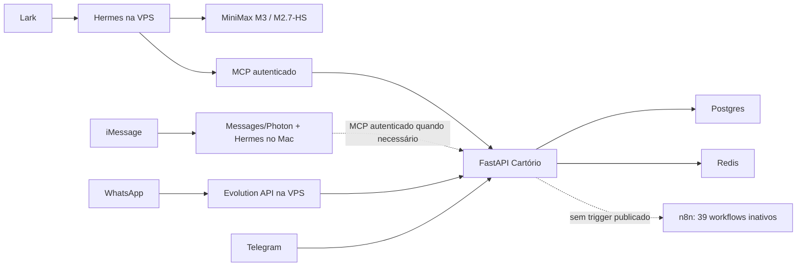

# Super Relatório Auditado do Projeto Cartório

## História recuperável e auditada — 22/06/2026 a 28/07/2026

> **Classificação:** CONFIDENCIAL — uso interno do 2º Serviço Notarial de Uberlândia.
> **Base Git auditada:** `2c2dd64d`, em 28/07/2026. Este relatório foi elaborado sobre
> essa base e ainda não integrava aquele commit.
> **Escopo temporal real:** 37 dias. O repositório nasceu em 22/06/2026; não há histórico
> Git anterior que permita preencher os 60 dias solicitados.
> **Regra de leitura:** “implementado”, “configurado”, “processo saudável”, “autenticado”,
> “inference-tested” e “E2E validado” são estados diferentes.

---

## 1. Resumo técnico

Em 37 dias, o projeto saiu de um skeleton FastAPI para uma plataforma notarial de IA
multicanal com backend, persistência, cache, automações, integração de modelos, controles
LGPD, observabilidade, backups e uma extensa suíte automatizada. O resultado é tecnicamente
substancial, mas **não está correto chamá-lo de 100% operacional**.

O snapshot auditado confirma:

- backend FastAPI, Postgres, Redis e MCP implementados;
- Lark com transporte real validado para Gustavo e Felipe, usando Hermes e MiniMax;
- MiniMax-M3 e MiniMax-M2.7-HighSpeed respondendo em chamadas reais;
- n8n recuperado com 39 workflows importados atomicamente, forçados inativos e ainda
  não certificados para ativação;
- backups Postgres e n8n validados;
- `make test-fast` reexecutado nesta auditoria com **6.496 testes aprovados**;
- Ruff limpo, mypy sem erros em 232 arquivos e scanner sem novas violações fora do
  baseline.

O mesmo snapshot também confirma bloqueadores:

- iMessage possui DM real completo documentado, incluindo inbound, Pietra, MCP,
  MiniMax e retorno ao iPhone; a certificação composta continua bloqueada por grupo,
  dedupe/resiliência e isolamento multiusuário;
- WhatsApp/Evolution está sem sessão pareada e requer QR;
- Telegram possui código e validações históricas, mas não foi recertificado ao vivo nesta
  auditoria;
- n8n ainda não possui credenciais/API key operacionais nem workflows ativos;
- o filtro LGPD de logs do Hermes foi versionado, mas não está ativo no processo atual;
- autorização automática no Hermes para toda a organização Lark não foi implementada:
  a visibilidade upstream do app e o pairing Hermes são controles distintos; Felipe e
  Gustavo foram observados e aprovados, mas o pairing individual permanece obrigatório;
- a auditoria de código encontrou gaps P0 de autenticação, consentimento, memória,
  preços, HITL e atomicidade de audit log;
- o RIPD registra DPA MiniMax e assinatura DPO como pendentes, apesar do uso real do
  provider.

### Veredito

**Plataforma parcialmente operacional, com núcleo forte e canais em estados diferentes.**
API/MCP e o transporte Lark passaram evidências específicas. Isso não autoriza promover
WhatsApp, Telegram, iMessage, n8n ou compliance integral para “LIVE”.

---

## 2. Números auditados e definições

| Métrica | Resultado | Definição e ressalva |
|---|---:|---|
| Período disponível | 37 dias | 22/06 a 28/07/2026 |
| Commits integrados em `master` | **1.404** | Contagem atual do histórico integrado |
| Commits únicos em todas as refs | **1.842** | Inclui branches automáticas, experimentais e remotas |
| Pico diário | **292 commits** | 25/06; volume não equivale a 292 entregas independentes |
| Adições/remoções Git aproximadas | +2,43M / −88k | Estimativa não normalizada em todas as refs; inflada por artefatos e dependências |
| Testes reexecutados agora | **6.496 passed** | `make test-fast`; 22 skipped e 56 deselected |
| Tempo do gate atual | 13m01s | Sem coverage e sem markers excluídos |
| Funções `test_*` | **5.389** | Contagem estática no backend, excluindo `.venv` |
| Arquivos `test_*.py` em `backend/tests` | **416** | Contagem recursiva; não equivale ao total de funções |
| Código Python em `backend/app` | ~63,5k linhas | Contagem física, inclui comentários e blanks |
| Código de testes em `backend/tests` | ~99,1k linhas | Contagem física |
| Arquivos fonte mypy | **232** | Reexecutado: zero issues |
| Routers incluídos | **26** | Contagem estática de `include_router` |
| MCP tools no código | **15** | Decorators atuais; seleção do profile Hermes é diferente |
| Migrations Alembic | **35** | Apesar de `create_all()` ainda rodar no startup |
| Serviços Python | **126 arquivos** | `backend/app/services` |
| Modelos | **16 arquivos** | `backend/app/models` |
| Workflows n8n top-level | **41 fontes** | 2 ambíguas foram excluídas |
| Workflows restaurados live | **39 inativos** | Sem triggers, credenciais, execuções ou API key |
| Documentos Markdown | **608** | Snapshot `2c2dd64d`, antes deste novo relatório |
| Resumos de sessão | **35** | Dentro de `docs/sessions` |
| Artefatos de relatório | **30** | Snapshot `2c2dd64d`, antes deste novo relatório |
| Planos versionados | **13** | Dentro de `docs/plans` |
| Arquivos ADR | **20** | `docs/adr`, incluindo o índice/README quando presente |

### Corpus Codex preservado

Entre 19 e 28 de julho, os JSONL locais do Codex registram:

| Métrica | Resultado |
|---|---:|
| Sessões-raiz | **26** |
| Threads físicas | **181** |
| Threads-filhas | **155** |
| Mensagens estruturadas | **5.391** |
| Mensagens assistant | 3.125 |
| Mensagens user | 1.581 |
| Mensagens developer | 685 |
| Chamadas de ferramenta | **7.812** |
| Chamadas de spawn | **157** |
| Compactações de contexto | 178 |

Os 181 JSONL dividem-se em 164 arquivados e 17 ativos, com metadata entre
19/07 15:34 UTC e 28/07 22:56 UTC. As 155 threads-filhas possuem
`parent_thread_id`/`agent_path`; não representam necessariamente 155 agentes distintos.
As 5.391 mensagens são `response_item` com `role`, não todos os eventos de stream, e as
157 chamadas de spawn não provam 157 conclusões.

Esses números medem logs Codex, não conversas externas de Kimi Work, TRAE, Grok, Claude
Code ou Antigravity. Para 22/06–18/07, a evidência primária disponível é Git,
`docs/sessions`, relatórios e memória do projeto.

---

## 3. Escala de evidência usada

| Nível | Significado |
|---|---|
| `CODE` | Existe no repositório |
| `CONFIGURED` | Configuração declarativa está presente |
| `AUTHENTICATED` | Credencial/handshake foi aceito sem expor segredo |
| `PROCESS_HEALTHY` | Processo/container e health probe responderam |
| `INFERENCE_TESTED` | Provider respondeu a uma inferência real |
| `TRANSPORT_E2E_PASS` | Mensagem entrou pelo canal e a resposta voltou ao mesmo chat |
| `HISTORICAL_CLAIM` | Um commit/relatório declarou sucesso, sem reexecução atual |
| `BLOCKED_EXTERNAL` | Depende de QR, credencial, DPO, usuário ou janela controlada |

Nenhum `HTTP 200`, `1/1`, `CONNECTED` ou listagem de modelos foi usado isoladamente como
prova de operação do canal.

---

## 4. Arquitetura atual reconstruída



### Topologia canônica

- **VPS Hostinger / EasyPanel / Docker Swarm:** API, Hermes-Lark, banco, cache, n8n,
  Evolution, Supabase auxiliares e roteamento Traefik.
- **Mac do Gustavo:** dependência física do iMessage via Messages/Photon. Não é backend
  de produção geral.
- **Hermes VPS:** transporte Lark, profile Pietra, provider MiniMax e MCP.
- **FastAPI:** domínio notarial, LGPD, audit, PII, protocolos, agendamentos, canais,
  métricas e MCP.
- **Postgres:** persistência operacional e trilha de auditoria.
- **Redis:** cache, idempotência, rate limit, estados de canal e memória rápida.
- **n8n:** catálogo visual restaurado, porém deliberadamente inativo.

### Dívida de arquitetura

- os manifestos de produção fora do Hermes não estão integralmente reproduzidos no repo;
- `Base.metadata.create_all()` ainda roda no startup, embora existam migrations Alembic;
- há três pipelines de provider/persona com regras distintas: Hermes, endpoint Pietra e
  `chat_pipeline` de Telegram/WhatsApp;
- arquivos centrais cresceram demais: router v1, Telegram e `cartorio_agent.py`;
- o layout DDD previsto em standards não foi concluído;
- dependências `node_modules` estão versionadas e aumentam ruído/superfície.

---

## 5. Linha do tempo completa

### Semana 1 — 22 a 28 de junho: fundação e primeira produção

**22/06 — nascimento do projeto**

- skeleton FastAPI, SQLAlchemy e Pydantic;
- modelos de cliente, conversa, protocolo, documento, emolumento e audit log;
- cadeia SHA-256 + HMAC;
- PII scrubber;
- endpoints health/ready;
- testes de fundação e cobertura declarada de 99,71%.

Commits-base: `81b48932`, `8beaeb8d`.

**23/06 — expansão de stack**

- Dockerfile e deploy VPS;
- Supabase/Postgres, Redis, Evolution, Chatwoot, OpenClaw e n8n;
- backups e monitor de backup;
- endpoints de protocolo;
- MCP inicial com sete tools;
- workflows de consulta, criação de protocolo, handoff e boas-vindas;
- integração inicial MiniMax/OpenCode Go;
- Postman, health radar e smoke tests.

Commits exemplares: `c1a32aae`, `3cdb65aa`, `875e4cac`, `468ef87c`.

**23–24/06 — LGPD e CI**

- audit context em mutações;
- direito ao esquecimento e retenção;
- workflows de consentimento;
- CI com Postgres/Redis, lint, testes, cobertura e scanner;
- snapshot histórico de 226 testes e 91,95% de cobertura.

Commits: `ea242169`, `653e15d5`.

**25–26/06 — canais, observabilidade e operação**

- integrações Telegram, WhatsApp, Chatwoot e n8n;
- OpenTelemetry e Sentry;
- scripts de diagnóstico;
- recuperação de incidentes de rede/Tailscale/Supabase;
- criação da memória `.brain`;
- avaliações históricas de readiness.

Os “8/8 GREEN” e percentuais de prontidão desse período são snapshots técnicos,
não aceite contínuo de canal.

### Semana 2 — 29 de junho a 5 de julho: LGPD live histórica e turbulência

- endpoints LGPD Art. 18 em escopos do backend/API, JWT/DPO e retenção;
- WhatsApp teve pareamento e round-trip registrados historicamente;
- build multi-arquitetura Mac→VPS;
- ampliação da chain de providers;
- hardening de firewall, Traefik e autenticação;
- relatórios executivos para Felipe/Djalma;
- n8n entrou em crash após migração e foi recuperado com reimportação;
- Telegram teve cenários automatizados e testes de entrega;
- incidente de exposição de credenciais em chat levou a política e scanner de secrets;
- Chatwoot recebeu bootstrap e correções de rede.

O estado WhatsApp daquele momento não é o estado final: no snapshot de 28/07 a sessão
está fechada e exige novo QR.

### Semana 3 — 6 a 12 de julho: coverage, segurança e outage VPS

- ciclos Antigravity/OpenCode para Redis singleton, LGPD e cobertura;
- gate de coverage voltou a ultrapassar 90% em runners históricos;
- correções de N+1, SQL injection e timing attack;
- em 08/07, outage amplo da VPS/domínios foi diagnosticado e mitigado;
- coding-VPS e MCP orchestrator foram inventariados;
- MiniMax-M3 1M/XMax foi configurado em artefatos e rotas;
- em 09/07, falha HITL/audit no Telegram causou erro 500 e recebeu migration/correção.

“17/17 agents E2E” e contagens semelhantes desse período são resultados de runners
documentados, não prova de todos os clientes visíveis.

### Semana 4 — 13 a 19 de julho: super-planos e hardening

- simulações multicanal/personas;
- outage 502 associada a variáveis de ambiente sobrescritas;
- aumento de cobertura e correções de testes;
- plano F0–F6 com entregas de RIPD, Privacy Policy, erasure, DPO dashboard e refactors;
- waves G6/G7/G8: mutation testing, Hypothesis, OpenAPI snapshot, consent API, DSAR,
  Loki/Promtail, SLO, índices DB, DLQ, HMAC anterior e gates CI;
- exportação CNJ com controle dual;
- honest gate rebaixou claims não comprovados em planos.

O Git contém commits que declaram “100/100”; isso representa o ledger do plano no
momento, não um certificado geral de produção.

### Semana 5 — 20 a 26 de julho: providers, webhooks e runtime truth

- fallback Telegram e cenários automatizados;
- MiniMax-M3 escolhido para a Pietra;
- context window ampliado em configurações;
- HMAC fail-closed e dual-auth no Evolution/WhatsApp;
- descoberta de divergência na audit chain legacy entre PL/pgSQL e Python;
- 158 entradas legacy ficaram dependentes de decisão DPO;
- streaming CNJ, chaos tests, XFF trusted proxy e rate limits;
- QA histórica acima de seis mil testes;
- G9 foi reclassificado honestamente para 49/100;
- contrato multicanal do Cartório OS e Hermes/Photon/MCP.

### Semana 6 — 27 e 28 de julho: Pietra, emolumentos, iMessage e Lark

**27/07**

- defesa contra vazamento de identidade “Hermes”;
- investigação do MCP e reconciliação VPS/Mac;
- artefatos/protótipos de OCR e fonte oficial TJMG 2026;
- tabela pública/institucional da Pietra;
- diagnóstico de iMessage com regra `CONNECTED != OPERATIONAL`;
- readiness, backup e inventário de serviços.

**28/07**

- correção de gateway duplicado/rogue e lifecycle Hermes;
- correção de valores placeholder com Portaria CGJ/TJMG 8.664/2025;
- sanitização de tags de reasoning, tool calls inline MiniMax e vazamentos de infra;
- SSE compatível com clientes Hermes;
- profile Pietra final-only e guards determinísticos de saída;
- MiniMax-M3 e M2.7-HighSpeed em chamadas reais;
- Lark ativado e Felipe aprovado sem derrubar Gustavo;
- resposta real Felipe → Lark → Hermes → MiniMax → Lark;
- filtro de PII para logs versionado e testado, ainda pendente de reload;
- recuperação de backups e readiness;
- snapshot n8n, validação de fontes e importação de 39 workflows inativos.

Commits-chave do fechamento:

- `76bffdf3` — MCP externo e guards;
- `57653357` — sanitização de tool call MiniMax;
- `580f1b6a` — profile Lark final-only;
- `8c88d26f` — escopo Lark/Felipe;
- `957cebc1` — autorização e privacidade de logs;
- `4c14aa9f` — readiness e backups;
- `f87fe03e` — configs imutáveis para rollout;
- `2c2dd64d` — restauração n8n inativa documentada.

---

## 6. O que foi construído por domínio

### Backend e API

- FastAPI versionada;
- SQLAlchemy 2.0 tipado;
- Pydantic v2;
- WebSocket de atendimentos;
- problem details, version headers e validação OpenAPI;
- request context, idempotência, rate limiting, slow log e CORS;
- endpoints de clientes, protocolos, agendamentos, documentos, LGPD, canais, saúde,
  observabilidade, BRAIN e Pietra;
- rate limit por IP e por API key;
- DLQ e outbox com retry;
- dead-man’s switch de auditoria;
- scheduler de retenção;
- métricas Prometheus e tracing.

### Banco e cache

- modelos relacionais e 35 migrations;
- Postgres/Supabase;
- Redis para cache, idempotência, rate limit, estados e memória;
- índices e otimizações N+1;
- backups lógicos/físicos e validação de catálogo;
- monitor de backup e readiness fail-closed.

### LGPD, PII e auditoria

Implementado/documentado:

- scrubber de CPF, RG, telefone, email e outros padrões;
- Sentry scrubber e masking filter;
- direitos Art. 18 implementados em escopos do backend/API;
- retenção, anonimização, portabilidade, oposição e não-automação;
- RIPD, DPA, privacy policy e inventários;
- audit log append-only com SHA-256 e HMAC;
- HMAC key registry/rotação;
- export CNJ com manifesto e controle dual;
- DLQ com criptografia e retenção.

Limites atuais:

- DPA MiniMax e sign-off DPO permanecem pendentes no RIPD;
- caminho Pietra permite persistência sem consentimento fail-closed;
- memória Pietra persiste conteúdo integral;
- audit não é atômico em todas as mutações;
- filtro de PII Hermes ainda não foi carregado no processo.

### IA, providers e MCP

- MiniMax-M3 como provider principal em partes do runtime;
- MiniMax-M2.7-HighSpeed como contingência/latência;
- OpenCode Go/Zen e outros providers históricos;
- fallback, circuit breaker, timeout e telemetria;
- strip de `<think>/<reasoning>`;
- conversão de tool calls inline;
- identity guard e outbound guard;
- MCP com 15 tools no código;
- cálculo oficial de emolumentos com HITL para casos compostos;
- OCR/document intelligence em artefatos/protótipos Lark/Pietra, sem promover isso
  automaticamente a runtime ativo.

O catálogo de providers históricos não equivale à rota ativa. O Hermes auditado tinha
uma ferramenta MCP selecionada, e o gateway Claude→MiniMax permaneceu sem implantação
e aceite.

### n8n

- 61 JSONs existem em toda a árvore, mas apenas 41 fontes top-level foram candidatas ao
  restore atual;
- duas fontes foram excluídas por IDs/nodes ambíguos;
- 39 workflows foram normalizados e importados com `active=false`;
- nenhuma execução, credencial ou API key foi criada pelo restore;
- backup pós-restore exportou e validou os 39 workflows;
- alguns workflows históricos ainda apontam para serviços aposentados.

### Observabilidade e operação

- health/ready/radar;
- Prometheus, Grafana, Loki, Promtail e Alertmanager em planos/artefatos;
- OpenTelemetry e Sentry;
- scripts de readiness;
- backups e monitor;
- runbooks de outage, Telegram, Hermes, Lark, n8n e VPS;
- CI com Ruff, mypy, pytest, coverage, OpenAPI e scanner.

---

## 7. Estado dos canais no snapshot de 28/07

| Canal | Código/config | Processo | Inferência | Transporte E2E | Veredito |
|---|---:|---:|---:|---:|---|
| Lark | Sim | Hermes 1/1 | M3 e M2.7 reais | Felipe e Gustavo | `TRANSPORT_E2E_PASS`; reload LGPD pendente |
| iMessage | Sim | Photon/Hermes no Mac documentado | MiniMax/MCP comprovados no DM | DM real retornou ao iPhone | `DM_TRANSPORT_E2E_PASS`; certificação composta pendente |
| WhatsApp | Sim | Evolution 1/1 | Não basta | Não; sessão fechada | QR obrigatório |
| Telegram | Sim | Webhook histórico | Histórico | Não recertificado agora | Re-probe PV + grupo |
| Web/API | Sim | API saudável | Rotas provider existem | REST/MCP parcial | Operacional no contrato testado |

### Lark em detalhe

- Gustavo e Felipe constavam no escopo oficial observado;
- ambos tinham pairing aprovado;
- nenhuma solicitação estava pendente;
- Felipe recebeu resposta no mesmo chat;
- Gustavo não foi removido;
- não houve restart feito durante a correção;
- `allow_all_users=false` permaneceu ativo;
- não existe sincronização automática Lark Contacts → pairing Hermes;
- “toda a organização” continua pendente de política/implementação própria.

### iMessage em detalhe

O documento `docs/IMESSAGE_E2E_CERTIFICATION.md` registra um DM real completo:

`iPhone → linha → Hermes/Pietra → provider/MCP → resposta → mesmo iPhone`

T1 inbound, T2 Pietra, T3 MCP e T5 outbound+iPhone passaram. O veredito composto correto
é `DM_TRANSPORT_E2E_PASS / PIETRA_IMESSAGE_NOT_CERTIFIED`: grupo, dedupe/resiliência e
isolamento multiusuário não foram certificados.

### WhatsApp em detalhe

O serviço Evolution estar `1/1` não significa sessão ativa. O snapshot final indica
sessão fechada e necessidade de QR. Código HMAC/dual-auth, testes e webhooks não substituem
o round-trip real.

### Telegram em detalhe

O projeto possui webhook canônico, idempotência, estado de grupo, typing, debounce,
fallback e extensa suíte. Houve entregas reais históricas, mas tokens, webhook e grupo são
estado volátil. Não foi feita recertificação ao vivo nesta compilação.

---

## 8. Agentes, ferramentas e autoria — o que é comprovável

| Agente/ferramenta | Evidência disponível | Contribuição documentada/atribuída | Limitação |
|---|---|---|---|
| Codex (provider OpenAI) | 181 JSONL, 26 roots, 155 threads-filhas | Auditorias, correções, testes e operação atribuídos por logs/artefatos | O provider não identifica sozinho o modelo; corpus começa em 19/07 |
| ZCode / Mavis | autoria Git, `.zcode`, docs e memória | Orquestração atribuída por autoria e artefatos | Rótulo não identifica o modelo exato |
| TRAE | `.trae/documents`, DB/config backups, docs | Configuração, planos e resumos locais | Chat externo não foi exportado |
| Kimi K3/K2.x | docs, configs e resumos de sessão | Configuração, planos e resumos locais | Conteúdo do Work.app não está disponível |
| Hermes | configs, runbooks, logs sanitizados e Swarm | Runtime Lark/iMessage, persona e MCP | Lark teve E2E Felipe; iMessage DM passou, certificação composta não |
| MiniMax | chamadas reais e configuração | M3/M2.7 em chamadas reais e no Lark | DPA/RIPD são pendências de governança |
| Grok | resumos e configuração Hermes/OAuth | Configuração e resumos locais | Não há transcript externo completo |
| Antigravity | notas AgentOS/OpenCode e commits | Configuração, planos e resumos locais | UI persistente tinha aceite pendente |
| Claude Code | docs de gateway e planos | Investigação Opus→MiniMax | Gateway Anthropic-compatible não implantado |
| Jules | branches/commits remotos | Cobertura e mudanças automatizadas | Branch automática não implica merge |
| OpenCode | configs, docs e commits | providers, fallback e ferramentas | Uso atual depende do cliente/runtime |
| Agent Zero | documentação histórica | Ambiente auxiliar fora do runtime Cartório | Não foi controlado nesta auditoria |

### Proveniência Git

No `master`, as principais identidades registradas são:

| Identidade Git | Commits |
|---|---:|
| Cartorio CI | 1.032 |
| Pietra | 270 |
| Gustavo Almeida | 59 |
| ZCode/Mavis e variações | 25 |
| Cartorio Agent | 8 |
| cartorio-dev e variações | 9 |
| Cartorio Bot | 1 |

Esses campos não permitem inferir sozinho quem escreveu cada linha. “Cartorio CI” pode
representar múltiplos agentes e automações.

### Ferramentas Codex mais usadas no corpus disponível

| Ferramenta | Chamadas |
|---|---:|
| `exec` | 5.741 |
| `wait` | 658 |
| `collaboration.wait_agent` | 363 |
| `collaboration.send_message` | 340 |
| `exec_command` | 207 |
| `collaboration.spawn_agent` | 157 |
| `write_stdin` | 99 |
| `apply_patch` | 77 |
| `collaboration.list_agents` | 60 |
| `node_repl.js` | 49 |

Isso comprova alta orquestração, mas não prova qualidade ou aceite operacional sem os
gates correspondentes.

---

## 9. Mensagens, chats e histórico recuperável

### O que foi recuperado

- 181 threads Codex locais de 19–28/07;
- 26 sessões-raiz e 155 subagentes;
- 5.391 mensagens estruturadas;
- 7.812 chamadas de ferramentas;
- 35 resumos de sessão versionados;
- 10 IDs de rollout Cartório mapeados pelo índice de memória, dos quais nove
  interseccionam o corpus JSONL local;
- três documentos TRAE específicos no repositório, como documentação/configuração,
  não export de chat;
- autoria, commits, plans, lessons, reports e runbooks;
- o thread Codex principal `019faa26-7f75-7c82-bdd0-f35bbeac58e9`.

### O que não foi recuperado

- export integral do chat Kimi Work.app;
- export integral de chats Grok, Claude Code ou Antigravity externos;
- transcript local Codex anterior a 19/07;
- conteúdo completo de todos os chats visíveis em aplicativos de terceiros;
- prova de UI atual para estados registrados apenas em relatório.

### Por que o relatório não replica todas as mensagens

Copiar mensagens brutas colocaria em risco credenciais, PII e dados operacionais. A
auditoria contou metadados e cruzou resultados com Git e documentos, sem republicar
conteúdo sensível. “Tudo” aqui significa todo o trabalho recuperável e verificável, não
um dump inseguro de conversas.

### Cobertura documental

Nove das 26 sessões-raiz Codex locais possuem rollout summary indexado. Subagentes
normalmente não recebem resumo individual. Portanto, a ausência de resumo não significa
ausência de execução; Git, tool logs e arquivos produzidos completam a trilha. Existe um
décimo ID mapeado pela memória sem JSONL local:
`019f99c6-ac72-7c22-8e55-6b19b1f1e2b1`.

---

## 10. Incidentes e estado da remediação

| Data | Incidente | Estado auditado |
|---|---|---|
| 01/07 | exposição de credenciais em chat | política/scanner criados; legado ainda exige inventário |
| 08/07 | outage amplo VPS/domínios | recuperado historicamente; re-probe sempre necessário |
| 09/07 | Telegram/HITL/audit 500 | migration e correção registradas |
| 14/07 | múltiplos 502 por env/infra | recuperado no snapshot posterior |
| 23–24/07 | Evolution sem HMAC efetivo | dual-auth/fail-closed implementado |
| 24/07 | audit chain legacy divergente | mitigação implementada; 158 entradas dependem de DPO |
| 27/07 | vazamento de identidade Hermes/Pietra | guards e testes; transporte ainda exige aceite por canal |
| 28/07 | emolumentos placeholder incorretos | núcleo oficial/MCP corrigido; catálogo paralelo Telegram ainda diverge |
| 28/07 | tool call/think/infra leak ao usuário | sanitizer e guards implementados |
| 28/07 | Lark não respondia Felipe | pairing/E2E corrigidos sem remover Gustavo |
| 28/07 | n8n vazio/inconsistente | 39 workflows restaurados inativos |
| 28/07 | previews PII em logs Hermes | filtro versionado; reload pendente |

Nenhum desses itens deve ser resumido como “11 incidentes todos resolvidos”. Alguns foram
corrigidos, outros mitigados e outros continuam bloqueados.

---

## 11. Achados P0 confirmados na revisão de código do snapshot

> Esta seção não reproduz credenciais, valores secretos, telefones ou PII.
> Os dez grupos abaixo receberam severidade P0 pelo contrato interno. Alguns são defeitos
> confirmados no código e outros são riscos condicionais/latentes; não há alegação de dez
> explorações comprovadas em produção.

### P0.1 — Router Pietra sem dependência de autenticação no código

O router `/pietra` é montado sem dependência global de autenticação. O código expõe
consulta/mutação de cliente, atendimentos, agendamentos, memória e inferência. Isso cria
risco de enumeração, leitura/escrita de conversa e consumo indevido do provider.
A exposição externa efetiva ainda deve ser validada na borda/Traefik.

Evidência:

- `backend/app/api/v1/pietra.py`;
- inclusão em `backend/app/api/v1/router.py`.

### P0.2 — Endpoints WhatsApp debug/test sem auth aparente no código

Existem endpoints para ler registros recentes e enviar mensagem a destinatário arbitrário,
sem gate administrativo evidente. Um deles retorna detalhe cru de exceção.
A publicação externa efetiva ainda deve ser validada na borda/Traefik.

Evidência: `backend/app/api/v1/whatsapp.py`.

### P0.3 — Consentimento LGPD não é fail-closed

`collect_cliente` registra warning quando o consentimento é falso e continua gravando.
O warning ainda usa parte do telefone. Isso contradiz o docstring e o contrato esperado;
a definição da base legal aplicável ao caso deve ser validada pelo DPO.

Evidência:

- `backend/app/api/v1/pietra.py`;
- `backend/app/services/pietra_coleta.py`.

### P0.4 — Memória integral em Postgres/Redis e leitura pública

O serviço persiste `content` integral nas duas camadas e o endpoint recupera o histórico
por telefone sem gate de titularidade. O mesmo módulo registra a URL Redis completa em
log; a presença de senha nessa URL é um risco condicional a validar, classificado como P1.

Evidência: `backend/app/services/pietra_memoria.py`.

### P0.5 — Bug de CPF dummy e salt efêmero

O hash temporário de cliente novo possui o mesmo comprimento usado para inferir “CPF
real”. A condição de substituição não identifica corretamente o dummy. O salt é mantido
somente em memória e muda após restart, prejudicando lookup e duplicidade.

Evidência:

- `backend/app/services/pietra_coleta.py`;
- `backend/app/api/v1/pietra.py`.

### P0.6 — Preços customer-facing divergentes no Telegram

O catálogo estático do Telegram contém preços antigos e pode apresentá-los durante
agendamento. O catálogo oficial atual está em `cartorio_agent.py` e diverge materialmente.

Evidência:

- `backend/app/api/v1/telegram.py`;
- `backend/app/services/cartorio_agent.py`;
- `docs/DADOS_PRECOS_E_PAINEL_AGENT_AI.md`.

### P0.7 — `DRAFT`/HITL não é invariante global

O serviço canônico cria protocolo como `DRAFT`, mas o default ORM permanece `aberto`.
Qualquer criação fora do serviço pode furar o gate.

Evidência:

- `backend/app/services/protocolo.py`;
- `backend/app/models/protocolo.py`.

### P0.8 — Audit log não é atômico em todas as mutações

`AuditService.log()` executa commit internamente. Em atendimento, o negócio é commitado
antes do audit, e a falha de audit é tratada como não bloqueante. Isso permite mutação
sem trilha.

Evidência:

- `backend/app/services/audit.py`;
- `backend/app/services/pietra_atendimento.py`;
- `backend/app/services/chat_pipeline.py`.

### P0.9 — MiniMax real com DPA/RIPD pendentes

O RIPD declara DPA MiniMax pendente e bloqueio de produção até assinatura, além de sign-off
DPO ausente. Mesmo assim, o provider foi usado em mensagens reais.

Evidência: `docs/RIPD_CARTORIO_V1.5_2026-07-18.md`.

### P0.10 — Credenciais candidatas rastreadas/baseline

A auditoria encontrou materiais rastreados em documentos, checklists e arquivos de
ambiente históricos. O scanner passou com sete entradas no baseline: três chaves
historicamente queimadas, três detecções correlatas de fallback e um hash público
classificado como falso positivo. Isso não prova ausência de outros materiais sensíveis
rastreados nem significa “histórico Git sem segredo”.

Nenhum valor foi reproduzido neste relatório. A limpeza exige inventário restrito,
revogação/rotação controlada e estratégia de histórico.

---

## 12. Qualidade: o que passou e o que isso não prova

### Reexecução atual

```text
make test-fast
6496 passed, 22 skipped, 56 deselected
109 warnings
13m01s
```

```text
make lint
Ruff: all checks passed
mypy: zero issues em 232 source files
secrets scanner: zero violações fora de 7 entradas no baseline
```

### Limitações

- `test-fast` não roda coverage;
- 56 testes foram desmarcados;
- markers de integração, smoke e E2E dependem de ambientes externos;
- unit tests verdes não detectaram os P0 de autorização e contrato acima;
- scanner com baseline não prova ausência de segredos históricos;
- nenhuma suíte substitui round-trip real de canal.

### Dívida de warnings

Foram registrados 109 warnings, principalmente:

- `datetime.utcnow()` deprecated;
- adaptadores datetime SQLite/Python 3.12 deprecated.

Não quebram o gate atual, mas devem ser eliminados antes de upgrade futuro.

---

## 13. Contradições documentais

- `ARCHITECTURE.md` menciona 10 MCP tools; o código atual tem 15;
- outros snapshots mencionam 16 tools; seleção do Hermes era apenas uma;
- docs antigos usam nomes de serviços Swarm substituídos;
- há docs que tratam Chatwoot/OpenClaw como ativos e outros como removidos;
- `ARCHITECTURE.md` afirma DPA de providers, enquanto o RIPD marca MiniMax pendente;
- GOALS/STATUS e task banks contêm estados históricos/stale;
- relatórios antigos chamam Telegram/iMessage/WhatsApp de operacionais sem o mesmo critério;
- o relatório anterior usou 1.398/1.399 commits; a contagem atual correta é 1.404 em
  `master` e 1.842 em todas as refs;
- “toda a organização Lark” aparece em commits, mas o runtime continua pairing individual.

Essas contradições justificam separar:

1. arquitetura alvo;
2. código/configuração;
3. snapshot de processo;
4. autenticação;
5. aceite E2E.

---

## 14. Pendências e ordem recomendada

### P0 — segurança e LGPD

1. autenticar rotas Pietra sensíveis;
2. autenticar/desabilitar endpoints WhatsApp debug/test;
3. inventariar, revogar/rotacionar e remover credenciais rastreadas;
4. tornar consentimento fail-closed;
5. scrub/encriptar memória e exigir titularidade/autorização;
6. corrigir CPF dummy e persistência de salt;
7. corrigir preços Telegram e remover catálogos paralelos;
8. tornar mutação + audit uma transação única;
9. mudar default de protocolo para `DRAFT`;
10. obter decisão DPO/DPA antes de ampliar tráfego MiniMax.

### P0/P1 — canais

1. planejar replacement `start-first`/blue-green do Hermes;
2. ativar o filtro PII sem janela cega;
3. repetir Lark E2E com fixture sem PII;
4. certificar grupo, dedupe/resiliência e isolamento multiusuário do iMessage;
5. parear WhatsApp por QR e executar E2E;
6. recertificar Telegram em PV e grupo;
7. definir política org-wide Lark sem bypass inseguro.

### P1 — n8n e integrações

1. criar API key/credenciais via UI/secret manager;
2. revisar destinos de cada workflow;
3. ativar um workflow por vez;
4. validar trigger, idempotência, PII, audit e rollback;
5. decidir restore ou decomissionamento definitivo de Chatwoot/OpenClaw.

### P1/P2 — engenharia

1. remover `create_all()` do startup após certificar Alembic;
2. consolidar pipelines de provider/persona;
3. quebrar módulos gigantes;
4. remover `node_modules` versionados;
5. atualizar architecture, status, goals e tasks;
6. eliminar warnings de datetime;
7. tornar IaC de produção reproduzível.

---

## 15. Metodologia e fontes

### Fontes primárias

- Git (`master`, branches e remotes);
- código em `backend/app`;
- testes em `backend/tests`;
- manifests `infra`;
- workflows `infra/n8n-workflows`;
- `docs/ARCHITECTURE.md`;
- `docs/ROADMAP.md`;
- `docs/sessions`;
- `.harness/memory`;
- `.brain/memory`;
- `.trae/documents`;
- JSONL Codex local;
- rollout summaries/memory index;
- runbooks e relatórios de 27–28/07.

### Documentos-chave

- `docs/HERMES_LARK_MINIMAX_RUNBOOK.md`;
- `docs/HERMES_VPS_DEPLOYMENT.md`;
- `docs/N8N_RESTORE_PLAN_20260728.md`;
- `docs/PRONTIDAO_VPS_AGENT_AI_20260727.md`;
- `docs/DIAGNOSTICO_VPS_MASTER_20260727.md`;
- `docs/DADOS_PRECOS_E_PAINEL_AGENT_AI.md`;
- `docs/RIPD_CARTORIO_V1.5_2026-07-18.md`;
- `docs/IMESSAGE_E2E_CERTIFICATION.md`;
- `docs/reports/REPORT_2026-07-27.md`;
- relatório histórico `docs/reports/super-relatorio-projeto/index.html`.

### Processo

1. contagem Git reproduzível;
2. inventário de código, testes, docs e workflows;
3. reconstrução semanal por commits e session summaries;
4. agregação de metadados Codex sem conteúdo sensível;
5. auditorias independentes de Git, arquitetura e históricos;
6. revisão crítica de 41 claims do relatório anterior;
7. inspeção direta pelo orquestrador dos achados P0;
8. reexecução de testes, Ruff, mypy e scanner;
9. classificação por nível de evidência;
10. consolidação sem copiar credenciais ou PII.

---

## 16. Limitações e perguntas em aberto

### Limitações

- o repositório cobre 37, não 60 dias;
- não há transcript Codex local antes de 19/07;
- chats externos não foram exportados integralmente;
- estados de VPS/canais são voláteis;
- vários números históricos vieram de commits/relatórios e não foram reexecutados;
- não houve novo E2E WhatsApp ou Telegram nesta auditoria; o iMessage DM foi aceito pelo
  artefato de certificação existente, sem nova execução nesta compilação;
- não houve review jurídico do DPO nesta auditoria;
- não foi feita limpeza/rotação de segredos, pois isso exige procedimento próprio;
- nenhuma correção P0 foi implementada nesta tarefa de relatório.

### Perguntas que mudam a decisão

1. O app Lark deve autorizar toda a organização automaticamente ou manter pairing?
2. Qual será o gate de titularidade para memória e rotas Pietra?
3. MiniMax pode continuar recebendo tráfego antes de DPA/sign-off DPO?
4. Chatwoot/OpenClaw serão restaurados ou aposentados?
5. Qual janela aceita o replacement blue-green do Hermes?
6. Quais workflows n8n entram primeiro em produção?
7. Qual será priorizado: certificação restante do iMessage, pareamento WhatsApp ou
   recertificação Telegram?

---

## 17. Conclusão

O projeto entregou em 37 dias uma quantidade extraordinária de código, testes,
documentação e automação. O núcleo técnico é real: API, banco, cache, MCP, Lark/Hermes e
MiniMax têm evidência concreta. O volume de 1.404 commits integrados, 6.496 testes
reexecutados e 181 threads Codex preservadas mostra trabalho intenso e altamente
orquestrado.

Ao mesmo tempo, o relatório auditado corrige a narrativa anterior: quatro canais
integrados não significam quatro canais aceitos; suíte verde não significa ausência de
gaps de autorização; scanner com baseline não significa histórico limpo; e provider
funcionando não substitui DPA/DPO.

O estado honesto é:

- **Lark:** E2E real para Gustavo e Felipe; pairing org-wide e reload LGPD pendentes;
- **API/MCP/Postgres/Redis:** núcleo operacional no contrato testado;
- **n8n:** restaurado atomicamente e inerte; não certificado para ativação;
- **iMessage:** DM E2E passou; grupo, dedupe e isolamento multiusuário ainda bloqueiam a
  certificação composta;
- **WhatsApp:** serviço saudável, sessão desconectada;
- **Telegram:** implementação e histórico fortes, recertificação necessária;
- **segurança/LGPD:** há dez grupos classificados P0 pelo contrato interno que precisam
  virar programa imediato de correção.

Este documento deve ser a base para a próxima etapa: corrigir primeiro autorização,
consentimento, memória, preços, DRAFT e audit atomic, e só depois ampliar canais e
automações.

---

## Apêndice A — Comandos de reprodução

```bash
git rev-list master --since='2026-05-28' --until='2026-07-29' --count
git rev-list --all --since='2026-05-28' --until='2026-07-29' | sort -u | wc -l
git shortlog -sne master --since='2026-05-28' --until='2026-07-29'
git log master --since='2026-05-28' --until='2026-07-29' \
  --date=short --pretty='%ad' | sort | uniq -c
rg -n '^\\s*(async\\s+)?def\\s+test_' backend -g '*.py' -g '!**/.venv/**'
find backend/tests -type f -name 'test_*.py' | wc -l
rg -n '^@mcp\\.tool\\(' backend/mcp_server.py
find infra/n8n-workflows -maxdepth 1 -type f -name '*.json'
make test-fast
make lint
```

## Apêndice B — Branch e snapshot

- branch de elaboração: `docs/super-relatorio-auditado-20260728`;
- base: `master`/`origin/master` em `2c2dd64d`;
- arquivos concorrentes presentes antes da elaboração e preservados:
  - `.brain/memory/2026-07-28.md`;
  - `.harness/memory/MEMORY.md`.
- `make test-fast` atualizou apenas o timestamp de
  `docs/DEAD_CODE_AUDIT_2026-07-28.json`; esse efeito colateral foi restaurado e não faz
  parte do relatório.

## Apêndice C — Identificadores Codex principais

Sessões-raiz com rollout summary e JSONL local:

- `019f7b03-86c3-7013-ba18-0b2a708ee861`;
- `019f7b03-86c8-7f51-9505-fc7fa0f10308`;
- `019f7b03-86cc-7842-b4e3-201f8fe02c69`;
- `019f7b03-86f6-7d63-b7f2-7c34f4c112ff`;
- `019f7ca0-d096-78b3-9182-4db79f541be4`;
- `019f7d30-5d87-7163-9463-066596dcb395`;
- `019f9f95-74a5-73f3-b4fe-0fa643e8f2c6`;
- `019f9fb3-2d54-7bb2-b90c-3f4e90d08eb8`;
- `019fa130-f64f-7313-8896-a8e238f36b63`.

Thread-raiz auditada mais recente:

- `019faa26-7f75-7c82-bdd0-f35bbeac58e9`.

---

Modified by Gustavo Almeida — auditoria consolidada em 28/07/2026.
